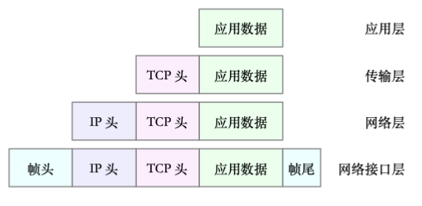

# 网络体系结构

OSI 参考模型是最早制定的网络体系结构，不过后来出现的 TCP/IP 参考模型更简单、更流行。

## OSI 参考模型

70 年代，国际标准化组织（International Organization for Standardization ，ISO）提出了开放系统互联（Open System Internetwork ，OSI）参考模型，将网络体系结构从上到下划分为 7 个层次：
- 应用层（application layer）
  - 以报文（message）为单位处理数据，存储了一个完整的消息。
  - 通常是一些直接面向用户的应用程序在工作。
  - 应用层协议有很多种，比如 HTTP、FTP ，它们都是规定了不同主机的应用程序之间如何通信。
- 表示层（presentation layer）
  - 处理来自不同系统的信息，整合之后传给上层。
- 会话层（session layer）
  - 建立并维持两个主机之间的会话。
- 传输层（transport layer）
  - 核心是 TCP、UDP 协议。
  - 以报文（message）为单位传输数据，实现终端之间的通信。
- 网络层（network layer）
  - 核心是 IP 协议。
  - 以分组（packet）为单位传输数据，根据 IP 地址选择路由。
- 数据链路层（data link layer）
  - 以帧（frame）为单位传输数据，负责 MAC 寻址、差错控制。
- 物理层（physical layer）
  - 以比特（bit）为单位传输数据，不考虑寻址，只管把数据沿着信道传输。

总结：
- 每一层都将该层及其以下层封装成一个黑盒，供高层使用。高层使用底层的服务时不需要知道其具体实现方法。
- 位于不同主机、但同层的程序之间，通过该层协议来通信；位于同一主机、且相邻层的程序之间，通过该主机本身的系统 API 来通信。
- 例如：一个程序从应用层发出一个 HTTP 报文时，会先添加应用层的控制信息，形成应用层的服务数据单元；然后传给表示层，添加表示层的控制信息，形成表示层的服务数据单元。以此类推，直到传到物理层才开始网络传输。
  - 不过传到网络层时，报文会被分割成长度较小的分组再添加控制信息。
  - 接收消息的过程正好相反，是从最下面的物理层逐层向上传递，依次拆除各层的控制信息，最后变成应用层的消息。
- 通信子网中的结点通常工作在最下面三层，比如路由器。

### 相关概念

- 数据帧的头部含有目的地址和源地址。
  - 数据链路层的通信结点收到一个数据帧之后，会先检查是否有错误，然后查看数据帧的目的地址，如果目的地址是本地地址或广播地址就接收该帧，否则转发。

- 目的地址的分类：
  - 单播地址：发往某个指定的 IP 地址。
  - 多播地址：发往一组 IP 地址。
  - 广播地址：地址全为 1 ，可以被所有结点接收。

- 最大传输单元：Maximum Transmission Unit（MTU），网卡允许传输的 IP 数据包的最大大小，单位 Bytes 。
  - 这是数据链路层的概念。
  - 以太网中的 MTU 通常设置为 1500 。
  - 如果某台主机的 MTU 比路由器的 MTU 大，过大的数据包就会被拆分传输，导致数据包数量变多。

## TCP/IP 参考模型

TCP/IP 参考模型从上到下划分为 4 个层次：
- 应用层
  - 对应 OSI 最上面的应用层、表示层、会话层。
  - 应用层协议有：基于 TCP 的 HTTP、FTP、telnet、电子邮件协议等，基于 UDP 的 DNS、SNMP（简单网络管理协议）、NFS（网络文件系统）、TFTP（通用文件传输协议）等。
- 传输层
  - 对应 OSI 的传输层。
  - 主要是 TCP、UDP 两种协议。
- 网络层
  - 对应 OSI 的网络层。
  - 一方面将传输层的报文封装成分组再选择路由发送，另一方面检查接收到的分组的 IP 地址，若与本地 IP 地址相同则拆除报头再传给传输层，否则选择路由并转发。
- 网络接口层
  - 对应 OSI 最下面的物理层、数据链路层。

当应用层发出数据包时，会先传到传输层，被加上 TCP 头；再传到网络层，被加上 IP 头；最后传到网络接口层，被加上帧头、帧尾。如下：

