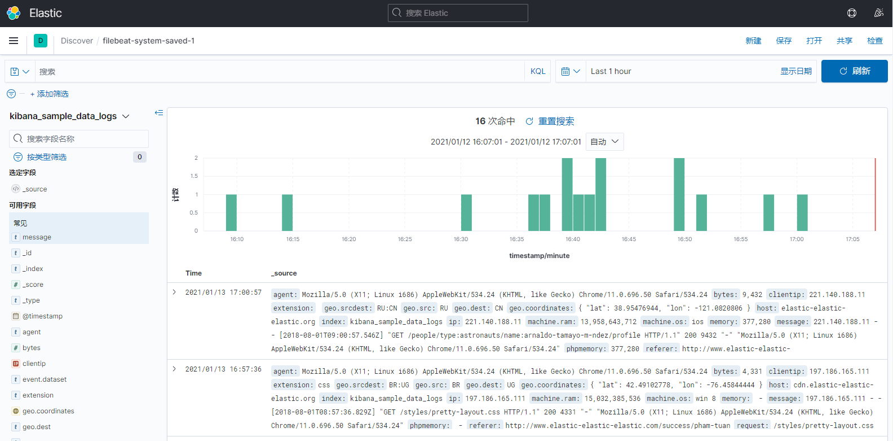

# Kibana

：一个基于 node.js 运行的 Web 服务器，用于查询、管理 ES 。

## 部署

- 下载二进制版：
  ```sh
  wget https://artifacts.elastic.co/downloads/kibana/kibana-7.10.0-linux-x86_64.tar.gz
  ```
  解压后运行：
  ```sh
  bin/kibana
  ```

- 或者用 docker-compose 部署：
  ```yml
  version: '3'

  services:
    kibana:
      container_name: kibana
      image: kibana:7.10.0
      restart: unless-stopped
      ports:
        - 5601:5601
      volumes:
        - ./config:/usr/share/kibana/config
        - ./data:/usr/share/kibana/data
  ```
  - 容器内以非 root 用户运行服务，需要调整挂载目录的权限：
    ```sh
    mkdir -p data
    chown -R 1000 .
    ```

## 配置

Kibana 的配置文件位于 `config/kibana.yml` ，内容示例：
```yml
server.port: 5601           # Kibana 监听的端口
server.host: 0.0.0.0        # Kibana 监听的 IP
server.name: kibana         # 服务器显示的名称

elasticsearch.hosts: ['http://10.0.0.1:9200']   # 要连接的 ES 地址。可以指定多个 host ，但必须属于同一 ES 集群
elasticsearch.ssl.verificationMode: none        # 不验证 ES 的 SSL 证书是否有效
# elasticsearch.username: kibana_system         # 让 Kibana 通过该账号访问 ES
# elasticsearch.password: ******
# kibana.index: '.kibana'   # 在 ES 中创建该索引，用于存储 Kibana 的数据
```
- 如果 ES 集群包含多个节点，为了让 Kibana 发向 ES 的查询请求实现负载均衡，可以额外部署一个 ES 节点，只担任 coordinating 角色，然后让 Kibana 将查询请求都发给它。

## 用法

- Kibana 的主要功能：
  - 查询 ES 中的数据，并可以创建仪表盘，便于分析。
  - 管理 ES 的索引，进行多种配置。
  - 支持在网页上上传日志文件，解析后存储到 ES ，便于测试。
- 访问 URL `/status` 可查看 Kibana 自身的状态。
- Kibana 会将自身的数据存储在 ES 中名为 .kibana 的索引中。
- Kibana 网站是单页面应用，但是加载网页时很慢，刷新首页都需要 5 秒。
- 建议在 Kibana 网站上进行以下设置：
  - 设置 Default 工作区，只显示 Kibana、Observability 中需要用到的部分功能。
  - Date format ：显示的日期格式，比如 `YYYY/MM/D HH:mm:ss.SSS` 。
  - defaultRoute ：Kibana 网站登录之后默认跳转的页面，比如 `/app/discover` 。
  - Maximum table cell height ：Discover 页面每个文档显示的最大高度。建议设置为 0 ，即取消限制。否则一个文档包含的内容过长时，可能显示不全。
  - Number of rows ：Discover 页面查询时返回的文档最大数量。
    - 默认值为 500 ，减小该值可以降低查询的耗时，特别是每个文档体积较大时。
    - 查询到文档之后，会先在浏览器中显示一部分文档。当用户向下翻页时，才动态加载后续的文档，直到显示出查询到的所有文档。

### Discover

- Kibana 的 Discover 页面原本名为 Logs UI ，用于查询、查看日志。但现在扩展了用途，可对所有 ES 文档进行可视化查询。
- 页面示例：

  

  - 页面左上方是搜索栏，支持输入任意字符串进行全文搜索，也支持复杂的查询表达式。
  - 页面右上方是时间筛选，支持筛选任意时间范围，或最近一段时间，还支持设置自动刷新的时间间隔。
    - 注意要选择有效的时间范围，否则查询结果可能为空。
  - 页面左侧可选择索引模式、显示的字段。
    - 需要事先在 Kibana 管理页面创建 index pattern ，且字段列表变化时，需要手动点击刷新按钮。
  - 页面中央是一个时间轴，显示每个时刻命中的 document 数量。
  - 页面中下方是一个列表，显示所有查询结果。
    - 每行一条 document ，点击某个 document 左侧的下拉按钮，就会显示其详细信息。
    - 默认显示 Time 和 _source 字段，可以在左侧栏中指定其它字段用作显示。
  - 点击搜索栏前端的保存按钮，可以保存当前的 query 配置，包括查询表达式、字段筛选、时间筛选。
  - 点击页面右上角的 Save 按钮，可以会保存当前的搜索页面，包括查询表达式、字段筛选、显示的字段，但不包括时间筛选。

- 搜索时，默认采用 Kibana 自带的查询语言 KQL 。
  - 例：
    ```sh
    elastic search            # 模糊查询，查询包含任一单词的文档。要求分词之后的单词完全匹配，比如 elastic 与 elasticsearch 是不同单词
    elastic*                  # 可以使用通配符，模糊匹配一个单词
    "elastic search"          # 加上定界符，要求文档包含该字符串
    elastic AND NOT search    # 支持使用 and、or、not 逻辑运算符
    ```
  - 支持用 `:` 对指定字段进行查询：
    ```sh
    agent_* : filebeat-*      # 支持在字段名、值中使用通配符
    agent_name: *             # agent_name 字段存在
    NOT agent_name: *         # agent_name 字段不存在
    status_code : (401 OR 403 OR 404)
    status_code : 200 AND NOT (tags : (success AND info))
    ```
  - 点击页面右上角的 Inspect ，可以查看查询的耗时、对应的 query 语句。

### Fleet

- Kibana 的 Fleet 页面原本名为 Ingest Manager ，用于批量管理 Elastic Agent 。
