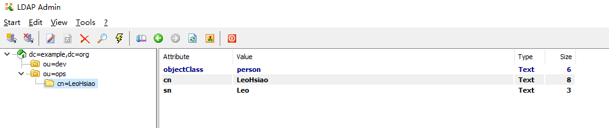
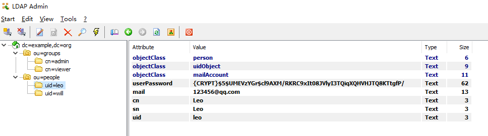

# Ldap Admin

：一个开源的 LDAP 客户端软件，运行在 Windows 上，无需安装。
- 它会将连接服务器的凭据以明文形式保存在 Windows 的注册表中。
- [官网](http://ldapadmin.org/)

## 用法

打开软件之后，先连接到服务器，配置示例如下：

连接成功之后，就会显示查询到的条目，如下：

## 对接 Jenkins 的示例

TODO

