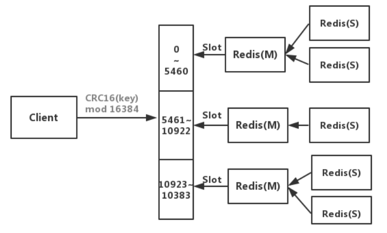

# 部署

Redis 常见的部署架构：
- 单实例
- 主从集群
- 主从+哨兵集群
- Codis 集群
  - 中国豌豆荚开源的一个集群框架，比较重，更新较慢。
  - 分成多个独立工作的小组，每组是一个小的主从集群。用一个 proxy 统一代理所有组。
- Cluster 集群
  - 由 Redis 官方发布。

## 版本

- v1.0
  - 于 2009 年发布。

- v6.0 以前
  - 没有划分用户，只有一个密码。客户端通过密码登录就可以拥有服务器的全部操作权限。
  - 核心模块采用单线程工作，但是通过 IO 多路复用处理高并发请求。
    - 优点：简化了代码开发。
    - 缺点：只能使用 CPU 的一个核，不过 Redis 并不是 CPU 密集型进程，影响不大。
  - 为了政治正确，逐渐将 slave 改名为 replica 。

- v6.0
  - 于 2020 年发布。
  - 支持 SSL 连接。
  - 增加了访问控制列表（ACL），可以定义多个用户，分配不同的权限。每个用户通过用户名、密码进行认证。
  - 支持多线程 IO ，提升效率。
  - 发布了集群代理 Redis Cluster proxy 。

## 单实例

### 部署

- 用 yum 安装：
  ```sh
  yum install -y http://rpms.famillecollet.com/enterprise/remi-release-7.rpm
  yum --enablerepo=remi install redis
  ```
  然后启动：
  ```sh
  redis-server
              /opt/redis/redis.conf # 使用指定的配置文件
  ```
  或者用 systemctl 启动：
  ```sh
  systemctl start redis             # 默认的启动命令是 /usr/bin/redis-server /etc/redis/redis.conf
  systemctl enable redis
  ```

- 或者用 docker-compose 部署：
  ```yml
  version: "3"

  services:
    mongo:
      container_name: redis
      image: redis:5.0.14
      command: redis-server redis.conf
      restart: unless-stopped
      ports:
        - 6379:6379
      volumes:
        - .:/data     # 挂载工作目录，其中包含配置文件 redis.conf
  ```

### 客户端

命令：
```sh
redis-cli               # 启动客户端（默认连接到本地 6379 端口的 Redis 服务器，使用 0 号数据库）
          -h 127.0.0.1  # 指定服务器的 IP 地址
          -p 6379       # 指定服务器的端口
          -a ******     # 指定密码
          -n 0          # 使用 0 号数据库
          [command]     # 不进入客户端的终端，只是执行一条命令
            -r 10       # 重复执行该命令 3 次
            -i 1.2      # 每次重复执行的间隔时长为 1.2s（可以使用小数）
```
- 执行 redis-cli 命令时，即使不能连接到 Redis 服务器，也会进入客户端的终端。
- 启动客户端时，默认不会进行密码认证。如果服务器设置了密码，此时就无权进行任何操作（连 ping 都不行），必须先完成密码认证。
- 登录服务器之后，可以执行一些命令，比如：
  ```sh
  auth ******                   # 填入密码，进行认证
  ping                          # 测试能否连接到 Redis 服务器

  client list                   # 显示与服务器连接的所有客户端
  client kill 127.0.0.1:59372   # 关闭一个客户端的连接
  quit                          # 退出当前客户端，关闭其连接

  info                          # 显示服务器的详细信息
  monitor                       # 实时显示服务器执行的所有命令，以及对应的时间戳、数据库、客户端，不包括 auth、quit 命令。这会大幅降低服务器执行速度
  shutdown                      # 正常终止服务器（相当于发送 SIGTERM 信号）
  ```
  - 命令名不区分大小写。
  - 单个命令的执行都具有原子性。
  - Redis 客户端可以一次发送多条命令（基于 pipeline），减少服务器的响应次数，提高效率。
  - [info 的参数含义](https://redis.io/commands/info)
- 例：
  ```sh
  redis-cli info                                       # 查询 redis 的信息
  redis-cli -r 100 -i 1 info | grep used_memory_human  # 轮询 Redis 占用的内存
  ```
- Redis 支持通过 Shell 管道符一次传入多条命令来执行。如下：
  ```sh
  echo -e "dbsize\ndbsize" | redis-cli
  ```

## 备份数据

Redis 服务器将数据保存在内存中，当 Redis 终止时，内存中的数据都会丢失。可采用以下方法持久化保存数据：

### RDB 模式

- ：如果在 n 秒内有至少 m 个 key 被改动，则将此时 Redis 的所有数据保存到备份文件中。
- RDB 模式的备份开销小、备份精度低，但是恢复速度快。
- Redis 默认启用 RDB 模式，相关配置如下：
  ```sh
  dbfilename dump.rdb   # 采用的备份文件的文件名

  # 默认采用以下备份策略
  save 3600 1           # 如果在 3600 秒内有 1 个 key 被改动，则备份一次
  save 300 100          # 在 300 秒内有 100 个 key 被改动
  save 60 10000         # 在 60 秒内有 10000 个 key 被改动

  # stop-writes-on-bgsave-error yes   # 当执行 bgsave 时，禁止写入数据
  # rdbcompression yes                # 是否压缩 RDB 备份文件
  ```
- 可以执行以下命令，立即将数据保存到 dump.rdb 文件中：
  ```sh
  save      # 将所有数据保存到备份文件中（在前台执行）
  bgsave    # 在后台执行 save 命令
  ```

### AOF 模式

- ：将 Redis 执行的所有命令保存到备份文件中。
- AOF 模式的备份精度高，但是备份开销大、恢复速度慢，因为要逐条执行命令。
- 相关配置：
  ```sh
  appendonly yes                  # 是否启用 AOF 模式，默认禁用
  appendfilename appendonly.aof   # 采用的备份文件的文件名

  # 备份的策略
  # appendfsync always            # 每执行一条命令就保存一次，这是最慢、最安全的策略
  appendfsync everysec            # 每隔一秒保存一次，这是默认策略
  # appendfsync no                # 由 Redis 自己决定什么时候保存，间隔时间可能达几十秒

  # 自动重写 aof 文件
  # auto-aof-rewrite-min-size 67108864    # aof 文件考虑自动重写的最小体积
  # auto-aof-rewrite-percentage 100       # aof 文件超过最小体积时，每增大 100% 就重写一次
  ```
- Redis 可以创建一个子进程，在后台重写 aof 文件，去掉重复、冗余的命令。
  - 每次重写时，会创建一个临时文件 temp-rewriteaof-xxx.aof ，重写成功了才用它替换 appendonly.aof 文件，因此重写失败也不会影响 appendonly.aof 文件。
  - 可执行 `bgrewriteaof` ，主动触发一次 aof 重写。
- 采用 RDB 或 AOF 模式时，如果要恢复数据，只需将 dump.rdb 或 appendonly.aof 文件拷贝到 Redis 工作目录下，然后重启 Redis 。
  - Redis 启动时，默认会读取 dump.rdb 文件，将其中的数据载入内存。
    - dump.rdb 体积越大，则 Redis 启动耗时越久。例如使用机械硬盘时，从 dump.rdb 每加载 10GB 数据，耗时大概为 10s 。
    - 如果配置了 `appendonly yes` ，则 Redis 不会读取 dump.rdb ，而是读取 appendonly.aof ，逐一执行其中的命令。

### 混合模式

- ：在启用 AOF 模式做增量备份的基础上，每隔一段时间用 RDB 模式做一次全量备份。
- 启用时，需要在 redis.conf 加入以下配置：
  ```sh
  appendonly yes
  aof-use-rdb-preamble yes    # 是否启用混合模式。从 Redis v5 开始默认为 yes
  ```
- 混合模式下，会将数据备份到 appendonly.aof 文件，文件的前面部分存储 rdb 格式的数据，后面部分存储 aof 格式的数据。
  - 每次重写 aof 文件，都会将 aof 文件的内容全部重写为 rdb 格式。

### RedisShake

：一个命令行工具，用于将一个 Redis 的数据，同步到其它 Redis 。
- [GitHub](https://github.com/tair-opensource/RedisShake)
- 由阿里云开源，采用 Golang 开发。
- 有多种迁移数据的模式：
  - sync ：基于 psync 命令从源 Redis 获取数据，然后导入目标 Redis 。这样属于增量同步。
  - restore ：先导出源 Redis 的 dump.rdb 文件，然后导入目标 Redis 。这样属于全量同步。
  - scan ：基于 scan 命令从源 Redis 获取数据，然后导入目标 Redis 。
- 用法：
  1. 下载 redis-shake 。
  2. 假设采用 scan 模式，修改配置文件 scan.toml ：
      ```sh
      type = "scan"

      [source]
      version = 5.0
      address = "10.0.0.1:6379"
      password = "???"

      [target]
      type = "standalone"
      version = 5.0
      address = "10.0.0.2:6379"
      password = "???"
      ```
  3. 执行以下命令，开始同步：
      ```sh
      ./redis-shake scan.toml
      ```
      - 默认会同步源 Redis 的所有数据，也可使用 lua 脚本过滤数据：
        ```sh
        ./redis-shake scan.toml filters/swap_db.lua
        ```

## 主从集群

- Redis 的主从集群，与 MySQL 主从集群类似，能实现数据备份、读写分离。
- 原理：
  1. 部署一个 Redis ，添加 replicaof 等配置参数，连接到另一个 Redis 。
      - 当前 Redis 为 replica 角色，另一个 Redis 为 master 角色。
      - 支持级联复制。一个 replica 角色的 Redis ，可以担任另一个 Redis 的 master 。
  2. replica 作为客户端连接到 master ，执行 `PSYNC <replicationid> <offset>` 命令，复制 master 执行过的命令，在 replica 处执行这些命令。
      - replica 会发送自己的 Replication ID 、上一次复制的 offset 。这样 replica 断线重连时，master 会从该 replica 之前的偏移量处，继续复制命令。
      - 默认采用异步复制。master 每执行一个命令，就会复制给 replica ，不会等待 replica 执行完命令，避免阻塞 master 。
      - 复制命令的方式适合增量同步。如果 master 发现 replica 的差异过大，则会拷贝全部数据的 rdb 快照，进行一次全量同步。

### 部署

1. 按普通方式部署一个 Redis ，担任 master 。
2. 再按普通方式部署一个 Redis ，并添加以下配置，担任 slave ：
    ```sh
    replicaof 10.0.0.1 6379    # 声明该节点为 slave 身份，及其 master 地址
    replica-read-only yes      # 当该节点为 slave 时，只允许读操作
    masterauth ******          # master 的密码
    ```
3. 进入 master 的终端，查看主从信息：
    ```sh
    127.0.0.1:6379> info Replication
    # Replication
    role:master                                                        # 该节点的角色是 master
    connected_slaves:2                                                 # 该节点有两个已连接的 slave
    slave0:ip=10.244.3.216,port=6379,state=online,offset=19856,lag=0   # 第一个 slave ，状态为在线，数据偏移量为 19856 ，对于 master 没有延迟
    slave1:ip=10.244.57.151,port=6379,state=online,offset=19561,lag=1
    master_replid:be1cd14e4facf4720f25d5baace8df62cabd8ee7
    master_replid2:0000000000000000000000000000000000000000
    master_repl_offset:19856                                           # master 目前的数据偏移量为 19856
    second_repl_offset:-1
    ```
4. 进入 slave 的终端，查看主从信息：
    ```sh
    127.0.0.1:6379> info Replication
    # Replication
    role:slave              # 该节点的角色是 slave
    master_host:10.0.0.1    # master 的地址
    master_port:6379        # master 的端口号
    master_link_status:up   # 与 master 的连接状态为正常
    ```
    - 一个 slave 也可以被其它 slave 连接，此时会显示 connected_slaves 。
    - `master_link_status: down` 的可能原因：
      - master 的 host、port 无效。
      - master 监听的是 127.0.0.1 ，不允许 slave 连接。
      - slave 没有使用正确的密码连接到 master 。
      - slave 被某事阻塞了、不能行动，比如正在从备份文件恢复数据，或正在从 master 拉取要同步的数据。
    - 如果发现 slave 不能连接到 master ，可以在 slave 主机上手动执行 redis-cli 命令试试登录 master 。

## 主从+哨兵集群

### 哨兵

：Sentinel ，一种以特殊模式运行的 redis 进程，能监控主从集群中的各个 Redis 服务器的状态，自动进行主从切换，实现 Redis 的高可用。
- [官方文档](https://redis.io/topics/sentinel)
- Redis 客户端需要先连接任一哨兵，查询 Redis 集群中当前的 master 地址，然后连接到 master 。
- 哨兵启动时首先要连接到 master ，以 master 为中介发现其它 slave、哨兵。
  - 哨兵每隔 10 秒会向 master 发送 info 命令，发现连接到该 master 的所有 slave 。
  - 哨兵每隔 2 秒会在 master 的消息队列中发布消息，被其它哨兵订阅。因此哨兵们能通过消息队列相互发现、通信。（哨兵之间不会直接通信）
  - 哨兵每隔 1 秒会向所有 Redis 服务器、其它哨兵发送 ping 请求，如果超过 down-after-milliseconds 时间没收到响应，则认为对方下线了。
    - 如果一个哨兵认为 master 下线了（称为主观下线），就会向其它哨兵广播这一消息。
    - 如果超过 quorum 数量的哨兵都认为 master 下线了（称为客观下线），就会开始救援。
  - 因此，不要让 master 执行耗时过久的操作，否则容易阻塞 master 过久，触发主从切换。当 master 变成 slave 之后，即使该操作执行完成，也不会同步到其它节点，导致该操作丢失。
- 哨兵的救援过程称为 failover ，主要流程如下：
  1. 哨兵们投票选出一个 leader 哨兵。一个哨兵需要获得超过半数的投票才能获选。
  2. leader 哨兵选出一个合格的 slave 担任新的 master.
  3. leader 哨兵通知其它哨兵、修改所有 slave 的配置，让它们连接到新 master 。救援完成。
  4. 如果救援过程失败，则重新开始救援，又要重新投票。
  5. 如果救援完成之后，旧 master 重新上线，哨兵会修改它的配置，将它的角色改为 slave 。

### 部署

- 可以用 Redis 安装自带的命令直接启动哨兵：
  ```sh
  redis-sentinel /opt/redis/sentinel.conf
  ```
  也可以将 redis-server 以哨兵模式启动：
  ```sh
  redis-server /opt/redis/sentinel.conf --sentinel
  ```

- 可以用 docker-compose 部署 Redis + Sentinel ：
  ```yml
  version: "3"

  services:
    redis:
      image: redis:6.0.8
      working_dir: /opt/redis
      command: redis-server redis.conf
      restart: unless-stopped
      ports:
        - 6379:6379
      volumes:
        - .:/opt/redis

    sentinel:
      image: redis:6.0.8
      working_dir: /opt/redis
      command: redis-server sentinel.conf --sentinel
      restart: unless-stopped
      ports:
        - 6379:6379
      volumes:
        - .:/opt/redis
  ```

- 通常在多个主机上部署多个哨兵，构成分布式集群，实现哨兵本身的高可用。
  - 哨兵不必与 Redis 运行在同一主机上，只需与各个 Redis 的物理网络连通。
  - 哨兵集群需要部署至少三个、奇数个哨兵服务器。如果启动的哨兵数过少，就可能达不到同意救援的哨兵数。

### 配置

- sentinel.conf 的配置示例：
  ```sh
  bind 0.0.0.0
  port 26379
  requirepass ******      # Redis 5.0 开始支持给哨兵设置密码
  # protected-mode yes    # 哨兵不能开启 protected-mode 模式
  # daemonize yes
  dir /opt/redis/
  logfile /var/log/redis-sentinel.log
  pidfile /var/run/redis-sentinel.pid

  sentinel monitor master1 10.0.0.1 6379 2      # 监控的 master ，最后的 2 表示 quorum
  sentinel auth-pass master1 ******             # master 的密码
  sentinel down-after-milliseconds master1 5000 # master 断开连接的超时时间（单位 ms）
  sentinel parallel-syncs master1 1             # 选出新 master 之后，同时安排多少个 slave 与它开始同步
  sentinel failover-timeout master1 30000       # 救援过程的超时时间（单位 ms），超过该时间之后就认为救援失败
  sentinel deny-scripts-reconfig yes            # 禁止在 Redis 终端用 SENTINEL SET 进行配置
  ```
- 关于 sentinel monitor ：
  - 哨兵在启动时只会连接到 master ，因此只需要配置当前 master 的 ip 和密码。
  - master 的名称由用户自定义。即使发生了主从切换，新的 master 也会使用原来的 master 名。
  - quorum（法定人数）表示至少有多少个哨兵认为 master 下线了，就开始救援。
  - quorum 为 2 时，集群中至少要有 2 个哨兵正常工作，否则不能自动切换主从。
- 哨兵在运行时会自动重写自己的配置文件，在主从切换时还会通过 config rewrite 命令重写 master 和 slave 的配置文件。
  - 哨兵会在自己的配置文件中记录已发现的 known-replica、known-sentinel 。即使它们下线，依然不会从配置文件中删掉。
  - 主从切换时，哨兵会自动配置各个 slave 的 replicaof 参数，但不会自动配置其密码，因此要事先在 master、slave 的配置文件中设置两份相同的密码：
    ```ini
    requirepass ******
    masterauth  ******
    ```

### 管理

- 执行 `redis-cli -p 26379` 可进入哨兵的终端，常用的命令如下：
  ```sh
  info                         # 显示该哨兵的信息
  SENTINEL masters             # 显示所有 master 的信息
  SENTINEL slaves <master>     # 显示指定 master 的所有 slave 的信息
  SENTINEL sentinels <master>  # 显示指定 master 的所有哨兵的信息
  SENTINEL failover <master>   # 强制开始一次救援，切换 master
  SENTINEL reset <master>      # 清空本机哨兵关于指定 master 的所有配置信息，按当前配置重写配置文件
  ```

- 例：向哨兵查询当前的主从信息
  ```sh
  [root@CentOS ~]# redis-cli -p 26379 info Sentinel
  # Sentinel
  sentinel_masters:1           # 监控了 1 个 master
  sentinel_tilt:0
  sentinel_running_scripts:0
  sentinel_scripts_queue_length:0
  sentinel_simulate_failure_flags:0
  master0:name=master1,status=ok,address=10.244.67.5:6379,slaves=2,sentinels=3    # 监控的第一个 master 的主从信息
  ```
  - 最后一行记录了已发现的 slave、sentinel 数量。
  - 哨兵会记录发现过的所有 slave、sentinel ，即使它们断开连接也不会移除，因此记录的数量可能比实际在线数多，执行 `SENTINEL reset <master>` 命令才会重新计数。
    - 用 Docker 部署时，应该让 sentinel 使用主机网卡。否则主机内通信时使用自身网卡、主机间通信时使用主机网卡，就会记录下两倍数量的哨兵地址。
    - 用 k8s 部署时，如果填写的 master 地址是其 Service 名，则会解析成 Service IP 。但各个 Redis 节点之间实际上是通过 Pod IP 进行通信，导致第一次主从切换之后哨兵会多记录一个 Redis 节点。此时，需要对每个哨兵执行 SENTINEL reset master1 命令，清除多余的 IP 。

### 日志分析

下例使用三台主机，每个主机上部署一个 redis-server 和 redis-sentinel ，组成一主二从集群。

- 终止 master 时，可见某个哨兵的日志如下：
  ```sh
  202:X 18 Nov 2019 17:02:12.468 # +sdown master master1 10.244.79.33 6379                       # 当前哨兵认为 master 已下线
  202:X 18 Nov 2019 17:02:12.583 # +new-epoch 12                                                 # 开始第 12 次救援
  202:X 18 Nov 2019 17:02:12.590 # +vote-for-leader 4f648158ea1a5f8df03b001396042d18cef56367 12  # 投票给编号为 ***367 的哨兵，希望它当 leader
  202:X 18 Nov 2019 17:02:13.547 # +odown master master1 10.244.79.33 6379 #quorum 3/2           # 有 3 个哨兵认为 master 下线，决定开始救援
  202:X 18 Nov 2019 17:02:13.644 # +switch-master master1 10.244.79.33 6379 10.244.53.62 6379    # 将 master 从*.33 节点改为*.62 节点
  202:X 18 Nov 2019 17:02:13.645 * +slave slave 10.244.25.157:6379 10.244.25.157 6379 @ master1 10.244.53.62 6379  # 添加*.157 节点作为 slave
  263:X 18 Nov 2019 17:02:16.355 * +slave slave 10.244.79.33:6379 10.244.79.33 6379 @ master1 10.244.53.62 6379
  ```
  - +sdown ：主观下线
  - +odown ：客观下线
  - -sdown ：主观上线（不会记录客观上线）
  - +reboot ：重启
  - 比如一个 slave 被阻塞过长的时间之后，会被哨兵先后记录 +sdown、-sdown ，但不会记录 +reboot 。

- 如果 failover 失败，哨兵们会重新开始救援，日志如下：
  ```sh
  503:X 18 Nov 2019 15:55:18.755 # +new-epoch 21
  503:X 18 Nov 2019 15:55:18.755 # +try-failover master master1 10.244.79.33 6379
  503:X 18 Nov 2019 15:55:18.762 # +vote-for-leader 91ad63983edf9cfc378b2a37491c5621ebfceff5 21   # 投票给编号*ff5 的哨兵，希望它当 leader
  503:X 18 Nov 2019 15:55:18.776 # dc54b5f06544c8bf830b9f8b00f199b96e0e6b16 voted for 91ad63983edf9cfc378b2a37491c5621ebfceff5 21  # 另一个哨兵也投票给编号*ff5 的哨兵
  503:X 18 Nov 2019 15:55:18.778 # d2ceda111b29ad5f6e3932864fb2b7ca8e2309ff voted for 91ad63983edf9cfc378b2a37491c5621ebfceff5 21
  503:X 18 Nov 2019 15:55:18.817 # +elected-leader master master1 10.244.79.33 6379
  503:X 18 Nov 2019 15:55:18.818 # +failover-state-select-slave master master1 10.244.79.33 6379   # 准备选出*.33 节点当 master
  503:X 18 Nov 2019 15:55:18.894 # -failover-abort-no-good-slave master master1 10.244.79.33 6379  # 发现*.33 节点不合格，不能当 master
  503:X 18 Nov 2019 15:55:18.995 # Next failover delay: I will not start a failover before Mon Nov 18 15:55:39 2019
  ```

## Cluster 集群

架构图：



- 将整个集群空间划分成 16384 个槽位（slot），将每个写入的 key 随机分配到一个 slot 中。
  - 给 key 分配 slot 的算法是 `CRC16[key]%16384` ：先计算 key 的 CRC16 哈希值，再对 16384 取模运算，结果就是要分配的 slot 序号。
- 集群由多个 Redis node 组成，每个 node 存储一部分 slot 。
  - 客户端可以访问集群中的任一 node ，如果读取的 key 不存在，则请求会被转到正确的 node 。
  - 如果一个 node 故障，则它存储的所有 slot 都会丢失。因此通常把每个 node 部署成主从集群，以保证高可用。
  - 当集群中的 node 增加或减少时，需要重新给每个节点分配 slot ，这会导致 key 的迁移。
- 优点
  - 容易横向扩展。
- 缺点
  - 只能使用 0 号数据库。
  - 一次操作多个 Key 时，它们可能存储在不同的 node 中，导致不能进行 mset 等批量操作、不能实现事务的原子性。
