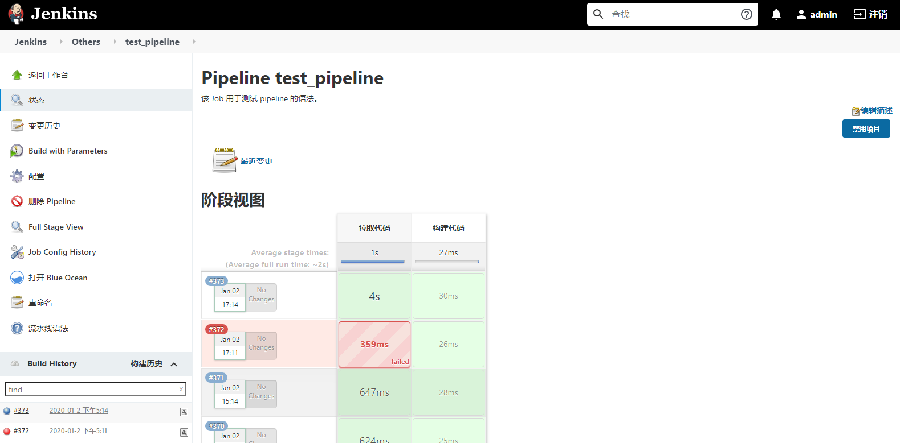

# Jenkins

：一个 Web 服务器，用于 CI/CD ，采用 Java 开发。
- [官方文档](https://jenkins.io/zh/doc/)
- 支持托管大量脚本（称为任务、Job ），供用户在浏览器中执行，实现便捷的项目构建、测试、部署等目标。
- 可体验官方在公网部署的 [Jenkins](https://ci.jenkins.io/job/Websites/job/jenkins.io/job/master/) 。

## 相关历史

- 2005 年，Sun 公司的 Kohsuke Kawaguchi 发布了一个简单的 CI 网站，名为 Hudson 。
- 2010 年，Oracle 公司收购了 Sun 公司，拥有了 Hudson 的版权。社区被迫将项目改名为 Jenkins ，进行开发。
- 2011 年，Hudson 被交给 Eclipse 基金会管理。但它越来越落后于 Jenkins ，于 2016 年停止开发。

## 部署

- 用 war 包启动：
  1. 安装 JDK 。
  2. 下载 Jenkins 的 war 包。
  3. 启动 Jenkins ：
      ```sh
      java -jar jenkins.war --httpPort=8080
      ```
      - 然后便可用浏览器访问 `http://localhost:8080` 。
      - 首次启动时，终端上会显示一个密钥，用于首次登录。

- 或者用 docker-compose 部署：
  ```yml
  version: "3"

  services:
    jenkins:
      container_name: jenkins
      image: jenkins/jenkins:2.289.3
      restart: unless-stopped
      environment:
        JAVA_OPTS: -Duser.timezone=GMT+08 -Xms4g -Xmx4g
      ports:
        - 8080:8080                                   # 供用户访问 Jenkins 的 Web 页面
        # - 50000:50000                               # 供 JNLP 类型的 agent 访问 Jenkins
      volumes:
        - ./jenkins_home:/var/jenkins_home
        - /var/run/docker.sock:/var/run/docker.sock   # 使容器内的 Jenkins 能与 dockerd 通信
  ```
  - 需要先修改挂载目录的权限：
    ```sh
    mkdir jenkins_home
    chown -R 1000:1000 .
    ```

## 原理

- Jenkins 的主目录称为 JENKINS_HOME ，拷贝该目录就可以备份、迁移 Jenkins 。
  - 在启动 Jenkins 之前，可以声明环境变量 `JENKINS_HOME=/opt/jenkins/` ，改变 Jenkins 主目录。
  - Jenkins 在每个节点上都会创建 JENKINS_HOME 目录。
    - master 节点的 JENKINS_HOME 目录用于保存 Jenkins 的主要数据。
    - slave 节点的 JENKINS_HOME 目录主要包含 workspace 。
- master 节点的 JENKINS_HOME 目录结构：
  ```sh
  jenkins_home
  ├── config.xml                # Jenkins 的配置文件
  ├── jobs/                     # 保存各个 Job 的信息
  │   ├── job1/
  │   │   ├── builds/           # 保存每次 build 的信息，包括配置文件、日志
  │   │   ├── config.xml        # 该 Job 的配置文件。Jenkins 重启时会读取该文件，修改 Job 之后会保存到该文件
  │   │   └── nextBuildNumber   # 记录下一次 build 的编号
  │   ├── job2/
  │   └── job3/
  ├── nodes/                    # 保存各个节点的信息
  ├── plugins/
  └── workspace/                # 包含在当前节点执行过的 Job 的工作目录
  ```

- Jenkins 每次执行 Job 时：
  - 先将该 Job 加入构建队列，等待分配某个 node 上的一个执行器（executor）。
    - 如果没有可用的 executor ，则在构建队列中阻塞该 Job 。
    - 如果构建队列中已存在相同的 build 任务（配置、构建参数相同），则不会将当前任务加入构建队列，甚至不会占用 Build ID 。
    - 通过 API 或上游 job 触发一个 job 时，会在构建队列中等待一段时间才执行，称为静默期。如果在静默期内多次触发该 job ，则会被构建队列自动去重。
  - 默认将当前节点的 `$JENKINS_HOME/workspace/$JOB_NAME` 目录作为工作目录（称为 workspace ）。
    - 执行 Job 之前、之后都不会自动清空工作目录，建议用户主动清理。
    - 如果将一个 Job 并发执行多个实例，则会生成多个工作目录，添加 @2、@3 格式的后缀。
  - 默认在 shell 中加入环境变量 `BUILD_ID=xxxxxx` ，当执行完 Job 之后就自动杀死所有环境变量 BUILD_ID 值与其相同的进程。
    - 可以在 shell 中声明环境变量 `JENKINS_NODE_COOKIE=dontkillme` ，阻止 Jenkins 杀死当前 shell 创建的进程。

## 用法

- 访问 `/restart` 页面，会显示一个重启按钮。
- Jenkins 的 Web 页面上，很多地方都显示了 ？ 图标，点击它就会显示此处的帮助文档。
- 新安装的 Jenkins 需要进行一些系统配置，比如添加节点、设置对外的 URL 。
  - 点击 `Manage Jenkins -> Configure System` 可进行一些系统配置，比如设置 Jenkins 对外的 URL、邮箱、全局的环境变量。
  - 用户可以将密码等私密数据保存成 Jenkins 的凭据，然后在执行 Job 时调用，从而避免泄露明文到终端上。

- Jenkins 的主页默认显示一个视图（view）。
  - 每个视图以列表形式包含多个任务（Job），便于分组管理。

- Jenkins 的主页的左侧显示了菜单列，点击新建按钮，即可创建一个 Job ，常见的几种类型如下：
  - Freestyle Project
    - ：自由风格的项目，可以通过 Web 页面上的配置实现大多数构建任务。
  - Pipeline
    - ：将项目的处理过程分成多个阶段，依次执行，称为流水线，用 Jenkinsfile 文件描述。
  - Multibranch Pipeline
    - ：多分支流水线。用于监听 SCM 仓库的事件，对各个分支分别执行流水线。
    - 需要先将 pipeline 文件保存到每个分支的 SCM 仓库中。
  - MultiJob Project
    - ：用于组合调用多个 Job 。
    - 可以设置多个阶段（Phase），每个阶段可以串行或并行执行多个 Job 。
  - Folder
    - ：用于对 Job 进行分组管理。
    - 此时 Job 的全名为 `<folder>/<job>` ，因此不同 Folder 下的 Job 可以重名。

- Job 的名称会用于组成 URL ，还会用于创建工作目录，因此应该避免包含特殊字符。
  - 可以采用 ` 项目名 _ 模块名 _ Job 类型 _ 环境 ` 的命名格式，比如 `mysite_front_DEPLOY_in_test`
  - 也可以创建多层 Folder ，分组管理 Job ，比如 `mysite / front / DEPLOY_in_test`

- 点击进入一个 Job 的详情页面，如下：

    

  - 左上方显示：该 Job 的菜单列，比如启动（Build）、配置、删除、重命名。
  - 左下方显示：构建历史（Build History），记录每次执行该 Job 的编号、时间、结果。
  - 中上方显示：Job 名称、描述信息。
  - 中下方显示：构建历史中，Job 每个阶段的耗时。

- 点击某次构建，可查看其详细信息，比如启动原因、持续时长、控制台输出（Console Output）。
  - 常见的几种构建结果：
    - success ：执行成功，显示为绿色。
    - failure ：执行失败，显示为红色。
    - unstable ：不稳定，显示为黄色，比如测试不通过。
    - aborted ：放弃执行，显示为灰色。比如达到超时时间、被用户主动取消。
  - Console Output 中，如果打印一个以 `http://` 开头的字符串，则会被显示成超链接。

### 管理节点

- 用户可以添加一些主机、Docker 容器作为 Jenkins 的运行环境，称为节点（node）、代理（agent）、slave 。
  - Jenkins 服务器所在的节点称为 master ，而其它节点称为 slave ，这些节点都可以用于运行 Job 。
  - 在每个节点上，Jenkins 都需要使用一个目录存储数据。可以指定 `/opt/jenkins/` 目录，或者创建 jenkins 用户，然后使用 `/home/jenkins/` 目录。
- 添加 slave 节点时，建议通过 SSH 密钥连接。步骤如下：
  1. 安装 `SSH Build Agents` 插件。
  2. 在 slave 节点上安装 JDK 。
  3. 将 master 节点的 `~/.ssh/id_rsa.pub` 公钥拷贝到 slave 节点的 `~/.ssh/authorized_keys` 中。
  4. 在 Jenkins 上创建一个 `SSH Username with private key` 类型的凭据，填入 master 节点的 `~/.ssh/id_rsa` 私钥。
  5. 在 Jenkins 上添加该节点，选择以 `Launch agents via SSH` 方式连接。
- 当 Jenkins master 通过 SSH 连接到 slave 之后（以 notty 方式连接，不创建终端），会执行 `java -jar remoting.jar`  命令，保持运行一个客户端。
  - master 每次连接 slave 时，不会加载 `/etc/profile` 和 `~/.bash_profile` ，只会加载 `/etc/bashrc` 和 `~/.bashrc` 。
  - 建议在 slave 的配置页面添加 Prefix Start Agent Command ：`source /etc/profile;source ~/.bash_profile;` 。
  - 客户端执行的所有 shell 命令都会继承它的 shell 环境变量。因此，当用户修改 shell 环境变量时，客户端不会自动更新，必须手动将 slave 断开重连。
- 2022 年，Jenkins 发布 LTS 2.361 版本，要求用 Java 11 或更高版本的 JVM 运行 jenkins.war 和 remoting.jar 。
  - 建议在 agent 主机上安装 `yum install java-11-openjdk` ，然后设置节点的 Java Path 变量。

### 管理权限

安装 `Role-based Authorization Strategy` 插件之后便可实现基于角色的用户权限控制。用法：
1. 进入 ` 全局安全配置 ` 页面，将授权策略改为 `Role-Based Strategy` 。
2. 进入 `Manage Jenkins -> Manage Users` 页面，创建一个用户账号。
3. 进入 `Manage Jenkins -> Manage and Assign Roles -> Manage Roles` 页面，创建角色。
    - 比如创建一个全局角色 visitor ，给予 Overall 的 Read 权限。即可以查看 Jenkins 主页，但看不到任何 Job 。
    - 比如创建几个项目角色，分别拥有对不同项目的权限。
    - 项目角色的 pattern 用于通过正则表达式选中多个项目，供他操作。
    - 建议将不同类型的 Job 采用不同的前缀命名，便于通过正则表达式分别匹配。
4. 进入 `Manage Jenkins -> Assign Roles` 页面，给各个用户分配角色。
    - 默认只能对 Jenkins 内置数据库中存储的用户进行操作，用户较多时配置很麻烦。建议使用 LDAP 服务器中存储的用户、用户组。

推荐做法：
- 只有 admin 用户拥有最高权限，比如进行 Jenkins 的系统设置。
- Jenkins 只能以 Job 为单位划分权限，因此应该给开发、测试、正式环境的构建任务分别创建 Job ，而不是通过构建参数选择它们。
- 给每个或每组 Job 创建两种项目角色，按需要分配给各个用户。
  - `*_user` ：只是使用该 Job ，拥有 Job 的 Build、Cancel、Read 权限。
  - `*_editor` ：允许编辑该 Job ，拥有大部分权限。

### 插件

在 `Manage Jenkins -> Manage Plugins` 页面可以管理 Jenkins 的插件。
- 安装、卸载插件时都要手动重启 Jenkins 才会生效，甚至修改了插件的配置之后可能也不会立即生效。

常用插件：
- Localization: Chinese (Simplified)
  - 用于对 Jenkins 的页面进行汉化。
- Blue Ocean
  - 提供了一个更美观的操作页面，但功能较少。
- Extended Choice Parameter
  - 提供了单选框、复选框、单选按钮、多选按钮类型的输入参数。
- Generic Webhook Trigger
  - 支持以 webhook 的方式触发 Jenkins 的 Job ，需要在 Job 的配置页面定义。通过 token 指定 Job ，可以通过请求字符串或 POST body 输入参数（区分大小写），如下：
    ```sh
    curl http://10.0.0.1:8080/generic-webhook-trigger/invoke?token=Sqeuu90VF0TE&ACTION=start
    ```
- Email Extension Plugin
  - 支持 Jenkins 发送邮件给用户。
  - Jenkins 自带的邮件通知功能比较简陋，不推荐使用。
- Job Configuration History
  - 用于记录各个 Job 以及系统配置的变更历史。
  - 原理：将每次修改后的 XML 配置文件保存一个副本到 `$jenkins_home/config-history/` 目录下。
  - 建议在 Jenkins 系统管理页面，限制该插件的变更历史的保留数量。
- Folder Properties
  - 用于在 Folder 中定义一些环境变量，称为属性，供其下的 Job 调用。
  - 需要在 Pipeline 的 options 中加入 withFolderProperties() ，才会在 stages 阶段载入 Folder 变量。
- AnsiColor
  - 用于在 Jenkins 网页上查看 Console Output 时，识别 ANSI 颜色编码。

## ♢ jenkinsapi

：Python 的第三方库，用于通过 HTTP 协议调用 Jenkins 的 API 。
- 安装：`pip install jenkinsapi`
- [官方文档](https://jenkinsapi.readthedocs.io/en/latest/)

### 例

- 创建客户端：
  ```py
  from jenkinsapi.jenkins import Jenkins

  jk = Jenkins('http://10.0.0.1:8080', username='xx', password='xx', use_crumb=True)
  ```
  - useCrumb 表示在 POST 请求中包含 Crumb 参数，避免 CSRF 攻击。

- 查询 job ：
  ```py
  job_names = jk.keys()             # 返回一个包含所有 job 名字的列表
  jk.get_jobs()                     # 返回一个可迭代对象，每次迭代返回一个二元组（job 名字，job 对象）

  job = jk.get_job('test1')         # 根据名字，获取指定的 job 对象，如果不存在则抛出异常
  job.url                           # 返回 job 的 URL
  jk.delete_job('test1')            # 删除一个 job
  ```

- job 的配置：
  ```py
  config = job.get_config()                  # 导出 job 的配置，为 XML 格式
  job = jk.create_job(jobname, config)       # 创建一个 job
  job.update_config(config.encode('utf-8'))  # 修改 job 的配置。建议修改 update_config() 的定义代码，允许传入 bytes 类型的 config
  ```

- job 的构建：
  ```py
  jk.build_job('test_job', params={'tag': 'v1.0.0'})  # 构建一个 job（按需要发送参数）

  b = job.get_build(20)             # 返回指定编号的 build 对象
  b = job.get_last_build()          # 返回最后一次构建的 build 对象
  job.get_next_build_number()       # 返回下一次构建的编号（如果为 1 则说明还没有构建）

  b.job.name                        # 返回这次构建所属 job 的名字
  b.get_number()                    # 返回这次构建的编号
  b.get_params()                    # 返回一个字典，包含这次构建的所有参数
  b.stop()                          # 停止构建，如果成功停止则返回 True
  b.is_running()                    # 如果这次构建正在运行，则返回 True
  b.get_status()                    # 返回这次构建的结果，可能是 SUCCESS、FAILURE、ABORTED 等状态，如果仍在构建则返回 None
  b.get_console()                   # 返回这次构建的控制台 stdout
  b.get_timestamp().strftime('%Y/%m/%d-%H:%M:%S')  # 返回开始构建的时间
  b.get_duration().total_seconds()                 # 返回这次构建的耗时，如果仍在构建则返回 0
  ```
