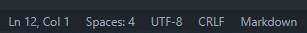

# VS Code

：Visual Studio Code
- 是微软于 2015 年发布的一款开源、轻量级的 IDE 。
- 支持运行在 Linux、Mac OS、Windows 上。
- 它本身像一个轻量级的文本阅读器，但可以通过安装插件扩展很多功能，比如搭建任意编程语言的开发环境、调整出美观的界面、配置各种快捷键。
- [官网](https://code.visualstudio.com/)

## 用法

- 在 VS Code 中打开一个项目目录，即可操作其下的文件。
- 界面的左侧显示了几个主要按钮，点击它们会显示不同内容的侧边栏：
  - Explorer ：显示项目目录的文件列表。
  - Search ：显示搜索栏。支持对项目目录下的所有文件进行全文搜索，支持替换、正则匹配。
  - Source Control ：显示 Git 的暂存区文件。
  - Run ：运行项目代码。可能需要配置合适的编译器、解释器。
  - Remote Explorer ：显示可用的远程开发环境。
  - Extensions ：显示插件列表。
- 状态栏的左下角包含几个按钮，比如切换 Git 分支、显示报错栏。
- 状态栏的右下角如下：
    
  - `Ln 12, Col 1` ：表示当前光标位于第 12 行、第 1 列。
  - `Spaces: 4` ：表示按下一个 Tab 键会输入 4 个空格。点击它可以设置空格数。
  - `UTF-8` ：表示当前文件的编码格式。点击它可以切换成其它编码格式。
  - `CRLF` ：表示当前文件的换行符风格。点击它可以改成 LF 风格。
  - `MarkDown` ：表示当前文件的语言。点击它可以切换成其它语言。

## 设置

- 点击页面左下角的齿轮按钮，即可打开设置页面。
- 可以进行全局设置，也可以只对某个项目进行设置。
- 如果对某个项目进行了个性化设置，则会在该项目的根目录下创建一个 .vscode 目录，用于保存设置信息。
- 建议的设置：
  - 在输入代码时时会自动弹出补全窗口，默认可以按 Tab 或 Enter 键进行补全，也可以按 Esc 键忽略。建议在设置中关闭 "Accept Suggestion On Enter" 选项，这样按 Enter 键的作用总是换行。
  - 设置切换行注释的快捷键为 `Ctrl + Q`，切换块注释的快捷键为`Ctrl + Shift + Q`，与 与 NotePad++ 的相应快捷键一致。
  - 启用 "Format On Type" 选项，允许在输入换行符时自动格式化代码。再设置手动格式化的快捷键为 `Alt + F`。

## 常用快捷键

- `F1` ：打开命令面板，用于快速执行一些命令。例如：
  - Fold All ：将代码块全部折叠。
  - Unfold All ：将代码块全部展开。
  - Trim Trailing Whitespace ：去掉每行末尾的空字符。
- ``Ctrl + ` `` ：打开终端。终端可以是 CMD、PowerShell、WSL 等类型。
- `F2` ：重命名光标所在的标识符。
- `F3` 或 `Ctrl + F` ：在当前文件中打开搜索栏。
- `F11` ：切换至全屏显示。
- `F12` ：转到光标所在的标识符的定义位置。
- `Alt + ↑/↓` ：向上、向下移动光标所在行或选中的多行。
- `Alt + ←/→` ：将光标切换到上一次、下一次编辑的位置，甚至可以切换到其它文件。
- 按住 `Alt` 时，可以用鼠标连续拖选多处文本，同时选中它们。
- 按住 `Shift` 时，可以按 `↑/↓` 键改变选中的文本范围。
- 选中一行或多行之后：
  - `Tab` ：向右移动文本，调整缩进。
  - `Shift + Tab` ：向左移动文本，调整缩进。
- `Ctrl + [/]` ：向左、向右移动文本，调整缩进。
- `Ctrl + Shift + [/]` ：折叠、展开代码块。
- `Ctrl + ←/→ `：以单词为单位左右移动光标。
- `Ctrl + Backspace/Delete` ：以单词为单位删除代码。
- `Shift + Enter`：在终端执行光标所在行或选中的内容，这便于调试执行 Python 等解释型语言的代码。

## 常用插件

- One Dark Pro ：提供几种界面主题。
- vscode-icon ：给不同类型的文件加上美观的图标。
- Align by RegEx ：用于自动添加空格以对齐多行中的某个字符，比如对齐注释符号 # 。
- Beautify ：用于格式化 JS、CSS、HTML 代码。
- Markdown Preview Enhance ：一个增强型的 Markdown 阅读器，支持实时预览、显示目录、导出成 HTML、PDF 等格式。
- Settings Sync ：通过 GitHub Gist 备份 VS Code 的主题、快捷键、插件等配置信息。
- Code Spell Checker ：检查单词拼写错误。建议将它禁用避免干扰，要检查时再启用。
- HexEditor ：用于按十六进制查看、编辑文件内容。

## 远程开发

VS Code 支持远程开发模式。
- 可以在本机的 VS Code 界面中打开其它主机上的文件目录，进行编辑、编译、调试等操作。
- 远程目录可以位于物理机、虚机，甚至 Docker 容器中。
- [官方教程](https://code.visualstudio.com/blogs/2019/05/02/remote-development)

## WSL

：Windows 的 Linux 子系统（Windows Subsystem for Linux）
- Windows 10 提供了 WSL 功能，用于在 Windows 中启动一个虚拟的 Linux 子系统。
  - 例如安装 Ubuntu 类型的 WSL 之后，在 CMD 命令行中执行 ubuntu 命令即可进入 shell 终端。
  - 启动只需要几秒，并且比虚拟机的开销小很多。
  - 兼容大部分的 Linux 接口，因此可以安装、运行大部分 Linux 程序。
  - 将 Windows 磁盘文件挂载在 /mnt/ 目录下，可以直接访问。
- WSL 2 比 WSL 1 的功能更强：
  - 具有完整的 Linux 内核，可以运行 Docker 容器。
  - 可以调用 Windows 程序。
- [官方文档](https://docs.microsoft.com/zh-cn/windows/wsl/)
