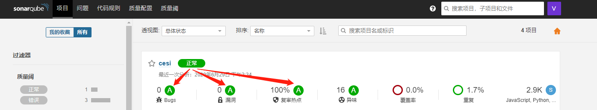

# SonarQube

：一个 Web 服务器，用于检查代码质量，采用 Java 开发。
- [官方文档](https://docs.sonarqube.org/latest/)
- 主要用于扫描静态代码，找出语法错误、漏洞、可优化之处。
- 支持扫描 C、C++、C#、Java、JavaScrip 等常见编程语言的代码。
- 采用 C/S 架构：
  - 先运行一个 SonarQube 服务器。
  - 然后执行一次 SonarScanner 扫描器，它会扫描代码，并上传到 SonarQube 服务器进行分析。
- 缺点：
  - 扫描的规则较少，有的语法错误都不会发现，有的无关紧要的问题也会报错。
  - 相同的问题会重复报错，导致报错很多。

## 部署

1. 配置以下内核参数：
    ```ini
    sysctl vm.max_map_count=262144
    sysctl fs.file-max=65536
    ```

2. 用 docker-compose 部署：
    ```yml
    version: "3"

    services:
      sonarqube:
        container_name: sonarqube
        image: sonarqube:9.4-community
        ports:
          - 9000:9000
        networks:
          - net
        environment:
          - sonar.jdbc.url=jdbc:postgresql://postgres:5432/sonarqube
          - sonar.jdbc.username=sonarqube
          - sonar.jdbc.password=******    # 密码
        volumes:
          - ./sonarqube/conf:/opt/sonarqube/conf
          - ./sonarqube/data:/opt/sonarqube/data
          - ./sonarqube/extensions:/opt/sonarqube/extensions
          - ./sonarqube/logs:/opt/sonarqube/logs

      postgres:
        container_name: postgres
        image: postgres:12
        networks:
          - net
        environment:
          - POSTGRES_USER=sonarqube
          - POSTGRES_PASSWORD=******    # 密码
          - POSTGRES_DB=sonarqube
        volumes:
          - ./postgres:/var/lib/postgresql/data

    networks:
      net:
    ```
    - 默认用户名、密码为 admin、admin 。
    - SonarQube 支持的外部数据库包括：Oracle、PostgreSQL、SQL Server 。如果不配置外部数据库，则默认会使用内置数据库，但不方便迁移数据、不支持版本更新。

## 用法

- 初次运行时的配置：
  1. 进入 Administration -> Security 页面，修改 admin 用户的密码，并取消 Anyone 用户组的访问权限。
  2. 进入 Administration -> Configuration -> Security 页面，勾选 "强制用户认证" ，从而禁止匿名用户访问。
  3. 进入 "配置（Administration）" -> "应用市场（Marketplace）" 页面，下载有用的插件。
    - 比如 "Chinese Pack" 插件可以汉化页面。
    - 下载插件之后，网页会提示需要重启服务器才能安装。

- 每个用户都可以在 SonarQube 首页看到所有项目。如下：

  

  - 每个项目都从 Bugs、漏洞、复审热点等多个方面进行了评分。
  - SonarQube 会根据 "质量阀" 判断项目是否 "正常" 。

- 点击项目的名字即可进入其详情页面，如下：

  

  - 在 "问题" 页面可以处理 Bugs、漏洞、异味，可以将它们的状态改为 "解决" 或 "标记为不会修复" 。
    - 如果关闭了所有严重的问题（允许存在次要问题），相关的评分就会变成 A 。
  - 在 "安全热点" 页面可以处理安全问题，可以将它们的状态改为 "已修复" 或 "安全"。
    - 如果关闭了所有的安全问题，项目的 "安全复审比率" 就会变成 100% ，评分为 A 。

## SonarScanner

### 基本用法

从 [官网](https://docs.sonarqube.org/latest/analysis/scan/sonarscanner/) 下载 SonarScanner 扫描器的发行版，或者运行 Docker 镜像：
```sh
docker run -it --rm \
    -v $PWD:/usr/src \
    sonarsource/sonar-scanner-cli:4.7.0 \
        -Dsonar.projectKey=test \                 # SonarQube 服务器上的项目名
        -Dsonar.projectBaseDir=. \                # 项目的根目录
        # -Dsonar.projectVersion=1.0 \            # 项目版本
        # -Dsonar.exclusions=dist \               # 不扫描这些目录
        # -Dsonar.sources=src,lib \               # 只扫描这些目录（必须在 projectBaseDir 之下）
        -Dsonar.sourceEncoding=UTF-8 \            # 源文件的编码格式
        -Dsonar.host.url=http://10.0.0.1:9000 \   # SonarQube 服务器的 URL
        -Dsonar.login=<token>                     # SonarQube 服务器上的用户密钥
        # -X                                      # 显示 DEBUG 信息
```
- 如果 SonarQube 服务器上不存在该项目，则会自动创建。
- 如果该项目的扫描结果没有通过质量阀（quality gate），则 sonar-scanner 命令的返回码为非 0 。

### Java 项目

如果项目包含 Java 代码：
- 不能直接扫描 .java 文件，需要先编译，再用 `-Dsonar.java.binaries=target` 命令选项指明 .class 文件的位置，不过这样手动操作很麻烦。
- 使用 Maven 3.x 时，可通过专用的 sonar-scanner 插件扫描，自动定位源文件和类文件，不过需要 JRE 11 。如下：
  ```sh
  docker run -it --rm \
      -v /root/.m2:/root/.m2 \
      -v $PWD:/app \
      --workdir /app \
      maven:3.8.4-jdk-8 \
      mvn clean compile

  docker run -it --rm \
      -v /root/.m2:/root/.m2 \
      -v $PWD:/app \
      --workdir /app \
      maven:3.8.4-jdk-11 \
      mvn sonar:sonar \                             # 不必配置 sonar.projectKey ，因为它会根据 pom.xml 自动配置
          -Dsonar.host.url=http://10.0.0.1:9000 \
          -Dsonar.login=<token>
  ```

### Jenkins 集成

在 Jenkins 上集成 SonarQube 的步骤：
1. 在 Jenkins 上安装 "SonarQube Scanner for Jenkins" 插件。
2. 在 Jenkins 的 "Configure System" 页面配置 "SonarQube servers" ，在 "Global Tool Configuration" 页面配置 "SonarQube Scanner" 。
3. 在 Pipeline 中按如下格式调用：
    ```groovy
    stage('SonarQube analysis') {
        steps{
            withSonarQubeEnv('SonarQube') {   // 输入已配置的 SonarQube 服务器的名称
                sh """
                    SONAR_SCANNER_OPTS="-Xmx1G"
                    /opt/sonar-scanner/bin/sonar-scanner \
                        -Dsonar.projectBaseDir=/root/django
                """
            }
        }
    }
    ```
    具体可参考官方教程：[SonarScanner for Jenkins](https://docs.sonarqube.org/latest/analysis/scan/sonarscanner-for-jenkins/)
