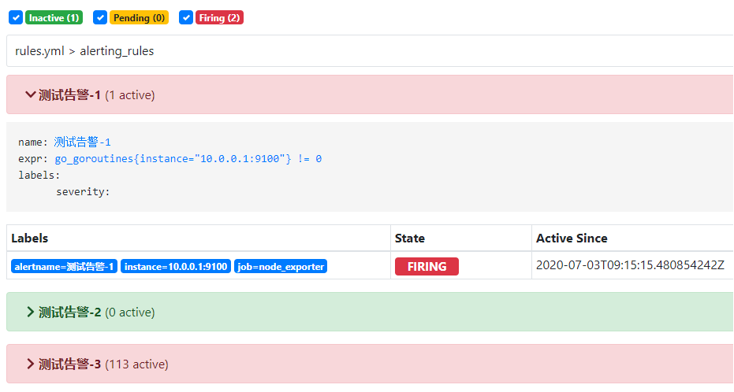
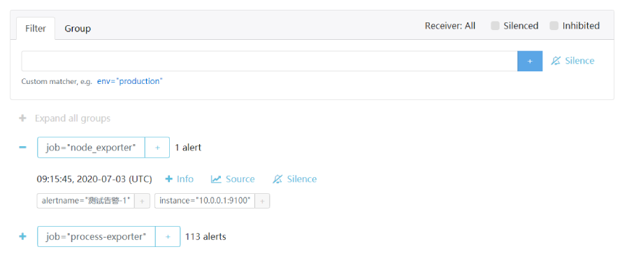

# Prometheus

：一个流行的监控系统，基于 Golang 开发。
- 源于 Google Borg 系统的监控系统，2016 年作为一个独立项目交给 CNCF 托管。
- 擅长从大量节点上采集指标数据，且提供了 Web 管理页面。
- [官方文档](https://prometheus.io/docs/introduction/overview/)
- 对比：
  - Zabbix 只擅长监控主机，而且配置比较繁琐。
  - Prometheus 可监控主机、进程、容器等多种对象，可扩展性高，而且自带查询语言，配置比较灵活。

## 安装

- 下载二进制版：
  ```sh
  wget https://github.com/prometheus/prometheus/releases/download/v2.18.1/prometheus-2.18.1.linux-amd64.tar.gz
  ```
  解压后启动：
  ```sh
  ./prometheus
              --config.file /etc/prometheus/prometheus.yml   # 使用指定的配置文件
              --storage.tsdb.retention 15d                   # TSDB 保存数据的最长时间（默认为 15 天）
              --web.listen-address '0.0.0.0:9090'            # 监听的地址
              --web.external-url 'http://10.0.0.1:9090'      # 供外部访问的 URL
              --web.enable-admin-api                         # 启用管理员的 HTTP API .比如删除 tsdb 的数据
              --web.enable-lifecycle                         # 启用 reload、quit 等 HTTP API
  ```

- 或者运行 Docker 镜像：
  ```sh
  docker run -d --name prometheus -p 9090:9090 \
          -v /etc/prometheus/prometheus.yml:/etc/prometheus/prometheus.yml \    # 挂载配置文件（可选项）
          prom/prometheus
  ```

## 示例

以下是用 Prometheus 监控自身的步骤：
1. 在 Prometheus 的配置文件中加入监控任务：
    ```yaml
    global:
      scrape_interval: 30s          # 每隔多久采集一次指标（这是全局值，可以被局部值覆盖）
      scrape_timeout: 10s           # 每次采集的超时时间
      evaluation_interval: 30s      # 每隔多久执行一次 rules
      # external_labels:            # 与 Alertmanager 等外部组件通信时，会加上这些标签
      #   monitor: 'codelab-monitor'

    # rule_files:                   # 导入 rule 文件
    # - rules_1.yml

    scrape_configs:
    - job_name: 'prometheus'
      static_configs:
      - targets: ['10.0.0.1:9090']
    ```

2. 重启 Prometheus 以重新加载配置文件，然后访问其 Web 页面。
   - 在 Status -> Targets 页面，可以看到所有监控对象及其状态。
   - 在 Graph 页面，执行一个查询表达式即可获得监控数据，比如 `go_goroutines` 。

## 架构

- 在每个监控对象的主机上运行一个负责采集监控指标的 HTTP 服务器作为 exporter 。
  - 向该 exporter 服务器发出 HTTP GET 请求，它就会按一种特定的文本格式输出监控指标。
  - exporter 只负责采集当前时刻的指标数据，不负责存储数据。

- Prometheus Server 会定时向各个 exporter 发出 HTTP 请求，获得指标数据，并存储到自己的时序数据库中。
  - 它属于离散采样，可能有遗漏、有延迟、有误差。
  - 数据默认保存在 `${prometheus}/data` 目录下，目录结构如下：
    ```
    data/
    ├── 01E728KFZWGDM7HMY6M2D26QJD/   # 一个 block 目录
    │   ├── chunks
    │   │   └── 000001                # 压缩后的数据，是二进制文件
    │   ├── index
    │   ├── meta.json
    │   └── tombstones
    ├── 01BKGTZQ1HHWHV8FBJXW1Y3W0K/
    ├── lock
    ├── queries.active
    └── wal/
        ├──00000003
        └──checkpoint.000002/
    ```
  - 最新获得的数据尚未写入 tsdb ，会暂时保存在 wal/ 目录下。此时还不算写入 Prometheus 的 tsdb 。
  - 每隔两个小时就会创建一个随机名字的 block 目录，将 wal/ 目录下的数据经过压缩之后保存到 xxx_block/chunks 目录下。此时才算写入 tsdb 。
  - 每过一段时间， block 目录还会被进一步压缩、合并。

- Prometheus 本身没有身份认证，不需要密码登录，不过可以用 Nginx 加上 HTTP Basic Auth ，或者通过防火墙只允许指定 IP 访问。
- Prometheus 的图表功能很少，建议将它的数据交给 Grafana 显示。
- Prometheus 及其插件都采用 UTC 时间，不支持修改时区。用户可以自行将查询结果中的时间字符串改成本地时区。

## 监控对象

用户必须在 Prometheus 的配置文件中配置需要监控的对象（称为 targets ），格式如下：
```yaml
scrape_configs:
- job_name: 'prometheus'            # 一项监控任务的名字（可以包含多组监控对象）
  # honor_labels: false
  # metrics_path: '/metrics'
  # scheme: http
  # scrape_interval: 30s
  # scrape_timeout: 10s
  static_configs:
  - targets:                        # 一组监控对象的 IP:Port
    - '10.0.0.1:9090'
    - '10.0.0.1:9091'
    # labels:                       # 为这些监控对象的数据加上额外的标签
    #   nodename: 'CentOS-1'
  - targets: ['10.0.0.2:9090']      # 下一组监控对象
  # basic_auth:
  #   username: <string>
  #   password: <string>
  # proxy_url:

- job_name: 'node_exporter'
  file_sd_configs:                  # 从文件读取配置（这样不必让 Prometheus 重新加载配置文件）
  - files:
    - targets/node_exporter*.json
    refresh_interval: 1m            # 每隔 1m 重新读取一次
```
- Prometheus 从每个监控对象处抓取指标数据时，默认会自动加上 `job: "$job_name"`、`instance: "$target"` 两个标签。
  还会自动记录以下指标：
  ```sh
  up{job="$job_name", instance="$target"}                       # 该监控对象是否在线（取值 1、0 分别代表在线、离线）
  scrape_samples_scraped{job="$job_name", instance="$target"}   # 本次抓取的指标数
  scrape_duration_seconds{job="$job_name", instance="$target"}  # 本次抓取的耗时
  ```
- 给抓取的指标添加标签时，如果原指标中已存在同名 label ，则根据 honor_labels 的值进行处理：
  - `honor_labels: false` ：默认值，将原指标中的同名 label 改名为 `exported_<label_name>` ，再添加新标签。
  - `honor_labels: true` ：保留原指标不变，不添加新标签。
- 考虑到监控对象的 IP 地址不方便记忆，而且可能变化，应该添加 nodename 等额外的标签便于筛选。
- 通过 file_sd_configs 方式读取的文件可以是 YAML 或 JSON 格式，如下：
  ```yaml
  - targets:
    - '10.0.0.1:9090'
    labels:
      nodename: 'CentOS-1'
  - targets:
    - '10.0.0.2:9090'
    labels:
      nodename: 'CentOS-2'
  ```
  ```json
  [{
      "targets": [
          "10.0.0.1:9100"
      ],
      "labels": {
          "nodename": "CentOS-1"
      }
  }, {
      "targets": [
          "10.0.0.2:9100"
      ],
      "labels": {
          "nodename": "CentOS-2"
      }
  }]
  ```

## 指标

- 每条指标数据是如下格式的字符串：
    ```sh
    <metric_name>{<label_name>=<label_value>, ...}     metric_value
    ```
  例如：
    ```sh
    go_goroutines{instance="10.0.0.1:9090", job="prometheus"}    80
    ```
  - metric_name 必须匹配正则表达式 `[a-zA-Z_:][a-zA-Z0-9_:]*` ，一般通过 Recording Rules 定义的指标名称才包含冒号 : 。
  - 标签（label）的作用是便于筛选指标。
  - label_value 可以包含任意 Unicode 字符。

- 根据用途的不同对指标分类：
  - Counter ：计数器，数值单调递增。
  - Gauge ：仪表，数值可以任意加减变化。
  - Histogram ：直方图。将时间平均分成一段段区间，将每段时间内的多个采样点取平均值再返回（由 Server 计算），相当于从散点图变成直方图。例如：
    - `prometheus_http_request_duration_seconds_count{}  10` 表示 HTTP 请求的样本总数有 10 个。
    - `prometheus_http_request_duration_seconds_sum{}  0.1` 表示 HTTP 请求的耗时总和为 0.1s 。
    - `prometheus_http_request_duration_seconds_bucket{le="60"}  10` 表示 HTTP 请求中，耗时低于 60s 的有 10 个。
  - Summary ：汇总。将所有采样点按数值从小到大排列，然后返回其中几个关键位置的采样点的值（由 exporter 计算），相当于正态分布图。例如：
    - `..._count`
    - `..._sum`
    - `http_request_duration_microseconds{handler="prometheus",quantile="0.5"}  3246.518` 表示 HTTP 请求中，排在 50% 位置处的耗时（即中位数）。
    - `http_request_duration_microseconds{handler="prometheus",quantile="0.9"}  3525.421` 表示 HTTP 请求中，排在 90% 位置处的耗时。
    - `http_request_duration_microseconds{handler="prometheus",quantile="0.99"}  3657.138` 表示 HTTP 请求中，排在 99% 位置处的耗时。

- 根据是否随时间变化对指标分类：
  - 标量（scalar）：包含一个或一些散列的值。
  - 矢量（vector）：包含一系列随时间变化的值。
    - 一个矢量由 n≥1 个时间序列组成，显示成曲线图时有 n 条曲线，在每个时刻处最多有 n 个数据点（又称为元素），不过也可能缺少数据点（为空值）。

## 查询

- Prometheus 提供了一种查询语言 PromQL ，使得用户可以通过一个查询表达式，就查询到指标数据，还可以进行加工计算。
  - 用户在 Graph 页面执行一个查询表达式之后，默认会将查询到的数据显示成表格（Table），用户也可以切换显示成曲线图（Graph）。
  - 显示曲线图的开销要大得多，可能会导致 Web 页面卡顿。
  - 大部分标量都不支持显示成曲线图。

- 查询表达式中，选取指标的语法如下：
  ```sh
  go_goroutines                                   # 查询具有该名称的指标
  {job="prometheus"}                              # 查询具有该标签值的指标
  {__name__="go_goroutines", job='prometheus'}    # 通过内置的 __name__ 标签，可以匹配指标名

  go_goroutines{job="prometheus"}                 # 查询该名称、该标签值的指标
  go_goroutines{job!="prometheus"}                # 要求具有 job 标签，且值不等于 prometheus
  go_goroutines{job=""}                           # 要求 job 标签的值为空字符串（这等价于不具有 job 标签）
  go_goroutines{job!=""}                          # 要求具有 job 标签且值不为空
  go_goroutines{job=~`prometheu\w`}               # 要求标签的值匹配正则表达式
  go_goroutines{job!~`prometheu\w`}               # 要求标签的值不匹配正则表达式

  go_goroutines{job="prometheus"}[1m]             # 查询 1 分钟以内的数据
  go_goroutines{job="prometheus"}[30m:1m]         # 查询 30 分钟以内、1 分钟以前的数据

  go_goroutines{job="prometheus"} offset 1m       # 相当于在 1 分钟之前查询
  sum(go_goroutines{job="prometheus"} offset 1m)  # 使用函数时，offset 符号要放在函数括号内
  ```
  - 用 # 声明单行注释。
  - 将字符串用反引号包住时，不会让反斜杠转义。
  - 查询表达式不能为空的 `{}` ，同理也不能使用 `{__name__=~".*"}` 选中所有指标。

- 可以使用以下时间单位：
  - s ：秒
  - m ：分钟
  - h ：小时
  - d ：天
  - w ：周
  - y ：年

### 运算符

- 可以进行如下算术运算：
  ```sh
  go_goroutines + 1   # 加
  1 - 2               # 减
  1 * 2               # 乘
  1 / 3               # 除法（小数点后会保留十多位）
  1 % 3               # 取模
  2 ^ 3               # 取幂
  ```
  - 只能对指标的值进行运算，不能对标签的值进行运算。

- 可以进行如下比较运算：
  ```sh
  go_goroutines == 2
  go_goroutines != 2
  go_goroutines > 2       # 返回大于 2 的部分曲线
  go_goroutines < 2
  go_goroutines >= 2
  go_goroutines <= 2
  ```
  - 比较运算默认是过滤掉不符合条件的数据。
  - 如果在比较运算符之后加上关键字 bool ，比如 `1 == bool 2` ，就会返回比较运算的结果，用 1、0 分别表示 true、flase 。

- 矢量之间可以进行如下集合运算：
  ```sh
  go_goroutines{job='prometheus'} and go_goroutines                       # 交集（返回两个矢量中标签列表相同的时间序列，取第一个矢量中的值）
  go_goroutines{job='prometheus'} or go_goroutines{job='prometheus'}      # 并集（将两个矢量中的所有时间序列合并，如果存在标签列表重复的时间序列，则取第一个矢量中的值）
  go_goroutines{job='prometheus'} unless go_goroutines{job!='prometheus'} # 补集（返回在第一个矢量中存在、但在第二个矢量中不存在的时间序列）
  ```

- 运算符的优先级从高到低如下，同一优先级的采用左结合性：
  ```sh
  ^
  * /  %
  + -
  == != <= < >= >
  and unless
  or
  ```

- 矢量之间进行运算时，默认只会对两个矢量中标签列表相同的时间序列（即标签名、标签值完全相同）进行运算。如下：
  ```sh
  go_goroutines - go_goroutines
  go_goroutines{instance="10.0.0.1:9100"} - go_goroutines                            # 两个矢量中存在匹配的时间序列，可以进行运算
  go_goroutines{instance="10.0.0.1:9100"} - go_goroutines{instance="10.0.0.2:9100"}  # 两个矢量中不存在匹配的时间序列，因此运算结果为空
  go_goroutines{instance="10.0.0.1:9100"} - go_gc_duration_seconds_sum{instance="10.0.0.1:9100"}  # 指标名不同，但标签列表相同，依然可以运算
  ```
  可以按以下格式，对只有部分标签匹配的时间序列进行运算：
  ```sh
  go_goroutines{instance="10.0.0.1:9100"} - on(job) go_goroutines{instance="10.0.0.2:9100"}             # 只考虑 job 标签，则能找到匹配的时间序列
  go_goroutines{instance="10.0.0.1:9100"} - ignoring(instance) go_goroutines{instance="10.0.0.2:9100"}  # 忽略 instance 标签，则能找到匹配的时间序列
  ```
  以上只是对时间序列进行一对一匹配，可以按下格式进行一对多的匹配：
  ```sh
  go_goroutines - on() group_left vector(1)   # 不考虑任何标签，用右边的一个时间序列匹配左边的多个时间序列，分别进行运算，相当于 go_goroutines - 1
  vector(1) + on() group_right go_goroutines  # group_right 表示用左边的一个时间序列匹配右边的多个时间序列，group_left 则相反
  ```

### 函数

- 矢量与标量的转换：
  ```sh
  vector(1)                             # 输入标量，返回一个矢量
  scalar(vector(1))                     # 输入一个单时间序列的矢量，以标量的形式返回当前时刻处的值
  ```

- 关于时间：
  ```sh
  time()                                # 返回当前的时间戳（标量），单位为秒
  timestamp(vector(1))                  # 返回矢量中每个数据点的时间戳（矢量）
  ```

- 关于排序：
  ```sh
  sort(go_goroutines)                   # 升序排列
  sort_desc(go_goroutines)              # 降序排列
  ```
  - 排序时，先将所有时间序列按照指标的名称进行排序；如果指标的名称相同，则按照第一个标签的值进行排序；如果第一个标签的值相同，则按照第二个标签的值进行排序，以此类推。
  - 在 Prometheus 中进行查询时，默认返回的时间序列会用 sort() 进行排序。如果用 by、without、on、ignoring 处理，则会按剩下的第一个标签的值进行排序。

- 修改矢量的标签：
  ```sh
  label_join(go_goroutines, "new_label", ",", "instance", "job")               # 给矢量 go_goroutines 添加一个标签，其名为 new_label ，其值为 instance、job 标签的值的组合，用 , 分隔
  label_replace(go_goroutines, "new_label", "$1-$2", "instance", "(.*):(.*)")  # 给矢量 go_goroutines 添加一个标签，其名为 new_label ，其值为 instance 标签的值的正则匹配的结果
  ```

- 矢量可以使用以下算术函数：
  ```sh
  abs(go_goroutines)                    # 返回每个时刻处，数据点的绝对值
  round(go_goroutines)                  # 返回每个时刻处，数据点四舍五入之后的整数值
  absent(go_goroutines)                 # 在每个时刻处，如果矢量为空（不存在任何数据点），则返回 1 ，否则返回空值
  absent_over_time(go_goroutines[1m])   # 在每个时刻处，如果过去 1m 以内矢量一直为空，则返回 1 ，否则返回空值
  changes(go_goroutines[1m])            # 返回每个时刻处，最近 1m 以内的数据点变化的次数
  delta(go_goroutines[1m])              # 返回每个时刻处，该数据点减去 1m 之前数据点的差值（可能为负），适合计算变化量
  idelta(go_goroutines[5m])             # 返回每个时刻处，过去 1m 以内最后两个数据点的差值（可能为负），适合计算瞬时变化量
  ```
  以下算术函数适用于计数器类型的矢量：
  ```sh
  resets(go_goroutines[1m])             # 返回每个时刻处，过去 1m 以内计数器重置（即数值减少）的次数
  increase(go_goroutines[1m])           # 返回每个时刻处，过去 1m 以内的数值增量（时间间隔越短，曲线高度越低）
  rate(go_goroutines[1m])               # 返回每个时刻处，过去 1m 以内的每秒平均增长率（时间间隔越长，曲线越平缓）
  irate(go_goroutines[5m])              # 返回每个时刻处，过去 1m 以内最后两个数据点之间的每秒平均增长率（曲线比较尖锐，接近瞬时值）
  ```
  - 如果矢量包含多个时间序列，算术函数会分别对这些时间序列进行运算，而聚合函数会将它们合并成一个或多个时间序列。
  - 使用算术函数时，时间间隔 `[t]` 必须要大于矢量的采样间隔，否则计算结果为空。
  - 例如：正常情况下 node_time_seconds 的值是每秒加 1 ，因此不论 scrape_interval 的取值为多少，
    - delta(node_time_seconds[1m]) 计算得到的每个数据点的值都是 60 。
    - rate(node_time_seconds[1m]) 每个点的值都是 1 。
    - irate(node_time_seconds[1m]) 每个点的值也都是 1 。
      因为 node_time_seconds 匀速增长，所以 irate() 与 rate() 的计算结果近似。
    - 如果 scrape_interval 为 30s ，则 idelta(node_time_seconds[1m]) 计算得到的每个数据点的值都是 30 。

  - increase() 实际上是 rate() 乘以时间间隔的语法糖。
  - 如果矢量为单调递增，则 delta() 与 increase() 的计算结果相同。
    但是如果时间间隔 `[t]` 不比 scrape_interval 大几倍，则 delta() 和 increase() 的计算结果会比实际值偏大。
  - 如果矢量的单调性变化，则 delta() 的计算结果可能为负，可以只取 >= 0 部分的值。
    而 rate() 只会计算出第一段单调递增部分的增长率 k ，然后认为该矢量在 t 时间内的增量等于 k × t ，最终得到的 increase() 值比 delta() 大。
  - idelta、irate 应该尽量使用大一些的时间间隔，因为时间间隔过大时不影响计算精度，但时间间隔过小时可能缺少数据点。

- 矢量可以使用以下聚合函数：
  ```sh
  count(go_goroutines)                  # 返回每个时刻处，该矢量包含的数据点的数量（即包含几个时间序列）
  count_values("value", go_goroutines)  # 返回每个时刻处，各种值的数据点的数量，并按 {value="x"} 的命名格式生成多个时间序列
  sum(go_goroutines)                    # 返回每个时刻处，所有数据点的总和（即将曲线图中所有曲线叠加为一条曲线）
  min(go_goroutines)                    # 返回每个时刻处，数据点的最小值
  max(go_goroutines)                    # 返回每个时刻处，数据点的最大值
  avg(go_goroutines)                    # 返回每个时刻处，数据点的平均值
  stdvar(go_goroutines)                 # 返回每个时刻处，数据点之间的标准方差
  topk(3, go_goroutines)                # 返回每个时刻处，最大的 3 个数据点
  bottomk(3, go_goroutines)             # 返回每个时刻处，最小的 3 个数据点
  quantile(0.5, go_goroutines)          # 返回每个时刻处，大小排在 50% 位置处的数据点
  ```
  - 聚合函数默认不支持输入有限时间范围内的矢量，需要使用带 _over_time 后缀的函数，如下：
    ```sh
    sum_over_time(go_goroutines[1m])    # 返回每个时刻处，过去 1m 内数据点的总和（分别计算每个时间序列）
    avg_over_time(go_goroutines[1m])    # 返回每个时刻处，过去 1m 内的平均值
    ```
  - 聚合函数可以与关键字 by、without 组合使用，如下：
    ```sh
    sum(go_goroutines) by(job)          # 将所有曲线按 job 标签的值分组，分别执行 sum() 函数
    sum(go_goroutines) without(job)     # 将所有曲线按除了 job 以外的标签分组，分别执行 sum() 函数
    sum(go_goroutines) by(Time)         # Time 是隐式 label ，这里相当于 sum(go_goroutines)
    ```

## Rules

- 规则分为两类：
  - Recording Rules ：用于将某个查询表达式的结果保存为新指标。这样可以避免在用户查询时才计算，减少开销。
  - Alerting Rules ：用于在满足某个条件时进行告警。（它只是产生警报，需要由 Alertmanager 加工之后转发给用户）
- 用户可以导入自定义的 rules.yml 文件，格式如下：
  ```yaml
  groups:
  - name: recording_rules               # 规则组的名称
    # interval: 15s                     # 每隔多久执行一次该 rules
    rules:
    - record: go_goroutines:sum_by_job  # 定义一个新指标
      expr: sum(go_goroutines) by (job) # 查询表达式

  - name: alerting_rules                # 规则组的名称
    rules:
    - alert: 测试告警-1                  # 定义一个告警规则
      expr: go_goroutines > 100         # 设置告警条件（只要表达式的执行结果是矢量，就会报警）
      for: 5m                           # 连续满足条件 5 分钟之后才告警
      # labels:
      #   severity: error
      annotations:
        summary: "节点地址：{{$labels.instance}}, 协程数：{{$value}}"
  ```
  - 可以重复定义同样内容的 rule ，但最终输出时，多个重复的数据会合并为一个。
  - Prometheus 会在每次抓取指标时自动检查一次 Alerting Rules ，因此不需要设置 interval 。
  - 默认会将 expr 计算结果中的所有 label 添加到告警信息中。
    - 可以通过 labels 子句添加一些标签到告警信息中，但是如果与已有的 label 重名则不会生效。
    - 可以通过 annotations 子句添加一些标签作为注释。
    - 给这些标签赋值时允许引用变量（基于 Golang 的模板语法）。
  - 上例中，最终生成的警报包含以下信息：
    ```json
    {
        "status": "firing",
        "labels": {
            "alertname": "进程数归零",
            "instance":"10.0.0.1:9090",
            "job":"prometheus",
        },
        "annotations": {
            "summary":"节点地址：10.0.0.1:9090, 协程数：90",
        },
        "startsAt": "2020-07-09T01:23:22.627587301Z",
        "endsAt": "0001-01-01T00:00:00Z"
    }
    ```
  - 当异常开始时，Prometheus 会产生 `"status": "firing"` 的警报；当异常结束时，还会产生 `"status": "resolved"` 的警报。
    - 在 fring 类型的警报中，"endsAt" 是无意义的值，比如 "0001-01-01T00:00:00Z" 。
    - 在 resolved 类型的警报中，才会给 "endsAt" 设置有意义的值。

- 在 Web 页面上可以看到 Alerting Rules 的状态：
  - 不满足告警条件时，属于 Inactive 状态。
  - 满足告警条件时，属于 Active 状态。
    - 如果不超过阙值时间，则属于 Pending 状态。
    - 如果超过阙值时间，则属于 Firing 状态。

## API

- 管理 Prometheus 的 HTTP API ：
  ```sh
  GET /-/healthy     # 用于健康检查，总是返回 Code 200
  GET /-/ready       # 返回 Code 200 则代表可以处理 HTTP 请求
  POST /-/reload     # 重新加载配置文件
  POST /-/quit       # 终止
  ```
- 关于数据的 API ：
  ```sh
  GET /api/v1/query?query=go_goroutines{instance='10.0.0.1:9090'}&time=1589241600               # 查询 query 表达式在指定时刻的值（不指定时刻则为当前时刻）  
  GET /api/v1/query_range?query=go_goroutines{instance='10.0.0.1:9090'}&start=1589241600&end=1589266000&step=1m  # 查询一段时间内的所有值
  POST /api/v1/admin/tsdb/delete_series?match[]=go_goroutines&start=1589241600&end=1589266000   # 删除数据（不指定时间则删除所有时间的数据）
  POST /api/v1/admin/tsdb/clean_tombstones                                                      # 让 TSDB 立即释放被删除数据的磁盘空间
  ```
  data/wal/ 目录下缓存的数据不会被删除，因此即使删除 tsdb 中的所有数据， Prometheus 依然会自动从 data/wal/ 目录加载最近的部分数据。

## 分布式部署

- Prometheus 支持抓取其它 Prometheus 的数据，因此可以分布式部署。
- 不过只能抓取当前时刻的数据， 就像抓取一般的 exporter 。
- 在配置文件中按如下格式定义一个 job ，即可抓取其它 Prometheus 的数据：
    ```yaml
    scrape_configs:
    - job_name: 'federate'
      honor_labels: true              # 设置 true ，以保存原指标中的 job 、instance 标签
      metrics_path: '/federate'
      params:
        'match[]':                    # 抓取匹配这些表达式的指标
          - '{__name__=~"go_.*"}'
          - 'go_goroutines'
      static_configs:
        - targets:                    # 目标 Prometheus 的地址
          - '10.0.0.2:9090'
          - '10.0.0.3:9090'
    ```

## Pushgateway

：作为一个 HTTP 服务器运行，允许其它监控对象主动推送数据到这里，相当于一个缓存，可以被 Prometheus 定时拉取。
- [GitHub 页面](https://github.com/prometheus/pushgateway)
- 优点：
  - 不需要保持运行一个 exporter 进程。
  - 允许 exporter 与 Prometheus 异步工作。
  - 提供了 Web 页面，可以查看其状态。
- 缺点：
  - 不能控制监控对象生成指标的间隔时间。
  - 只会抓取当前时刻的数据，不会同步历史数据。并且，如果监控对象离线，依然会将最后一次抓取的数据作为当前值。
  - 不能直接判断监控对象是否在线，需要根据 push_time_seconds 进行判断。
  - Pushgateway 不会保存指标数据，重启后会丢失。
- 下载后启动：
  ```sh
  ./pushgateway
                --web.listen-address 0.0.0.0:9091    # 设置监听的地址
                --persistence.file  metrics.bak      # 将指标数据备份到该文件中（默认不会备份，因此重启后会丢失）
  ```
  默认的访问地址为 <http://localhost:9091>
- 在 Prometheus 的配置文件中加入如下配置，使其抓取 Pushgateway ：
  ```yaml
  scrape_configs:
  - job_name: 'pushgateway'
    honor_labels: true
    static_configs:
    - targets:
      - '10.0.0.1:9091'
  ```
- 例：推送指标到 Pushgateway
  ```sh
  cat <<EOF | curl --data-binary @- http://localhost:9091/metrics/job/pushgateway/instance/10.0.0.1
  # TYPE test_metric gauge
  # HELP test_metric Just an example.
  test_metric{name="one"} 42
  EOF
  ```
  - Pushgateway 会将收到的指标按 job、instance 的值进行分组。
    - 如果 URL 中不指定 job ，则会报错 404 。
    - 如果 URL 中不指定 instance ，则会默认设置为 instance="" 。
  - 指标中：
    - `# TYPE <metric_name> <type>` 行必须存在，用于声明该指标的类型。
    - `# HELP <metric_name> <comment>` 行不是必要的，用作该指标的注释。
    - 每行末尾要有换行符，最后一行也需要换行。

- 推送之后，Pushgateway 会记录以下指标：
  ```sh
  test_metric{job="pushgateway", instance="10.0.0.1", name="one"}  42               # 该 metric 最后一次推送的值
  push_failure_time_seconds{job="pushgateway", instance="10.0.0.1"}  0              # 该组 metric 最后一次失败推送的时间戳
  push_time_seconds{job="pushgateway", instance="10.0.0.1"}  1.5909774528190377e+09 # 该组 metric 最后一次成功推送的时间戳
  ```
  重复推送 test_metric 指标时，只会更新这三个指标的值，不会保留旧值。

- 常用 API ：
  ```sh
  curl -X DELETE http://localhost:9091/metrics/job/pushgateway/instance/10.0.0.1      # 删除某个指标
  ```

## Alertmanager

：作为一个 HTTP 服务器运行，用于将 Prometheus 产生的警报加工之后转发给用户。
- 优点：
  - Prometheus 产生的警报是 JSON 格式的信息，Alertmanager 可以对它们进行分组管理，加工成某种格式的告警消息，再转发给用户。
  - 配置比较麻烦但是很灵活。
  - 可以在 Web 页面上搜索警报、分组管理。
- 缺点：
  - 只能查看当前存在的警报，不能查看已发送的历史消息。
- [GitHub 页面](https://github.com/prometheus/alertmanager)

### 部署

- 下载后启动：
  ```sh
  ./alertmanager --config.file=alertmanager.yml
                # --web.listen-address "0.0.0.0:9093"         # 监听的地址
                # --web.external-url 'http://10.0.0.1:9093'   # 供外部访问的 URL
                # --cluster.listen-address "0.0.0.0:9094"     # 集群监听的地址（默认开启）
                # --data.retention 120h                       # 将数据保存多久
  ```
  默认的访问地址为 <http://localhost:9093>

### 原理

一般的工作流程：
1. Prometheus 每隔 interval 时长执行一次 alert rule 。如果执行结果包含 n 个时间序列，则认为存在 n 个警报，通过 HTTP 通信发送 alerting 状态的消息给 Alertmanager 。
2. Alertmanager 收到之后，
   - 先根据 route 判断它属于哪个 group 、应该发送给哪个 receiver 。
   - 再判断该 group 当前是否处于冷却阶段、是否被 Silence 静音、是否被 Inhibit 抑制。如果都没有，则立即发送告警消息给用户。
3. 如果 Prometheus 再次执行 alert rule 时，发现执行结果为空，则认为警报已解决，立即产生 resolved 状态的消息，发送给 Alertmanager 。
4. Alertmanager 收到之后，立即发送给用户。

- 如果一个指标不再满足告警条件，或者 Prometheus 不再抓取相应的指标，或者不再执行相应的 alert rule ，都会让 Prometheus 认为该警报已解决，产生一个 resolved 状态的消息，发送给 Alertmanager 。
- 目前在 Prometheus 端并不能控制是否产生 resolved 消息，只能在 Alertmanager 端控制是否发送 resolved 消息。

其它概念：
- Filter
  - ：通过 label=value 的形式筛选警报。
  - 它方便在 Web 页面上进行查询。
- Group
  - ：根据 label 的值对警报进行分组。
  - 它需要在配置文件中定义，但也可以在 Web 页面上临时创建。
- Silence
  - ：不发送某个或某些警报，相当于静音。
  - 它需要在 Web 页面上配置，且重启 Alertmanager 之后不会丢失。
- Inhibit
  - ：用于设置多个警报之间的抑制关系。当发出某个警报时，使其它的某些警报静音。
  - 它需要在配置文件中定义。
  - 被静音、抑制的警报不会在 Alertmanager 的 Alerts 页面显示。

常用的 HTTP API ：
```sh
GET /-/healthy     # 用于健康检查，总是返回 Code 200
GET /-/ready       # 返回 Code 200 则代表可以处理 HTTP 请求
POST /-/reload     # 重新加载配置文件
```

### 示例

Prometheus 的 Alerts 页面示例：



- 上图中，处于 Inactive、Pending、Firing 状态的 alerting_rule 分别总共有 1、0、2 个。
- rules.yml 文件中定义了三条 alerting_rule 。
  - 第一条 alerting_rule 名为 “测试告警-1” ，包含 1 个 active 的警报。
    - 每个警报源自一个满足 alerting_rule 的时间序列。
    - Active Since 表示警报从什么时候开始存在，即进入 pending 状态的时刻。如果警报中断，则会刷新该时刻。
  - 第三条 alerting_rule 名为 “测试告警-3” ，包含 113 个 active 状态的警报。

Alertmanager 的 Alerts 页面示例：



- 上图中存在两个 group ：
  - 第一个 group 是 job="node_exporter" ，包含 1 个警报。
  - 第二个 group 是 job="process-exporter" ，包含 113 个警报。
- 上图中存在一个 instance="10.0.0.1:9100" 的警报：
  - 09:15:45 UTC 表示该警报的产生时刻，即在 Prometheus 那边变成 Firing 状态的时刻。重启 Alertmanager 也不会影响该时刻。
  - 点击 Info 会显示该警报的详细信息。
  - 点击 Source 会跳转到 Prometheus ，查询该警报对应的指标数据。
  - 点击 Silence 可以静音该警报。

### 配置

使用 Alertmanager 时，需要在 Prometheus 的配置文件中加入如下配置，让 Prometheus 将警报转发给它处理。
```yaml
alerting:
  alertmanagers:
  - static_configs:
    - targets:
      - '10.0.0.1:9093'
```

alertmanager.yml 的配置示例：
```yaml
global:                           # 配置一些全局参数
  # resolve_timeout: 5m           # 如果 Alertmanager 收到的警报 JSON 中不包含 EndsAt ，则超过该时间之后就认为该警报已解决
  smtp_smarthost: 'smtp.exmail.qq.com:465'
  smtp_from: '123456@qq.com'
  smtp_auth_username: '123456@qq.com'
  smtp_auth_password: '******'
  smtp_require_tls: false

receivers:                        # 定义告警消息的接受者
- name: 'email_to_leo'
  email_configs:                  # 只配置少量 smtp 参数，其余的参数则继承全局配置
  - to: '123456@qq.com'
    send_resolved: true           # 是否在警报消失时发送 resolved 状态的消息
  # - to: '123456@163.com'        # 可以指定多个发送目标
- name: 'webhook_to_leo'
  webhook_configs:
  - url: 'http://localhost:80/'

route:
  receiver: 'email_to_leo'

# templates:                      # 从文件中导入自定义的消息模板
#   - templates/*.tmpl

# inhibit_rules:
#   - ...
```

### route

route 块定义了分组处理警报的规则，如下：
```yaml
route:
  receiver: 'email_to_leo'        # 只能指定一个接收方
  group_wait: 1m
  group_interval: 1m
  repeat_interval: 24h
  group_by:                       # 根据标签的值对已匹配的警报进行分组（默认不会分组）
    - alertname
  routes:
  - receiver: 'webhook_to_leo'
    # group_by:
    #   - alertname
    match:                        # 符合这些 label:value 条件的警报才算匹配
      job: prometheus
    match_re:                     # value 采用正则匹配
      job: prometheus|grafana
      instance: 10.0.0.*
    # continue: false
  - receiver: 'xxx'
    ...
```
- 上例中的大部分参数都不是必填项，最简单的 route 块如下：
  ```yaml
  route:
    receiver: 'email_to_leo'
  ```
- 配置文件中必须要定义 route 块，其中至少要定义一个 route 节点，称为根节点。
  - 在根节点之下可以定义任意个嵌套的 route 块，构成一个树形结构的路由表。
  - 子节点会继承父节点的所有参数值，作为自己的默认值。
- Alertmanager 每收到一个警报时，会从根节点往下逐个尝试匹配。
  - 如果当前节点匹配：
    - 如果子节点不匹配，则交给当前节点处理。
    - 如果子节点也匹配，则交给子节点处理。（相当于子节点覆盖了父节点）
    - 如果配置了 `continue: true` ，则还会继续尝试匹配之后的同级节点。否则结束匹配，退出路由表。
  - 如果当前节点不匹配，则会继续尝试匹配之后的同级节点。
  - 警报默认匹配根节点。因此，如果所有节点都不匹配，则会交给根节点处理。
- Alertmanager 以 group 为单位发送告警消息。
  - 每次发送一个 group 的消息时，总是会将该 group 内现有的所有警报合并成一个告警消息，一起发送。
  - 当一个 group 中出现第一个警报时，会先等待 `group_wait` 时长再发送该 group 。
    - 延长 group_wait 时间有利于收集属于同一 group 的其它警报，一起发送。
  - 当一个 group 的警报一直存在时，要至少冷却 `repeat_interval` 时长才能重复发送该 group 。
    - 实际上，是要求当前时刻与上一次发送时刻的差值大于 repeat_interval 。
      因此，即使重启 Alertmanager ，也不会影响 repeat_interval 的计时。
      不过，在配置文件中修改 group_wait、repeat_interval 等参数的值时，会立即生效。
  - 当一个 group 处于冷却阶段时：
    - 如果收到一个属于该 group 的新警报，则会等待 `group_interval` 时长之后让该 group 解除冷却，发送一次消息，并且从当前时刻开始重新计算 repeat_interval 。
    - 如果一个警报被解决了，也会让该 group 解除冷却，发送一次 resolved 消息。
    - 如果一个被解决的警报再次出现，也会让该 group 解除冷却，发送一次消息。
    - 因此，如果一个警报反复被解决又再次出现，则会绕过 repeat_interval 的限制，导致 Alertmanager 频繁发送消息给用户。

特殊情况：
- 假设 Prometheus 与 Alertmanager 正常连接，且存在一些警报：
  - 如果两者断开连接，则大概两分钟之后 Alertmanager 会自行认为所有警报已解决，发送 resolved 状态的消息给用户。
  - 如果两者重新连接，则 Alertmanager 会认为这些警报的 group 是新出现的，立即发送 alerting 状态的消息给用户。
  - 因此，如果两者反复断开连接又重新连接，则会绕过 repeat_interval 的限制，导致 Alertmanager 频繁发送消息给用户。
- 假设一个新警报出现，Alertmanager 正常地发送一次告警消息给用户。
  - 如果此时用 Silence 隐藏该警报，则 Alertmanager 的首页上不会显示该警报，但并不会发送 resolved 消息给用户。
  - 如果接着在 Prometheus 端解决该警报，则 Alertmanager 也不会发送 resolved 消息。
  - 如果接着取消 Silence ，则 Alertmanager 依然不会发送 resolved 消息。

### inhibit_rules

例：
```yaml
inhibit_rules:
- source_match:
    severity: error
  target_match:
    severity: warn
  equal:
  - alertname
  - instance
- source_match:
    alertname: target 离线
    job: node_exporter
  target_match:
  equal:
  - nodename
```
- 工作原理： Alertmanager 会先根据 source_match 指定的 label:value 选中一些警报，再根据 target_match 选中一些警报。如果 source 警报存在，则抑制与它 equal 标签值相同的 target 警报。
  - 如果改为 source_match_re、target_match_re ，则是对 label 的 value 进行正则匹配。
  - 如果 source_match、target_match 列表为空，则是选中所有警报。
  - 如果 equal 列表为空，或者 source 警报与 target 警报都不具有 equal 标签（此时相当于它们的该标签值都为空），则抑制所有 target 警报。
  - 如果 target 警报与 source 警报相同，并不会抑制 source 警报本身。
- 上例中，第一条抑制规则的作用是：当出现 severity 为 error 的警报时，抑制与它同类型、但 severity 为 warn 的其它警报。
- 上例中，第二条抑制规则的作用是：当某个主机离线时，抑制该主机的其它警报。

## exporter

- [官方的 exporter 列表](https://prometheus.io/docs/instrumenting/exporters/) 
- 主流软件大多提供了自己的 exporter 程序，比如 mysql_exporter、redis_exporter 。有的软件甚至本身就提供了 exporter 风格的 HTTP API 。

### Prometheus

- 本身提供了 exporter 风格的 API ，默认的 metrics_path 为 '/metrics' 。
- 在 Grafana 上显示指标时，可参考 Prometheus 数据源自带的 "Prometheus Stats" 仪表盘。
- 常用指标：
  ```sh
  prometheus_build_info{branch="HEAD", goversion="go1.14.2", instance="10.0.0.1:9090", job="prometheus", revision="ecee9c8abfd118f139014cb1b174b08db3f342cf", version="2.18.1"}  # 版本信息

  time() - process_start_time_seconds                             # 运行时长（s）
  irate(process_cpu_seconds_total[5m])                            # 占用 CPU 核数
  process_resident_memory_bytes                                   # 占用内存
  prometheus_tsdb_storage_blocks_bytes                            # tsdb block 占用的磁盘空间
  sum(increase(prometheus_http_requests_total[1m])) by (code)     # 每分钟收到 HTTP 请求的次数
  sum(increase(prometheus_http_request_duration_seconds_sum[1m])) # 每分钟处理 HTTP 请求的耗时（s）

  count(up == 1)                                                  # target 在线数
  sum(scrape_samples_scraped)                                     # scrape 的指标数
  sum(scrape_duration_seconds)                                    # scrape 的耗时（s）
  sum(increase(prometheus_rule_evaluations_total[1m])) without (rule_group)          # rule 每分钟的执行次数
  sum(increase(prometheus_rule_evaluation_failures_total[1m])) without (rule_group)  # rule 每分钟的执行失败次数
  irate(prometheus_rule_evaluation_duration_seconds_sum[5m])                         # rule 每分钟的执行耗时（s）

  ALERTS{alertname="xxx", alertstate="pending|firing"}            # 存在的警报
  ALERTS_FOR_STATE{alertname="xxx"}                               # 警报开始的时间戳（这是 pending 状态的开始时间，不能区分 firing 状态）
  ```

### Alertmanager

- 本身提供了 exporter 风格的 API ，默认的 metrics_path 为 '/metrics' 。
- 常用指标：
  ```sh
  alertmanager_build_info{branch="HEAD", goversion="go1.13.5", instance="10.0.0.1:9093", job="alertmanager", revision="f74be0400a6243d10bb53812d6fa408ad71ff32d", version="0.20.0"}   # 版本信息

  time() - process_start_time_seconds       # 运行时长（s）
  irate(process_cpu_seconds_total[5m])      # 占用 CPU 核数
  process_resident_memory_bytes             # 占用内存
  sum(increase(alertmanager_http_request_duration_seconds_sum[1m])) # 处理 HTTP 请求的耗时（s）

  alertmanager_alerts                       # 存在的警报数（包括激活的、被抑制的）
  alertmanager_silences{state="active"}     # Silences 数量
  alertmanager_notifications_total          # 发送的消息数
  alertmanager_notifications_failed_total   # 发送失败的消息数
  ```
  - 如果重启 Alertmanager ，则会使一些计数的指标归零。

### Grafana

- 本身提供了 exporter 风格的 API ，默认的 metrics_path 为 '/metrics' 。
  - 访问时不需要身份认证，但只提供了关于 Grafana 运行状态的指标。
- 在 Grafana 上显示指标时，可参考 Prometheus 数据源自带的 "Grafana metrics" 仪表盘。
- 常用指标：
  ```sh
  grafana_build_info{branch="HEAD", edition="oss", goversion="go1.14.1", instance="10.0.0.1:3000", job="grafana", revision="aee1438ff2", version="7.0.0"}  # 版本信息

  time() - process_start_time_seconds                        # 运行时长（s）
  irate(process_cpu_seconds_total[5m])                       # 占用 CPU 核数
  process_resident_memory_bytes                              # 占用内存
  sum(increase(http_request_total[1m])) by (statuscode)      # 每分钟收到 HTTP 请求的次数
  sum(increase(http_request_duration_milliseconds_sum[1m]))  # 每分钟处理 HTTP 请求的耗时（ms）

  grafana_alerting_active_alerts                             # Alert Rule 的数量
  increase(grafana_alerting_result_total[1h])                # 每小时的 Alert Rule 状态
  increase(grafana_alerting_notification_sent_total[1h])     # 每小时发出的告警次数
  ```

### Jenkins

- 安装插件 "Prometheus metrics" 可提供 exporter 风格的 API ，默认的 metrics_path 为 '/prometheus/' 。
  - 在 Jenkins 的 "Configure System" 页面可以对 "Prometheus" 栏进行配置。
  - 不能统计到安装该插件以前的 Jenkins 指标。
- 常用指标：
  ```sh
  time() - process_start_time_seconds     # 运行时长（s）
  irate(process_cpu_seconds_total[5m])    # 占用 CPU 核数
  process_resident_memory_bytes           # 占用内存
  increase(http_requests_count[1m])       # 每分钟收到 HTTP 请求的次数
  http_requests{quantile=~"0.5|0.99"}     # 每分钟处理 HTTP 请求的耗时（s）

  jenkins_node_count_value                # node 总数
  jenkins_node_online_value               # node 在线数
  jenkins_executor_count_value            # 执行器的总数
  jenkins_executor_in_use_value           # 执行器正在使用的数量
  jenkins_node_builds_count               # Jenkins 本次启动以来的构建总次数

  jenkins_job_count_value                 # Job 总数
  jenkins_queue_size_value                # 构建队列中的 Job 数（最好为 0 ）
  default_jenkins_builds_duration_milliseconds_summary_count{, jenkins_job='xxx'}  # Job 的构建总次数（当构建结束时才记录）
  default_jenkins_builds_duration_milliseconds_summary_sum{jenkins_job='xxx'}      # Job 的构建总耗时（包括被阻塞的时长）
  default_jenkins_builds_success_build_count{jenkins_job='xxx'}                    # Job 构建成功的次数
  default_jenkins_builds_failed_build_count{jenkins_job='xxx'}                     # Job 构建失败的次数
  default_jenkins_builds_last_build_start_time_milliseconds{jenkins_job='xxx'}     # Job 最后一次构建的开始时间
  default_jenkins_builds_last_build_duration_milliseconds{jenkins_job='xxx'}       # Job 最后一次构建的持续时长
  default_jenkins_builds_last_build_result{jenkins_job='xxx'}                      # Job 最后一次构建的结果（ 1 代表 success 、0 代表其它状态）
  ```
  - 如果删除某个 Job 的构建记录，则会使其总的构建次数减少。

### node_exporter

：用于监控类 Unix 主机的状态。
- [GitHub 页面](https://github.com/prometheus/node_exporter)
- 下载后启动：
  ```sh
  ./node_exporter
                 # --web.listen-address=":9100"
                 # --web.telemetry-path="/metrics"
  ```
  默认的访问地址为 <http://localhost:9100/metrics>

- 常用指标：
  ```sh
  node_exporter_build_info{branch="HEAD", goversion="go1.13.8", instance="10.0.0.1:9100", job="node_exporter", revision="ef7c05816adcb0e8923defe34e97f6afcce0a939", version="1.0.0-rc.0"}  # 版本信息
  node_uname_info{domainname="(none)", instance="10.0.0.1:9100", job="node_exporter", machine="x86_64", nodename="Centos-1", release="3.10.0-862.el7.x86_64", sysname="Linux", version="#1 SMP Fri Apr 20 16:44:24 UTC 2018"}  # 主机信息

  node_boot_time_seconds                                                      # 主机的启动时刻
  node_time_seconds                                                           # 主机的当前时间（Unix 时间戳）
  node_time_seconds - node_boot_time_seconds                                  # 主机的运行时长（s）
  node_time_seconds - time() + T                                              # 主机的时间误差，其中 T 是估计每次抓取及传输的耗时

  node_load1                                                                  # 每分钟的平均负载
  count(node_cpu_seconds_total{mode='idle'})                                  # CPU 核数
  avg(irate(node_cpu_seconds_total[5m])) without (cpu) * 100                  # CPU 各模式占比（%）
  (1 - avg(irate(node_cpu_seconds_total{mode="idle"}[5m])) without(cpu)) * 100 # CPU 使用率（%）

  node_memory_MemTotal_bytes                                         # 物理内存总量
  node_memory_MemAvailable_bytes                                     # 物理内存可用量，CentOS 7 以上版本才支持该指标
  node_memory_SwapTotal_bytes                                        # swap 内存总量
  node_memory_SwapFree_bytes                                         # swap 内存可用量

  sum(node_filesystem_size_bytes{fstype=~`ext\d|xfs`, mountpoint!~`/boot`}) without(device, fstype, mountpoint)  # 磁盘总量
  sum(node_filesystem_avail_bytes{fstype=~`ext\d|xfs`, mountpoint!~`/boot`}) without(device, fstype, mountpoint) # 磁盘可用量

  sum(irate(node_disk_read_bytes_total[5m]))                         # 磁盘每秒读取量
  sum(irate(node_disk_written_bytes_total[5m]))                      # 磁盘每秒写入量

  irate(node_network_receive_bytes_total{device!~`lo|docker0`}[5m])  # 网卡每秒接收量
  irate(node_network_transmit_bytes_total{device!~`lo|docker0`}[5m]) # 网卡每秒发送量

  node_network_info{address="00:60:F6:71:20:18",broadcast="ff:ff:ff:ff:ff:ff",device="eth0",duplex="full",ifalias="",operstate="up"} # 网卡的信息（broadcast 是广播地址，duplex 是双工模式，）
  node_network_up                               # 网卡的状态（取值 1、0 表示是否正在启用）
  node_network_mtu_bytes                        # MTU 大小
  node_network_receive_packets_total            # 网卡接收的数据包数
  node_network_receive_errs_total               # 网卡接收的错误包数
  node_network_receive_drop_total               # 网卡接收时的丢弃包数
  node_network_receive_compressed_total         # 网卡接收的压缩包数
  node_network_receive_multicast_total          # 网卡接收的多播包数

  node_network_transmit_packets_total           # 网卡发送的数据包数
  node_network_transmit_errs_total
  node_network_transmit_drop_total
  node_network_transmit_compressed_total

  node_sockstat_sockets_used                    # 使用的 socket 数量
  node_netstat_Tcp_CurrEstab                    # ESTABLISHED 加 CLOSE_WAIT 状态的 TCP 连接数
  node_netstat_Tcp_InSegs                       # 接收的 TCP 报文数
  node_netstat_Tcp_OutSegs                      # 发送的 TCP 报文数
  node_netstat_Udp_InDatagrams                  # 接收的 UDP 报文数
  node_netstat_Udp_OutDatagrams                 # 发送的 UDP 报文数
  node_netstat_Icmp_InMsgs                      # 接收的 ICMP 消息数（包括出错的）
  node_netstat_Icmp_OutMsgs                     # 发送的 ICMP 消息数
  ```

### process-exporter

：用于监控 Linux 主机上的进程、线程的状态。
- [GitHub 页面](https://github.com/ncabatoff/process-exporter)
- 它主要通过读取 `/proc/<pid>/` 目录下的信息，来收集进程指标。
- 下载后启动：
  ```sh
  ./process-exporter -config.path=process-exporter.yml
                    # -web.listen-address :9256
                    # -web.telemetry-path /metrics
                     -children=false             # 采集每个进程的指标时，是否包含其所有子进程的指标（默认为 true）
                     -threads=false              # 是否采集每个线程的指标（默认为 true）
  ```

- 在配置文件中定义要监控的进程：
    ```yaml
    process_names:
    - exe:                            # 定义多行条件，每个条件可能匹配零个、一个或多个进程
      - top
      - /bin/ping

    - comm:
      - bash

    - name: "{{.ExeBase}}"            # 这里使用可执行文件的基本名作为 name
      cmdline:
      - prometheus --config.file

    - name: "{{.Matches.name}}"       # 这里使用正则匹配的元素组作为 name
      cmdline:
      - ping www.(?P<name>\S*).com    # 用 ?P<name> 的格式命名正则匹配的元素组
    ```
    - 关于匹配规则：
      - exe 是对进程的 `/proc/<PID>/exe` 指向的可执行文件名进行匹配（必须完全相同）。
      - comm 是对进程的 `/proc/<PID>/comm` 进行匹配（必须完全相同）。
      - cmdline 是对进程的 `/proc/<PID>/cmdline` 进行正则匹配（只要匹配部分字符串即可，与 grep 类似）。
      - exe、comm 可以同时定义多行匹配条件，而 cmdline 同时只能定义一行条件，否则不会被执行。
      - exe、comm 会自动使用匹配条件作为被匹配的进程的名称，并用作监控指标的 groupname 。而 cmdline 需要手动设置 name 。
    - 已经被匹配的进程不会被之后的条件重复匹配。
    - 执行以下命令可查看当前监控的进程：
      ```sh
      curl 127.0.0.1:9256/metrics | grep num_procs
      ```

- 常用指标：
  ```sh
  namedprocess_scrape_errors                                                # 抓取时的错误数
  
  namedprocess_namegroup_num_procs                                          # 进程数（统计属于同一个 groupname 的进程实例数量）
  timestamp(namedprocess_namegroup_oldest_start_time_seconds) - (namedprocess_namegroup_oldest_start_time_seconds>0)  # 同一个 groupname 中最老的那个进程的运行时长（ s ）
  sum(irate(namedprocess_namegroup_cpu_seconds_total[5m])) without (mode)   # 进程占用的 CPU 核数
  namedprocess_namegroup_memory_bytes{memtype="resident"}                   # 进程占用的物理内存
  irate(namedprocess_namegroup_read_bytes_total[5m])                        # 磁盘每秒读取量
  irate(namedprocess_namegroup_write_bytes_total[5m])                       # 磁盘每秒写入量

  namedprocess_namegroup_num_threads                                        # 进程的线程数
  namedprocess_namegroup_states{state="Sleeping"}                           # Sleeping 状态的线程数
  namedprocess_namegroup_open_filedesc                                      # 打开的文件描述符数量
  ```
  - 当 process-exporter 发现进程 A 之后，就会一直记录它的指标。即使进程 A 停止，也会记录它的 namedprocess_namegroup_num_procs 为 0 。
    但是如果重启 process-exporter ，则只会发现此时存在的进程，不会再记录进程 A 。
    例如：如果主机重启之后，进程没有启动，则它不能发现进程没有恢复，不会发出警报。
  - 不能监控进程的网络 IO 。

### windows_exporter

：用于监控 Windows 主机的状态，也可监控其进程的状态。
- [GitHub 页面](https://github.com/prometheus-community/windows_exporter)
- 下载 exe 版：
  ```sh
  curl -O https://github.com/prometheus-community/windows_exporter/releases/download/v0.13.0/windows_exporter-0.13.0-amd64.exe
  ```
  启动：
  ```sh
  windows_exporter.exe
                      # --telemetry.addr :9182
                      # --telemetry.path /metrics
                      --collectors.enabled cpu,cs,logical_disk,net,os,process,system  # 启用指定的指标采集器
                      # --collector.process.whitelist="firefox|chrome"                # 指定要监控的进程的白名单（对进程名进行正则匹配）
                      # --collector.process.blacklist=""                              # 指定要监控的进程的黑名单
  ```
- 或者下载 msi 版：
  ```sh
  curl -O https://github.com/prometheus-community/windows_exporter/releases/download/v0.13.0/windows_exporter-0.13.0-amd64.msi
  ```
  执行它会安装 windows_exporter ，并作为后台服务运行、自动开通防火墙。
  ```sh
  windows_exporter.msi
                      # LISTEN_ADDR 0.0.0.0
                      # LISTEN_PORT 9182
                      # METRICS_PATH /metrics
                      ENABLED_COLLECTORS=cpu,cs,logical_disk,net,os,process,system
                      EXTRA_FLAGS="--collector.process.whitelist=firefox|chrome"
  ```
- 常用指标：
  ```sh
  windows_exporter_build_info{branch="master", goversion="go1.13.3", instance="10.0.0.1:9182", job="windows_exporter", revision="c62fe4477fb5072e569abb44144b77f1c6154016", version="0.13.0"}  # 版本信息

  # os collector
  windows_os_info{instance="10.0.0.1:9182", job="windows_exporter", product="Microsoft Windows Server 2016 Standard", version="10.0.14393"} # 主机信息
  windows_os_time                           # 主机的当前时间（Unix 时间戳）
  windows_os_timezone{timezone="CST"}       # 采用的时区
  windows_os_visible_memory_bytes           # 可见的物理内存的总量，可能小于实际容量
  windows_os_physical_memory_free_bytes     # 物理内存的可用量
  windows_os_virtual_memory_bytes           # 虚拟内存的总量
  windows_os_virtual_memory_free_bytes      # 虚拟内存的可用量

  # cs collector
  windows_cs_logical_processors             # CPU 核数

  # system collector
  windows_system_system_up_time             # 主机的启动时刻

  # cpu collector
  windows_cpu_core_frequency_mhz                                                # CPU 频率
  avg(irate(windows_cpu_time_total[5m])) without(core) * 100                    # CPU 各模式占比（%）
  (1 - avg(irate(windows_cpu_time_total{mode="idle"}[5m])) without(core)) * 100 # CPU 使用率（%）

  # logical_disk collector 的指标
  sum(windows_logical_disk_size_bytes) without(volume)                    # 磁盘的总量
  windows_logical_disk_free_bytes{volume!~'HarddiskVolume.*'}             # 磁盘的可用量，磁盘分区 HarddiskVolume 一般是系统保留分区
  irate(windows_logical_disk_read_bytes_total[5m])                        # 磁盘每秒读取量
  irate(windows_logical_disk_write_bytes_total[5m])                       # 磁盘每秒写入量

  # net collector
  irate(windows_net_bytes_received_total{nic="xxx"}[5m])                  # 网卡每秒接收量
  irate(windows_net_bytes_sent_total{nic="xxx"}[5m])                      # 网卡每秒发送量

  # process collector
  timestamp(windows_process_start_time) - (windows_process_start_time>0)  # 进程的运行时长
  sum(irate(windows_process_cpu_time_total[5m])) without (mode)           # 进程占用的 CPU 核数
  windows_process_private_bytes                                           # 进程独占的内存，即进程总共提交的内存，包括物理内存、虚拟内存
  windows_process_working_set                                             # 进程可用的内存，包括独占的内存、与其它进程的共享内存
  windows_process_thread_count                                            # 进程的线程数
  windows_process_io_bytes_total                                          # 进程的 handle 数量
  ```
  - 当 windows_exporter 发现进程 A 之后，就会一直记录它的指标。但是如果进程 A 停止，则不会再记录它的指标。
  - 不能监控进程的网络 IO 。
  - 不能通过启动命令区分相同名字的进程，只能通过 PID 区分。


### cAdvisor

：用于监控容器的状态。
- [GitHub 页面](https://github.com/google/cadvisor)


### blackbox_exporter

：可以检测 DNS、ICMP、TCP、HTTP 状态，以及 SSL 证书过期时间。
- 相当于探针（probe）。
- [GitHub 页面](https://github.com/prometheus/blackbox_exporter)
- 下载后启动：
  ```sh
  ./blackbox_exporter
                # --config.file blackbox.yml
                # --web.listen-address :9115
  ```
- HTTP 请求示例：
  使用 icmp 模块，检测目标主机能否 ping 通（同时也会检测出 DNS 耗时）
  ```sh
  curl 'http://localhost:9115/probe?module=icmp&target=baidu.com'
  ```

  使用 tcp_connect 模块，检测目标主机的 TCP 端口能否连接
  ```sh
  curl 'http://localhost:9115/probe?module=tcp_connect&target=baidu.com:80'
  ```

  使用 http_2xx 模块，检测目标网站的 HTTP 响应是否为 200
  ```sh
  curl 'http://localhost:9115/probe?module=http_2xx&target=http://baidu.com'
  ```

- 在 Prometheus 中的配置示例：
  ```yml
  - job_name: blackbox_exporter
    metrics_path: /probe
    params:
      module: [icmp]
    static_configs:
      - targets: ['10.0.0.2']
        labels:
          instance: '10.0.0.2'
    relabel_configs:
      - source_labels: [__address__]
        target_label: __param_target
      - target_label: __address__
        replacement: '10.0.0.1:9115'  # 填入 blackbox_exporter 的 IP 和端口
  ```
  Prometheus 会将 scrape_timeout 用作探测的超时时间。

- 常用指标：
  ```sh
  probe_success                   # 是否探测成功（取值 1、0 分别表示成功、失败）
  probe_duration_seconds          # 本次探测的耗时
  probe_dns_lookup_time_seconds   # 查找 DNS 的耗时
  ```

### kafka_exporter

：用于监控 Kafka 的状态。
- [GitHub 页面](https://github.com/danielqsj/kafka_exporter)
- 下载后启动：
  ```sh
  ./kafka_exporter
                --web.listen-address :9308
                --web.telemetry-path /metrics
                --kafka.server kafka:9092
                --sasl.username xx
                --sasl.password ******
  ```
- 常用指标：
  ```sh
  kafka_brokers                                                               # 该 Kafka 集群的 broker 数量
  kafka_topic_partitions{topic="xx"}                                          # partition 数量
  kafka_topic_partition_replicas{topic="xx", partition="x"}                   # partition 的副本数
  kafka_topic_partition_in_sync_replica{topic="xx", partition="x"}            # partition 的已经同步的副本数
  kafka_topic_partition_under_replicated_partition{topic="xx", partition="x"} # partition 是否有没有同步的副本

  kafka_topic_partition_leader{topic="xx", partition="x"}                     # partition 的 leader 的 ID
  kafka_topic_partition_leader_is_preferred{topic="xx", partition="x"}        # partition 的 leader 是否为 preferred replica
  kafka_topic_partition_current_offset{topic="xx", partition="x"}             # partition 的当前偏移量
  kafka_topic_partition_oldest_offset{topic="xx", partition="x"}              # partition 的最后偏移量
  kafka_consumergroup_current_offset{consumergroup="xx", topic="xx", partition="x"}   # 某个 consumergroup 在某个 partition 的偏移量
  kafka_consumergroup_lag{consumergroup="xx", topic="xx", partition="x"}      # 某个 consumergroup 在某个 partition 的滞后量
  ```
