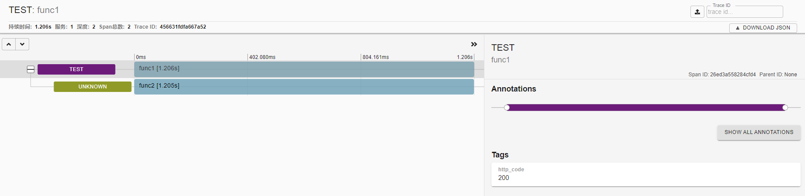

# Zipkin

：一个 Web 服务器，用于链路追踪。
- [官方文档](https://github.com/openzipkin/zipkin/blob/master/zipkin-server/README.md)
- 由 Twitter 公司开源，采用 Java 开发。

## 原理

- 工作流程：
  1. 用户向业务系统发出一个请求。
  2. 业务系统的一个服务处理该请求，并可能调用其它服务 API ，组成一个 trace 。每个服务 API 被调用之后，都发送一次 span 监控数据到 Zipkin 服务器。
  3. Zipkin 统计分析所有监控数据，比如绘制树形图、散点图。

- 例：Zipkin 显示的一个 trace

  

- 业务服务需要在代码中使用 Zipkin 客户端库，封装服务 API ，从而发送监控数据到 Zipkin 。负责发送、接收的模块分别称为 Reporter、Collector 。
  - Zipkin 提供了 Java、Python 等多种编程语言的客户端库，供业务服务使用。
  - Reporter 有几种通信方式可选：
    - HTTP ：默认方式。
    - Kafka ：适合缓冲大量数据。
    - Scribe ：用于收集日志。
  - 支持给服务器、客户端分别设置采样率。

- Zipkin 默认将数据存储在内存中，没有持久化保存。并且默认最多存储 `MEM_MAX_SPANS=500000` 条记录，超过则删除旧记录。
  - 可以采用 Cassandra、ES、MySQL 等外部存储后端。

- Zipkin 默认每天执行一个 Spark Job ，绘制当天（UTC 时区）的 dependencies 依赖图。
  - 采用外部存储后端时，不会自动执行该 Job 。用户可以主动执行：
    ```sh
    java -jar zipkin-dependencies.jar 2021-01-02
    ```
    - 执行该 jar 包时，默认处理今天的数据，也可以传入指定的日期。
    - 其它配置参数通过环境变量传入。

## 部署

- 用 docker-compose 部署：
  ```yml
  version: '3'

  services:
    zipkin:
      container_name: zipkin
      image: openzipkin/zipkin:2.20
      restart: unless-stopped
      environment:
        # QUERY_PORT: 9411
        # QUERY_TIMEOUT: 11s              # 查询的超时时间，设置为 0 则不限制
        # QUERY_LOG_LEVEL: INFO
        # COLLECTOR_SAMPLE_RATE: 1.0      # 采样率，作用于全局。默认为 1.0 ，表示 100%
        SELF_TRACING_ENABLED: 'true'      # 是否启用 Zipkin 的自身跟踪，默认为 false
        SELF_TRACING_SAMPLE_RATE: 0.001   # 自身跟踪的采样率

        STORAGE_TYPE: elasticsearch       # 存储后端的类型，默认为 mem ，存储在内存中
        ES_HOSTS: http://10.0.0.1:9200
        # ES_USERNAME:
        # ES_PASSWORD:
        # ES_INDEX: zipkin                # 索引名的前缀，实际创建的索引名会加上日期后缀，比如 zipkin:span-2021-01-01
        # ES_INDEX_SHARDS: 5
        # ES_INDEX_REPLICAS: 0
        # ES_ENSURE_TEMPLATES: true       # 是否自动创建索引模板
      ports:
        - 9411:9411

    denpendencies:                        # 该容器需要每天执行一次
      container_name: zipkin-dependencies
      image: openzipkin/zipkin-dependencies:2.4
      entrypoint:
        - /bin/sh
        - -c
        - start-zipkin-dependencies `date -ud yesterday +%F`
      environment:
        STORAGE_TYPE: elasticsearch
        ES_HOSTS: http://10.0.0.1:9200
        ES_NODES_WAN_ONLY: 'true'         # 是否只使用 ES_HOSTS 中列出的 ES 地址。默认为 false ，会连接本机的 9200 端口
  ```
  - Zipkin 的 v2.21 版本更换了 UI ，并且支持的 ES 版本从 v6 改为 v7 。

## ♢ py-zipkin

：Python 的第三方库，用作 Zipkin 客户端。
- [GitHub](https://github.com/Yelp/py_zipkin)
- 安装：`pip install py-zipkin`
- 例：
  ```py
  import requests
  import time
  from py_zipkin.zipkin import zipkin_span
  from py_zipkin.request_helpers import create_http_headers

  # 自定义一个函数，用于发送编码后的 span 数据到 Zipkin
  def http_transport(encoded_span):
      zipkin_url = "http://10.0.0.1:9411/api/v1/spans"
      headers = {"Content-Type": "application/x-thrift"}
      requests.post(zipkin_url, data=encoded_span, headers=headers)

  # 定义一个 API ，采集 span 数据
  def func1():
      with zipkin_span(       # 可通过 with 上下文定义 span
          service_name='test',
          span_name='func1',
          transport_handler=http_transport,
          sample_rate=100,    # 采样率，取值为 0.0 ~ 100.0
      ) as zipkin_context:
          func2()             # 调用同一个服务内的其它 API 时，会自动传递 traceId 等 Headers
          zipkin_context.update_binary_annotations({'http_code': 200})  # 可以给本次 span 增加记录 tags

  @zipkin_span(service_name='test2', span_name='func2')   # 可通过装饰器定义 span
  def func2():
      headers = create_http_headers() # 调用其它服务的 API 时，需要主动传递 traceId 等 Headers
      r = requests.get('http://127.0.0.1/', headers=headers)
      time.sleep(1)
  ```
  - 当 span 抛出异常时，会自动在 tags 中记录 error: xxx 。
