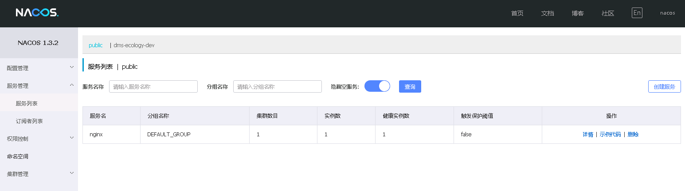

# Nacos

：一个配置管理、服务发现平台。
- [官方文档](https://nacos.io/zh-cn/docs/quick-start.html)
- 由阿里巴巴公司开源，基于 Java 开发。
- 提供了发布配置、获取配置、注册服务、发现服务等 API 。
- 更新速度快，可以实现动态配置。
- 支持基于 DNS 或 RPC 的服务发现，支持对接 k8s、gRPC/Dubbo、Spring Cloud 等平台的服务。

## 部署

- 下载二进制包，解压后以单机模式启动：
  ```sh
  sh startup.sh -m standalone
  ```

- 或者用 Docker 部署：
  ```sh
  docker run -d --name nacos \
          -p 8848:8848 \
          -e PREFER_HOST_MODE=hostname \
          -e MODE=standalone \
          nacos/nacos-server
  ```

## Web 页面

- 访问 `http://127.0.0.1:8848/nacos/` 即可登录 Nacos 的 Web 页面，默认账号、密码为 nacos、nacos 。
- Web 页面示例：

  


## HTTP API

```sh
# 发布配置
curl -X POST "http://127.0.0.1:8848/nacos/v1/cs/configs?dataId=d1&group=test&content=HelloWorld"

# 获取配置
curl -X GET "http://127.0.0.1:8848/nacos/v1/cs/configs?dataId=d1&group=test"

# 注册服务
curl -X POST 'http://127.0.0.1:8848/nacos/v1/ns/instance?serviceName=nginx&ip=10.0.0.1&port=80'

# 发现服务
curl -X GET 'http://127.0.0.1:8848/nacos/v1/ns/instance/list?serviceName=nginx'
```
