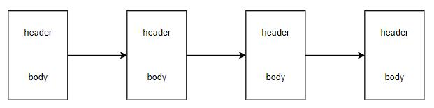

# BTC

- 比特币（Bitcoin，BTC）：一种数字货币，在 BTC 区块链发行。
- [官方文档](https://developer.bitcoin.org/devguide/index.html)

## 架构

- 在区块链中存储所有交易数据。
- 一些主机根据 BTC 协议相互通信，组成了 BTC 网络。这些主机称为 BTC 节点。
  - 每个节点会存储区块链的一个副本，包含最新的一些区块，或者全部区块。
  - 一些节点会收集网络上广播的交易，打包写入最新的一个区块，然后将新区块广播给其它节点。
  - 基于 PoW 共识算法决定哪个节点有权生成最新的一个区块。
  - 用户可以运行专门的程序，作为节点，接入 BTC 网络。然后下载区块链，查询历史交易，或者广播新交易。

## 区块

- 如下图，一条区块链由多个区块串联组成，后一个区块会记录前一个区块的哈希值，构成哈希链。

  

  - 哈希运算时采用 SHA256 算法。
  - 存储字节流时采用小端序。
  - 每个区块最多允许包含 1MB 的数据，超过则视作无效区块。
  - 区块高度（Height）：从最早一个区块往后数，给各个区块分配一个从 0 开始递增的编号，用于索引。
  - 区块深度（Depth）：从最新一个区块往前数，给各个区块分配一个从 1 开始递增的编号。
    - 假设区块链的总高度为 H ，则对于高度为 h 的区块，其深度为 H-h+1 。

- 一个区块的数据结构分为两部分：
  - header ：存储区块的元数据。
  - body ：存储一些交易信息。

- 区块 header 的长度固定为 80 bytes ，按顺序记录以下信息：
  - nVersion
    - ：区块链协议的版本。
    - 4 bytes ，int32_t 。
  - previous block header hash
    - ：上一个区块的 header 的哈希值。用于确保它们不会被篡改。
    - 32 bytes ，char[32] 。
  - merkle root hash
    - ：当前区块 body 中所有交易信息的 Merkle Tree 的根哈希。用于确保它们不会被篡改。
    - 32 bytes ，char[32] 。
  - timestamp
    - ：矿工打包当前区块时的 Unix time 时间戳。必须大于前 11 个区块的平均时间戳、不大于当前实际时间 +2 小时。
    - 4 bytes ，uint32_t 。
  - nBits（target threshold）
    - ：nonce 的目标阈值。
    - 4 bytes ，uint32_t 。
  - nonce
    - ：一个随机数。
    - 4 bytes ，uint32_t 。

- 区块链浏览器（Explorer）
  - ：一种 Web 网站，用于浏览、搜索数字货币的区块链信息，比如每个区块的内容、每笔交易的内容、每个地址的余额。
  - 例如 blockchain.com 、btc.com 网站，提供了 BTC、ETH 等多种数字货币的区块链浏览器。

## 节点

- 一些主机运行 BTC 客户端，根据 BTC 协议相互通信，组成了 BTC 网络。这些主机称为 BTC 节点。
  - 基于 TCP/IP 协议进行通信。
  - 通信模式为点对点（P2P），即主机之间两两建立对等连接。
    - 如果两个节点建立对等连接，则称为相邻节点。
    - 一个节点可以将消息发送给所有相邻节点，后者再转发给它们的相邻节点，以此类推，就可以将该消息广播给网络的大部分节点。
  - 通常人们使用的是 BTC 主网络，但还有测试网络等其它网络。每个网络中存在一条独立的区块链。

- 节点分类：
  - 全节点（Full Node）
    - ：存储了 BTC 区块链的所有区块，是 BTC 网络的基础。
    - 可以接收并验证网络上广播的交易、区块，如果有效则广播给其它节点。
    - 允许其它节点连接到自己，从而下载区块链。
  - 挖矿节点（Mining Node）
    - ：属于全节点，但还会收集交易、打包新区块，即更新区块链。
  - 轻节点（Light Node）
    - ：只存储所有区块的的 header ，需要获取区块 body 时，再从全节点下载。
      - 可根据自己存储的 header ，验证全节点提供的各个区块是否正确。
    - 全节点能够独立验证一个交易、区块是否有效，而轻节点需要依赖全节点，因此不能进行挖矿。
    - 大部分的钱包软件属于轻节点，通过 SPV 验证指定账户的历史交易、UTXO 。
      - 简单支付验证（Simplified Payment Verification ，SPV）：普通节点连接到全节点，发送布隆过滤器（bloom filter），筛选出与指定账户相关的所有历史交易，然后下载这些交易。

- 一个全节点的启动步骤：
  1. 与至少一个全节点建立对等连接，加入 BTC 网络。
      - 通常在本机存储了一些全节点的 IP 地址，可在启动时快速连接它们。
      - 可以发现并连接新的全节点。也可以广播自己的 IP 地址，供其它节点连接。
      - 默认监听 TCP 8333 端口，供其它节点连接自己。也可以不监听，只允许自己主动连接其它节点。
  2. 从其它全节点下载区块数据，更新本机存储的区块链。
      - 如果本机之前没有存储区块链，则需要从第一个区块开始下载并验证各个区块。
      - 如果本机已经存储了旧的区块链，则只需下载并验证最新的一些区块。
  3. 保持运行，接收网络上广播的消息。例如：
      - 接收新产生的区块，如果验证通过则存储到本机。
      - 接收新的未打包交易，如果验证通过则广播给相邻节点。

- 相关概念：
  - [bitnodes](https://bitnodes.io/)
    - ：一个网站，统计了全球各地的 BTC 全节点的数量。
  - [Bitcoin Core](https://github.com/bitcoin/bitcoin)
    - ：一个 C++ 程序，实现了标准、完整的 BTC 协议，可用于运行一个全节点，还提供了挖矿、钱包的功能。
      - 包含一个守护进程 bitcoind ，进行 RPC 通信。
      - 包含一个命令行工具 bitcoin-cli ，供用户操作。
      - 基于 Qt 提供了 GUI 界面，又称为 Bitcoin-Qt 。
    - 最初由中本聪开发，后来作为一个开源项目托管在 GitHub 上。
  - [bitcoinj](https://github.com/bitcoinj/bitcoinj)
    - ：一个实现了 BTC 协议的 Java 库，可用于编写钱包软件。

### 共识

- 所有 BTC 节点遵循一些相同的共识规则，比如如何验证一个交易、区块是否有效。

- BTC 改进提案（Bitcoin Improvement Proposals ，BIP）：BTC 社区通过提案来讨论一些改进方案。
  - [GitHub](https://github.com/bitcoin/bips)

- 实施一个新的共识规则时，根据兼容性，分为两种情况：
  - 软分叉（Soft Fork）：新的共识规则向前兼容旧规则，因此旧节点依然接受新节点打包的区块。
    - 但旧节点打包的区块，要符合新共识规则才会被新节点接受，否则网络分叉成两条区块链。
  - 硬分叉（Hard Fork）：新的共识规则不向前兼容，因此旧节点不会接受新节点打包的区块，导致新、旧网络分叉成两条区块链。

- 根据 BIP9 ，一个软分叉升级的流程如下：
  1. 将软分叉部署到网络上，进入 started 状态。
  2. 矿工们修改新区块的 nVersion 中的标志位，表示是否支持该软分叉。
  3. 如果在超时之前，该软分叉获得 95% 矿工（占全网哈希算力的比例）的支持，则锁定（lock_in）成为共识规则。然后在一段时间之后激活（activate），给其它节点留有准备时间。
      - 如果超时，则部署失败，变为 failed 状态。

### 矿工

- 打包新区块的节点，有权得到 coinbase 交易产生的 BTC 。该过程称为挖矿（mining），运行挖矿节点的人称为矿工（miner）。

- 矿工挖矿的流程：
  1. 接收网络上广播的多个交易，打包成一个候选区块。
      - 矿工需要验证交易是否有效，比如 sigScript、locktime 。否则打包的区块不符合共识规则，不会被其他矿工承认。
  2. 尝试穷举区块的 nonce 值，直到满足挖矿难度，使得候选区块变成有效区块。
      - 如果发现其他矿工抢先打包了新区块，则放弃打包当前区块，开始打包下一个区块。

- 矿工打包一个新区块时，能得到两种收益：
  - coinbase 奖励
    - BTC 协议规定，BTC 币总量为 2100 万个。初期的每个区块 coinbase 会产生 50 个 BTC 。每隔 4 年，即大概 21 万个区块，新区块的产量减少一半。
    - 因此 coinbase 奖励会越来越少，矿工越来越依赖交易费的收益。
  - 区块内所有交易的交易费
    - 假设 coinbase 奖励为 25 个 BTC ，总交易费为 0.1 个，则矿工可以编写 coinbase 交易，将 25.1 个 BTC 发送到指定账户。
    - 通常以 satoshi/Byte 为单位计算平均的交易费。
      - 为了增加收益，矿工会优先打包交易费高且体积小的交易。如果一个交易的交易费少且体积大，则可能长时间没有矿工愿意打包它。
      - 最大可提取价值（Maximal Extractable Value，MEV）：通过算法挑选一组交易用于打包，使得从一个区块获得的收益最大化。
      - 用户希望快速达成交易时，应该设置比平均水平更高的交易费。

- 矿工需要付出一定成本，主要是运行挖矿节点的设备费用、电费、网络费。
  - 独自挖矿时，矿工自己算力占全网算力的比例，就是挖矿成功率，可能等很多天才能挖矿成功。
  - 早期的 BTC 主要采用 CPU 挖矿，后来过渡到效率更高的 GPU 挖矿，再后来过渡到专业矿机，采用特制的集成电路芯片（ASIC）。
    - 目前的全文哈希算力极高，竞争极大，使用家用电脑独自挖矿的成功概率趋近于零。

- 一些矿工会组成一个矿池，一起挖矿，增加挖矿成功率。挖矿成功之后，根据每个人贡献的算力，分配挖矿收益。
  - 矿池下的矿工不是直接加入 BTC 网络，而是连接到矿池服务器，执行运算、提交工作量证明。
  - 优点：
    - 独自挖矿时，运气不好就长时间没有收益。而加入矿池，每天都能分到稳定的收益。
    - 如果个人算力较低，则独自挖矿几乎不可能成功。但加入矿池，也可以出售微薄的算力。
  - 例如 BTC.com 是一个大矿池，原本由比特大陆公司经营。2021 年，500 彩票网收购该矿池及域名，并将公司改名为比特矿业。

### 挖矿难度

- 矿工打包新区块时，需要尝试指定 nonce 值，比如穷举。如果使得当前 header 的哈希值小于等于 target threshold ，则有权打包该区块，被其他矿工承认。
  - SHA256 哈希值的长度为 32 bytes ，而 target threshold 以有损压缩形式存储为 nBits ，长度为 4 bytes 。
  - 例：根据 nBits 计算出 target threshold
    ```py
    >>> nBits  = int('0x170cfecf', 16)                              # 假设 nBits 的取值
    >>> target = 256**(int('0x17', 16) - 3) * int('0x0cfecf', 16)   # 将第一个字节作为 256 的幂，再乘以后三个字节
    >>> '0x' + "{:064x}".format(target)
    '0x0000000000000000000cfecf0000000000000000000000000000000000000000'
    ```
    - 可见 nBits 第一个字节的值越大，会使 taget 越大，开头连续的 0 越少，因此挖矿难度越小。

- difficulty 表示挖矿难度。
  - 计算公式如下：
    ```py
    diffculty = difficulty_1_target / target
    ```
    - 可见 difficulty 与 target 成反比，取值越小则挖矿难度越小，最小为 1 。
  - difficulty_1_target 表示区块链的初始难度，是一个常数：
    ```py
    >>> difficulty_1_target = 2**(256-32)-1
    >>> '0x' + "{:064x}".format(difficulty_1_target)
    '0x00000000ffffffffffffffffffffffffffffffffffffffffffffffffffffffff'
    >>> difficulty_1_target / target
    21659675333681.926
    ```
  - 当 difficulty 为 1 时，target 达到允许的最大值 0x1d00FFFF 。因为有损压缩丢失了右侧的所有 0xF ，所以有的程序会将 difficulty_1_target 计算成偏小的值：
    ```py
    >>> _target = 256**(int('0x1d', 16) - 3) * int('0x00FFFF', 16)
    >>> '0x' + "{:064x}".format(_target)
    '0x00000000ffff0000000000000000000000000000000000000000000000000000'
    >>> _target / target
    21659344833264.848
    ```
    - 丢失右侧 0xF 的 difficulty_1_target 常用于快速估算难度，称为 bdiff（Bitcoin difficulty）。
    - 标准的 difficulty_1_target 常用于正式挖矿，称为 pdiff（Pool difficulty）。
  - 例：根据 nBits 估算出 difficulty
    ```py
    >>> nBits      = int('0x170cfecf', 16)
    >>> difficulty = 256**(29 - (nBits >> 24))*(65535.0 / ((float)(nBits & 0xFFFFFF)))
    >>> difficulty
    21659344833264.848
    ```
  - BTC 预计每隔 10 分钟生成一个新区块。为了维持这一速率，所有节点会每隔 2016 个区块调整一次挖矿难度，重新计算 nBits ：
    ```py
    expected_time  = 2016*10    # 理论上最近 2016 个区块应该消耗 2016*10 分钟即 2 周
    actual_time    = ...        # 填入实际上最近 2016 个区块消耗的时长
    new_difficulty = old_difficulty * ( actual_time / expected_time )
    new_nBits      = ...        # 根据 new_difficulty 算出 new_nBits
    ```

- 理论上，SHA256 哈希值有 2^256 种可能性，而 nonce 只有 2^32 种可能性，因此可能穷举 nonce 的所有值之后依然不满足 target threshold 。
  - 例如 2020 年发布的蚂蚁矿机 S19 ，额定算力为 95 THash/s ，遍历 nonce 所有值的耗时不超过 1 秒：
    ```py
    >>> (2**32) / (95*10**9)
    0.045
    ```
  - 当 nonce 被穷举完时，矿工通常会在 coinbase 交易中加入一个 4 bytes 的随机数，称为 extraNonce ，从而增加到 2^64 种可能性。
  - 例如 2020 年 BTC 全网算力达到了 150 EHash/s = 150 * 10^3 PHash/s = 150 * 10^6 THash/s ，遍历 nonce + extraNonce 消耗的秒数为：
    ```py
    >>> round((2**64) / (150*10**15))
    123
    ```
    因此挖矿难度自动上调得很大，从而限制产生新区块的耗时依然为 10 分钟。矿工需要增加 extraNonce 的位数到 8 bytes 。

## 账户

- BTC 协议中，用户可以根据 ECDSA 算法随机生成一对私钥、公钥，代表一个 BTC 账户，相当于一个银行账户的密码、账户名。
  - 示例：
    ```sh
    0xL3HpQs5M7tZLN1m6zmJ9YSPuFzA4gJDJy8Ru2hd5nAwcZC4tPm1T  # 私钥
    0x1N8nCD314Z87BgYsK1y3vwRpAk8S1qbRcg                    # 公钥
    ```
    - 前缀 0x 表示十六进制。
    - 私钥需要保密，而公钥可以公开给所有人。
  - BTC 采用椭圆曲线数字签名算法（ECDSA）生成数字签名，其中采用的椭圆曲线为 secp256k1 。
    - 用户可以编写一个消息，将消息的哈希值用私钥加密之后公布，称为数字签名。其他人可使用对应的公钥解读数字签名，从而验证该消息的内容没有被篡改，并且是由该公钥对应的私钥签署的。
  - BTC 协议中，账户之间可以直接转账交易，只需用账户私钥生成交易的数字签名，相当于盖章授权。
    - 不需要经过银行等第三方平台中转，实现了去中心化交易。

- 生成一个账户的步骤：
  1. 用户生成一个很大的随机整数，作为私钥（private key）。
      - 私钥的长度为 256 bits = 32 bytes  。通常经过 Base58Check 编码，表示成 52 位长度的十六进制数。
      - 用户选择私钥时应该尽量随机，避免与其他人相同。
  2. 根据 ECDSA 算法，计算出私钥在椭圆曲线上对应的一个点，其坐标 x、y 作为公钥。
      - 通过私钥可以计算出对应的公钥，但不能通过公钥反推出私钥。而且值域庞大，使得穷举几乎不可能。
      - 未压缩公钥（uncompressed）：由坐标 x、y 的值组成，并加上前缀 0x04 作为标识，总长度为 1+32+32 = 65 bytes 。
      - 压缩公钥（compressed）：由坐标 x 的值组成，并加上前缀 0x02 或 0x03 表示坐标 y 为偶数或奇数，总长度为 33 bytes 。
        - 椭圆曲线关于 x 轴对称，一个坐标 x 对应两个 y 点。且在 secp256k1 曲线中，这两个 y 点分别为偶数、奇数，因此需要通过前缀区分。
        - 使用压缩公钥时，需要给私钥加上后缀 0x01 作为标识，其长度增加 1 字节。
        - 压缩格式的公钥、私钥更方便记录，是用户通常看到的格式，也是一般钱包采用的导入格式（Wallet Import Format ，WIF）。
        - 钱包软件在实际使用公钥时，会从压缩格式转换成非压缩格式。

  3. 计算压缩公钥的 SHA256 哈希值，再计算其结果的 RIPEMD-160 哈希值。
  4. 将公钥哈希值（public key hash）经过 Base58Check 编码，表示成 34 位长度的十六进制数，称为账户地址（address）。

- Base58Check 编码是为了将数据表示成更短的值，并加上校验码，并不会加密原数据。过程如下：
  1. 输入原数据 payload 。
  2. 在 payload 之前加上 1 字节的地址版本号 version 。
  3. 对 version、payload 串联成一个字符串，计算两次哈希值，取结果开头的 4 字节作为校验码 checksum 。
      - 如果网络传输之后，再次计算两次哈希值，发现结果开头与校验码不一致，则说明编码值出错。
  4. 将 version、payload、checksum 串联成一个字符串，进行 base58 编码。
      - 与 base64 相比，base58 的特点：
        - 移除了 `+/` 两个特殊字符，只允许使用大小写字母、数字。
        - 移除了 `0OIi` 四个容易混淆的字母。
      - P2PKH 地址的 version 为 0x00 ，因此编码之后，开头为 1 。
      - P2SH 地址的 version 为 0x05 ，因此编码之后，开头为 3 。
      - BTC 私钥的 version 为 0x80 ，因此编码之后，未压缩格式的开头为 5 ，压缩格式的开头为 K 或 L 。

- 相关概念：
  - 虚荣地址（Vanity Addresses）：虽然 BTC 私钥、公钥是随机的，但用户可以尝试生成大量私钥、公钥，直到公钥中包含有意义的单词，比如 ILoveU 。
  - [bitaddress](https://www.bitaddress.org/) ：一个网站，用于随机生成 BTC 账户，支持离线使用。

### 钱包

- 钱包（wallet）：一种管理数字货币账户的软件，可能为 PC 端软件、浏览器插件、手机 app 等。
  - 基本功能：生成新账户、使用账户私钥发起转账交易。
  - 接收转账只需要公布自己的账户地址，不需要使用钱包软件。
- 主要分类：
  - 冷钱包
    - ：使用时不需要联网。
    - 离线交易的流程如下：
      1. 在联网电脑 A 上获取最新的区块链数据，据此生成一笔交易，但不包含签名 sigScript 。
      2. 将未签名的交易拷贝到断网电脑 B 上，生成签名。比如通过 U 盘拷贝。
      3. 将已签名的交易拷贝到联网电脑 A 上，广播到网络。
    - 离线交易保证了私钥不会通过网络泄漏，安全性很高，但是比较麻烦。
  - 分层确定性钱包（Hierarchical Deterministic ，HD）
    - ：随机生成一个主密钥，又称为种子（seed）。然后根据某种单向确定的算法，生成多个私钥，从而生成多个账户。
    - 用户只需保存主密钥，即可控制多个账户。
    - 类似的，有的钱包会随机生成一组单词，称为助记词，用于生成私钥。用户只需保存助记词，而不需保存私钥，更方便阅读。
  - 热钱包
    - ：使用时需要联网。
    - 用户需要担心账户私钥被热钱包窃取，或因为漏洞被攻击。
  - 硬件钱包
    - ：一种像 U 盘的电子设备，用于离线存储私钥，连接到电脑之后才提供冷钱包的功能。
    - 冷钱包软件运行在通用计算机上，而硬件钱包运行在特制的电子设备中，更安全，但携带、存放更麻烦，而且该电子设备也并不一定可靠。
  - 纸钱包
    - ：将账户私钥记录在一张纸上，或者保存为二维码图片。
    - 比硬件钱包更安全，成本很低。

## 交易

- 一个交易（transaction）记录成特定格式的数据，像账本中的一条记录，主要包含以下信息：
  - version ：交易格式的版本号，占 4 bytes 。
  - in-counter ：表示输入项的数量。
  - inputs ：包含 n≥1 个输入项。
    - 每个输入项的主要内容：
      - index ：输入项在 inputs 中的序号，从 0 开始递增。
      - previous txid ：引用一个历史交易，表示将该交易的 UTXO 全部输入当前交易。
      - sigScript
  - out-counter ：表示输出项的数量。
  - outputs ：包含 n≥1 个输出项。
    - 每个输出项的主要内容：
      - index
      - value ：输出的 BTC 数量。
      - pkScript
    - 一个交易的总输入减去总输出的差值，会被矿工当作交易费拿走，即 `fee = sum(inputs) – sum(outputs)` 。
  - locktime ：表示允许将该交易打包到区块中的最早时间，占 4 bytes 。
    - 如果取值小于 5 亿，则视作区块高度。
    - 如果取值大于 5 亿，则视作 Unix 时间戳。
    - 交易通常将 locktime 设置为 0x00000000 ，表示不限制。

- 区块 body 中可以记录 n≥1 个交易，最大数量取决于区块的容量限制。
  - 记录的第一个交易必须是 coinbase 交易。
    - coinbase 交易不存在输入，凭空产生一定量可以输出的 BTC ，作为打包该区块的网络节点的激励。
  - coinbase 交易之后可以记录 m≥0 个普通交易。
    - 通常采用交易的哈希值作为其标识符，称为 txid 。
    - BTC 交易时，最小的单位为聪（satoshis），1 BTC = 10^8 聪。
  - 一个交易数据的体积没有上限，只受到区块的容量限制。
    - 增加交易体积时，通常需要增加交易费，吸引矿工打包该交易。

### 发起交易

- 如果一个账户拥有一些 BTC ，则可以发起一个交易，输入一些 BTC ，然后输出给其它账户。
  - 所有账户收到的 BTC ，都来自历史交易的输出，且源头都是 coinbase 交易。
  - 如果一个交易输出的 BTC ，尚未被目标账户花费，则称为未花费交易输出（Unspent TX Output ，UTXO）。
    - 一个账户拥有的所有 UTXO 总和，称为该账户的余额。
    - 一个交易的 UTXO 要么不被花费，要么被一次性全部花费，不能拆开花费。
      - 例如 UTXO 为 5 BTC 时，用户可以新建一个交易，发送 1 BTC 给别人，然后将剩下的 BTC 发送给自己，从而实现找零。
  - 统计 BTC 区块链上所有历史交易的输入、输出，就可以计算出所有账户的 UTXO 即余额。
    - BTC 协议并没有直接提供 UTXO 数据库，但一些区块链浏览器提供了这种查询功能。

- 用户发起一个交易的步骤：
  1. 编写一个交易。
      - 此时需要连接到 BTC 网络，获取最新的区块链数据，从中查询账户的历史交易，选择将哪些交易的 UTXO 作为当前交易的输入。
  2. 生成交易的 sigScript ，存放在交易的 inputs 中。
  3. 将交易广播到 BTC 网络上，等待矿工将它打包入新区块。

- 用户广播一个交易之后，需要等待矿工将它写入区块，才算交易成功。分为多个阶段：
  - 0 次确认
    - ：交易还没有被写入区块。
  - 1 次确认
    - ：交易被写入最新的一个区块。
    - 但可能有多个矿工同时打包出不同的最新区块，需要等待哪个最新区块最终被大部分矿工承认，因此交易还不算持久保存到区块链。
  - 2 次确认
    - ：交易被写入一个区块，该区块的深度为 2 。
    - BTC 网络中，篡改最近的两个区块需要超过 50% 的哈希算力，成本很大，因此一般可靠。
  - 6 次确认
    - ：交易被写入一个区块，该区块的深度为 6 ，几乎不可能被篡改。
    - 由于 BTC 平均每隔 10 分钟生成一个区块，6 次确认需要等待 60 分钟。

- 双花：一种攻击方式，指将同一个 UTXO 花费多次。
  - 攻击方式举例：
    - 一个不诚实的用户，同时广播多个交易，重复花费同一个 UTXO 。此时，诚实的矿工只会将其中一个交易写入新区块，将之后的交易视作无效。因此双花攻击无效。
    - 一个不诚实的矿工，明知当前区块链高度为 N ，但依然从高度 N-i 处重新生成一条区块链，从而重写最近 i 个历史区块中的交易。\
      此时网络上同时存在新链和原链。根据 BTC 协议，所有矿工应该在最长的那条区块链上工作。不诚实的矿工需要掌握全网哈希算力的 50% 以上，使得新链生成新区块的速度比原链更快，在一段时间之后长度超越原链。\
      因此这种双花攻击几乎不可能，需要消耗大量哈希算力和时间成本。

### pkScript

：公钥脚本（Pubkey Script ，pkScript），采用一种专用的脚本语言编写，包含一些指令。
- 该脚本语言的特点：
  - 基于堆栈。
  - 非图灵完备，不支持循环。因此不能实现复杂的逻辑，但减少了出错的可能性。
- pkScript 可以声明一些条件，当 sigScript 满足条件时才能花费其 UTXO 。
  - 例如 P2PKH 的条件通常是：输出 n 个 BTC ，并指定一个公钥。只有拥有该公钥对应私钥的人，才有权花费该 UTXO 。
- pkScript 又称为锁定脚本（locking script），因为它输出的 BTC 一直不可用，直到有人提供满足条件的 sigScript ，又称为解锁脚本。

pkScript 有多种类型：
- Pay To Pubkey（P2PK）
  - ：将 BTC 转账给公钥。
- Pay To Public Key Hash（P2PKH）
  - ：将 BTC 转账给公钥哈希。
  - P2PK 常用于 BTC 早期的交易，后来被 P2PKH 取代。主要原因：
    - P2PKH 地址更短。
    - 转账给 P2PKH 地址时，采用公钥哈希，隐藏了公钥，提供了额外的安全性。直到用户花费该账户时，才会公开公钥。
- Pay To Script Hash（P2SH）
  - ：将 BTC 转账给脚本哈希。
    - 如果其他人提供的 sigScript 中，包含与 P2SH 哈希一致的脚本，称为赎回脚本（redeem script），则有权花费该 UTXO 。
  - 基于赎回脚本可实现复杂的功能，例如多重签名、SegWit 兼容地址。
- Pay to Witness Pubkey Hash（P2WPKH）
  - ：与 P2PKH 类似，但启用了 SegWit 。
- Pay to Witness Script Hash（P2WSH）
- Null Data（空数据）
  - ：pkScript 的开头是一个操作符 OP_RETURN ，表示终止脚本执行。
    - OP_RETURN 之后可以添加任意内容的数据，反正不会被执行。
    - 该交易的 UTXO 不能被花费。
  - BTC 区块链原本用于记录交易信息，但一些用户想用区块链记录自定义的数据，比如一段文字广告。
    - 有的用户在 coinbase 交易的剩余位置记录自定义数据。
    - 有的用户在普通交易的 pkScript 位置记录自定义数据，导致该交易被发送到无效地址，不能花费 UTXO 。
    - 推荐用户使用 OP_RETURN 记录自定义数据，此时将 UTXO 设置为 0 ，只需支付交易费。

### sigScript

：签名脚本（Signature Script ，sigScript）。
- sigScript 包含以下内容：
  - pubKey ：账户公钥。
  - sig ：交易数据的数字签名，使用账户私钥生成。
- 交易延展性（Transaction Malleability）攻击
  - ：一种攻击方式，指改变未打包交易中的签名，使得整个交易的哈希值改变，导致引用该交易 txid 的其它交易失效。
    - 由于椭圆曲线的对称性，可以计算出两个有效的签名，还可以根据其中一个签名推算出另一个签名。因此，可以替换交易中的签名。
  - 常见的解决办法：
    - 等待一个交易被打包，再引用它的 txid 。但这就不能实现闪电交易。
    - 规定只采用取值较小的那个签名。
    - 使用 SegWit 。

### SegWit

：隔离见证，一种 BTC 的扩容方案，属于软分叉升级。
- 原理：给区块附加一个称为 witness 的结构，将交易中的见证数据（主要包含 sigScript ）移出，存放在 witness 区域。
  - 这会减小交易的一大半体积，可以在区块中打包更多交易。
  - witness 区域的 tree 哈希记录在 coinbase 交易中，从而嵌入 Merkle Tree 。
  - 此时的区块称为 SegWit 格式。基础容量（称为 size ）依然限制为 1MB ，附加 witness 数据时的总体积（称为 weight ）限制为 4MB 。
  - 此时交易的哈希值称为 wtxid 。改变 sigScript 时，不会影响 wtxid ，避免了 Transaction Malleability 攻击。
- 使用 SegWit 时，账户地址有两种格式：
  - 原生地址（Native）：采用 Bech32 编码格式，只允许使用小写字母、数字，长度为 42 位，开头为 bc1 。
  - 兼容地址（Nested）：采用 P2SH 地址，开头为 3 。
    - 原生地址地址的效率比兼容地址更高。
    - 传统地址（Legacy）不支持与 SegWit 原生地址转账。
    - SegWit 兼容地址支持与传统地址、SegWit 原生地址转账。

- SegWit 软分叉还涉及到 BTC 社区的治理问题，相关历史：
  - 2015 年，Bitcoin Core 开发人员提出了 BIP141 ，提议 SegWit ，是此时 BTC 变动最大的一次软分叉升级。
  - 2016 年，Bitcoin Core 按 BIP9 方式开始 SegWit 软分叉，但支持 SegWit 的矿工远未达到 95% 的激活阈值，主要原因：
    - SegWit 尚未推广，早期升级的收益较小。
    - 旧区块可通过 AsicBoost 算法提高挖矿的哈希算力。
    - SegWit 增加了区块的复杂性，需要修改很多客户端代码，不如硬分叉简单。
  - 2017 年 2 月，社区的开发人员提出了 BIP148 ，提议用户激活软分叉（User Activated Soft Fork ，UASF），逼迫矿工激活 SegWit 。
    - BIP148 大意为：从 8 月开始，采用 BIP148 的节点会拒绝不支持 SegWit 的新区块，导致发生硬分叉。
    - BIP9 让矿工投票决定软分叉升级，而 UASF 使得用户也拥有了控制权。但这更像一个抗议行动，不支持的矿工只是少了打包这部分用户的交易费。
  - 2017 年 4 月，Charlie Lee 与矿工协商之后，成功在 LTC 上激活 SegWit 。
  - 2017 年 5 月，一些公司和矿池签署了纽约共识（New York Agreement ，NYA），表示作为激活 SegWit 的交换，要求也激活 SegWit2x 。
    - 原理：与 SegWit 不同，直接将区块的基础容量限制从 1MB 增加到 2MB ，属于硬分叉升级
    - SegWit2x 与 BCH 的区块扩容类似，受到 Bitcoin Core 开发人员的反对，最终在 11 月放弃了该提议。
  - 2017 年 5 月，一个开发人员提出了 BIP91 ，使得 BIP148 与 SegWit2x 两派可以兼容，避免发生硬分叉。
    - BIP91 的内容与 BIP148 相似，但没有限制时间。
    - BIP91 部署之后，激活它的阈值为 80% 。当 BIP141 被激活或失败时，BIP91 就会停止。
  - 2017 年 7 月，市场担心 BIP148 硬分叉的风险，BTC 价格从 $2700 跌到 $2000 ，促使矿工们支持 BIP91 并激活它。
  - 2017 年 8 月，SegWit2x 终于激活。
    - 此时，大部分矿工、钱包软件依然没有升级 SegWit 。但是采用 SegWit 原生地址的用户越来越多，为了服务这部分用户，矿工、钱包软件会逐渐升级 SegWit 。

## 合约交易

基于 P2SH 脚本可实现一些合约交易，提供多种功能。

### 多重签名

：多重签名（multi-signature ，multisig），一种基于 P2SH 的交易方式。
- 原理：将 BTC 转账到一个 P2SH 地址，通过 pkScript 指定 n 个公钥组成一个列表，要求 sigscript 至少包含 m 个对应的私钥签名才有效。
  - 其中 1≤m≤n≤15 ，又称为 m-of-n 交易。
- 1of2 是允许两个账户中的任意一个都有权花费 UTXO 。
- 2of3 适合三方交易。例如 A 想花费 BTC 从 B 处购买商品，先将 BTC 转账到 2of3 多签地址。
  - 如果仲裁方判断交易成功，则与 B 一起签名，将 BTC 转账给 B 。
  - 如果仲裁方判断交易失败，则与 A 一起签名，将 BTC 转账给 A 。
  - 没有 A 或 B 的同意，仲裁方不能私自转走 BTC 。

### 闪电交易

：闪电交易（Lightning Network ，LN），一种 layer2 技术，基于链下交易（Off-Chain）。
- [GitHub](https://github.com/lightning/bolts)
- 原理：在区块链之外临时创建一个通道，供两个用户进行任意数量的交易，然后将这些交易的结果保存到区块链。主要步骤如下：
  1. 开启通道：两个账户将一笔 BTC 转账到一个多签地址，暂时锁定，称为开启一个闪电交易通道（channel）。
  2. 使用通道：双方建立对等连接（Peer connection），私下进行一些交易。
  3. 关闭通道：双方根据交易结果，将多签地址的 BTC 分配给双方。

- 在通道中，两个用户进行的交易只需要互相知道，不必公布到区块链上，称为承诺交易（commitment transaction）。
  - 每个承诺交易，表示此时的通道状态，即双方应该分别拥有通道的多少 UTXO 。
  - 每创建一个新的承诺交易，就撤销旧的承诺交易。
    - 为此双方要交换一个承诺撤销密钥，证明它已撤销。
    - 如果一方将已撤销的承诺交易广播到链上，企图双花攻击。则另一方可以根据撤销密钥，广播一个更新的惩罚交易（Penalty transaction），将通道的全部资产转给自己。
  - 每个承诺交易设置了 locktime ，如果某方离线，则另一方等待 locktime 时间之后就可以将承诺交易公布到链上，从而关闭通道。
    - 每个承诺交易的 locktime 依次递减，因此越新的承诺交易能越早公布到链上。
    - 准备关闭通道时，双方签署最后一笔承诺交易，立即公布到链上。

- 闪电交易通道只能连通两个账户，但大量相互开启通道的账户可以组成闪电交易网络。
  - 假设 A 与 B 之间存在通道，B 与 C 之间存在通道，则 A 可以通过 B 间接转账给 C 。此时 B 称为路由节点，像计算机网络的路由转发。
  - 哈希时间锁定合约（Hash Time Locked Contracts ，HTLC）：一种智能合约，用于保证路由节点的可信任。工作流程如下：
    1. A 创建一个密钥 secret ，私下发送给 C 。
    2. A 在 A、B 之间的通道，使用 secret 的哈希值签署一个 HTLC 合约，将 BTC 转入合约。合约大意为：如果 B 能在 locktime 时间内发现 secret ，则有权获得合约的 UTXO ，否则资金将返回给 A 。
    3. B 在 B、C 之间的通道，也创建一个使用同样 secret 哈希值的 HTLC 合约，请求 C 提供 secret 。但是合约锁定的 UTXO 微少一点，因为 B 收取了交易费。locktime 也更短一点。
    4. C 提供 secret ，完成 B 的 HTLC 合约，得到 UTXO 。然后 B 再提供 secret ，完成 A 的 HTLC 合约。
        - 即使 B 下线，C 依然可以完成 B 的 HTLC 合约，只有 B 会受到损失。
  - 一些大型的路由节点可连接大量用户，像中心化网络。
  - 一些路由节点会担任瞭望塔（watchtower），监控网络，广播惩罚交易。

- 优点：
  - 能快速处理大量新交易。
  - 交易费很低：支付给路由节点的费用很低，适合以 satoshis 为单位的小额交易。
  - 耗时短：每个交易不超过一分钟，不需要等待区块链打包、确认。
  - 隐私：只有开启通道、关闭通道的两次交易需要公布到链上，期间的交易不会上链，路由节点也不会知道整个交易的源头、终点。
  - 通道中的交易不必打包到区块链，因此节省了区块空间，降低了区块链的负载。

- 相关历史：
  - 2017 年 5 月，LTC 区块链进行了第一次闪电交易。
  - 2019 年 1 月，twitter 用户发起了一场称为闪电火炬（Lightning Torch）的行动，用于推广闪电交易。
    - 规则：通过闪电交易发送一笔小额 BTC ，收到转账的账户添加 10w satoshis 之后再发送给下一个账户，以此类推。
    - 这笔 BTC 传递了将近 300 次，最终被捐赠。

### 侧链

- 侧链（Sidechain）
  - ：在 BTC 区块链之外，另外运行一条独立的区块链，用户可在两条区块链之间转移 BTC 。
  - 2014 年，BTC 开发者发布了侧链协议的白皮书，希望通过侧链扩展 BTC 主链的功能，比如在侧链支持智能合约。
  - 优点：
    - 侧链是独立运行的，因此可采用不同的共识规则。比如出块时间更短、区块体积更大，从而提高网络吞吐量。
    - 用户可以将小额的 BTC 转移到侧链上，进行交易，从而分散主链的负载压力。
  - 缺点：
    - 侧链的安全性、可靠性不如主链。
    - 侧链不会像 layer2 那样将事务汇总保存到主链，因此不能继承主链的安全性。

- 双向挂钩（Two-Way Peg，2WP）：一种跨链桥，用于在主链与侧链之间转移 BTC 。步骤如下：
  1. 用户在主链创建交易，将一些 BTC 发送到特定地址，请求转移到侧链。
      - 实际上这些 BTC 会被锁定在主链上。
  2. 用户在侧链创建交易，提取转移过来的 BTC ，然后便可在侧链使用。
      - 同理，用户将 BTC 从侧链转移回主链时，需要在侧链锁定 BTC ，然后在主链解锁的 BTC 。
      - 如果侧链被攻击，导致用户的 BTC 丢失了，则主链上的 BTC 会一直锁定，不能找回。

### CoinJoin

：一种混币方案。
- 原理：n 个账户共同发起一笔 BTC 交易，分别输入 C 数量的 BTC ，然后分别输出 C 数量到 n 个账户。
  - 如果输出账户与输入账户都是不同的地址，则难以确定它们之间的对应关系。
  - n 的数量越大，混淆度越高。
- 假设用户 A 参与了一次 CoinJoin 混币，从自己的一个账户发送 BTC 到自己的另一个账户。
  - 虽然混币交易是公开的，其他人知道了 A 参与了混币，但并不知道哪个输出账户是由 A 控制，任意一个输出账户是由 A 控制的概率为 1/n 。
  - 因此即使输入账户暴露了现实身份，输出账户也重新得到了匿名性。

- BTC 账户具有匿名性，但账户的交易过程、余额都是公开的，难以保护隐私。
  - 例如用户 A 使用一个 BTC 账户在网上购物，转账记录都是公开的，其他人可以知道他购买的所有商品，推测他的消费习惯、个人喜好。
    - 如果购物时的 IP 地址、物流信息被泄露，账户就失去了匿名性。即使 A 将 BTC 转入其它账户，其他人也知道新账户的地址，推测新账户很可能属于他。

- 混币（Coin Mixing）
  - ：指混淆多个账户的交易过程，使得难以确定每个账户的收入来自哪个账户、支出去向哪个账户，只能知道每个账户收入、支出的数量以及余额。
  - 常见的混币方案：
    - 通过第三方平台转账：比如将币转入中心化交易所，再由从交易所转出到其它账户地址。但这样需要担心交易所的提现风险，而且交易所也能查出交易过程、记录 KYC 信息。
    - CoinJoin
  - 闪电交易也加强了隐私，但并不属于混币，而是避免交易过程上链。

## 相关历史

- 2008 年，一个网名为 Satoshi Nakamoto（中本聪）的人发布了 [比特币白皮书](https://bitcoin.org/bitcoin.pdf) ，设计了 BTC 的最初架构：
  - 去中心化交易：属于点对点的交易系统。用户之间可以直接转账交易，不需要经过第三方机构中转、审批。
  - 基于区块链，存储已发生的转账交易，防止被篡改。
    - 所有交易是公开记录的，容易溯源。但账户地址是匿名的，不需绑定身份信息。
    - 工作量证明（Proof-of-Work）：各节点都可以尝试开采新区块，但只有最先满足挖矿难度的节点有权开采新区块，并提交 nonce 作为哈希运算的工作量证明。
    - 激励：成功创建新区块的节点，可以获得一定量的 BTC 。
    - 如果同时存在多条区块链，则最长的那条拥有的工作量证明最多，被各节点接受。
- 2009 年 1 月，中本聪开始运行 BTC 区块链，生成了第一个 BTC 区块。，称为创世区块（Genesis Block）。
  - 中本聪在该区块的 coinbase 中记录了一个字符串，是泰晤士报的一个新闻标题：`The Times 03/Jan/2009 Chancellor on brink of second bailout for banks.` ，是指英国政府在 2008 年金融危机后，对银行进行第二次救助。
  - 这表示中本聪希望发明一种货币，摆脱传统金融机构的弊端。

- 2010 年 5 月，一个美国程序员在 bitcointalk.org 论坛发帖，愿意花费 10000 BTC 换取两个披萨，最后在当地披萨店换取 40 美元左右的披萨。这标志着 BTC 首次兑换实物。
- 2010 年 8 月，有人利用 BTC 协议的一个严重漏洞，在一次交易中向两个地址分别发送了 900 多亿 BTC 。
  - 该漏洞是因为 BTC 代码没有考虑到交易输出值过大的情况，以至于求和值溢出。
  - 发现区块中打包了这个错误交易之后，Bitcore 开发者在几个小时之后升级了代码，通过软分叉拒绝这个错误交易。
- 2011 年 2 月，BTC 单价达到 1 美元，区块高度达到 10w ，已开采 500w 个 BTC ，全网算力达到 10 GHash/s 。
- 2011 年 4 月，中本聪向 Bitcoin Core 一个开发者发送了一封电子邮件作为告别，从此从互联网消失。

- 2011 年 10 月，Google 的一个程序员 Charlie Lee 发布了莱特币（Litecoin ，LTC）。
  - LTC 改编自 BTC 源代码，旨在处理小型交易。
  - 货币总量增加到 8400 万，出块周期减少为 2.5 分钟。
  - 区块产量从 50 开始，每四年即 84 万个区块减半一次。
  - 对于工作量证明，用 scrypt 算法取代 SHA256 算法，使得 GPU 挖矿效率低于 CPU ，从而避免算力被矿场垄断。但后来出现了特制的 ASIC 矿机。

- 2011 年 6 月，日本交易所 Mt.Gox 的用户数据库被泄露，导致几百个弱密码哈希的用户被盗号，总共损失 25000 BTC 。几天之后又被黑客登录了一个管理员账户，提取了 2000 BTC 。
  - 2013 年，Mt.Gox 成为全球最大交易所，交易量占全球 70% 。
  - 2014 年，Mt.Gox 突然申请破产保护，停止交易、提币，宣称过去几年累计丢失了 85w BTC 。不确定是黑客攻击还是监守自盗。

- 2017 年 8 月，以比特大陆为主的矿工发起了 BTC 硬分叉，产生一个新币 BCH（Bitcoin Cash）。
  - 将单个区块的容量限制从 1MB 增加到 8MB ，后来又增加到 32MB 。
  - 客户端名为 Bitcoin ABC（Adjustable Blocksize Cap）。
  - 硬分叉之后，之前拥有 BTC 的账户地址依然在 BCH 链上存在，拥有等量的 BCH 币。

- 2018 年 11 月，冒充中本聪的 Craig Wright 从 BCH 硬分叉出一个新币 BSV（Satoshi Vision）。
  - 将区块容量增加到 128MB ，宣称更符合中本聪的愿景。
