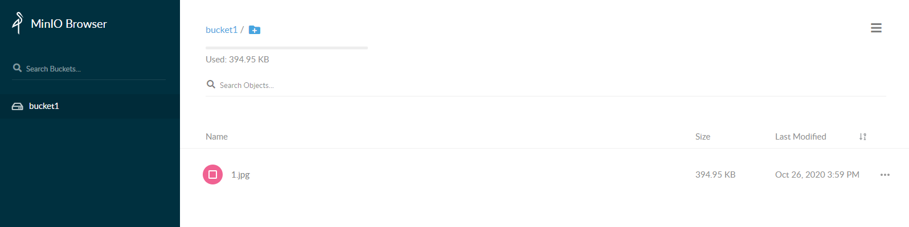

# MinIO

：一个 Web 服务器，提供了对象存储的功能。
- [官方文档](https://docs.min.io/docs/)
- 采用 Golang 语言开发，基于 HTTP 通信。
- 特点：
  - 轻量级，读写速度快，云原生架构。
  - 支持给文件生成 HTTP URL 形式的临时下载链接。
  - 兼容 AWS S3 协议的 API 。
  - 提供了命令行客户端 mc 。
  - 提供了 Python、Go、Java 等语言的客户端库。

## 部署

- 用 docker-compose 部署：
  ```yml
  version: '3'

  services:
    elasticsearch:
      container_name: minio
      image: minio/minio:RELEASE.2022-10-24T18-35-07Z
      command:
        - server
        - /data
      environment:
        MINIO_CONSOLE_ADDRESS: :9001  # Web 端监听地址
        MINIO_ACCESS_KEY: minioadmin  # 默认账号
        MINIO_SECRET_KEY: minioadmin  # 默认密码

        MINIO_COMPRESSION_ENABLE: on  # 将文件存储到磁盘时，是否进行压缩。默认为 off 。如果启用压缩，只会对
        # MINIO_COMPRESSION_EXTENSIONS: ".txt, .log, .csv, .json, .tar, .xml, .bin"  # 启用压缩时，只压缩这些扩展名的文件
        # MINIO_SCANNER_SPEED: default  # 每隔多久扫描一次所有文件。扫描时，才能发现过期的文件并删除，或者发现新文件并复制到其它 Minio
      ports:
        - 9000:9000   # API 端口
        - 9001:9001   # Web 端口
      volumes:
        - ./data:/data
  ```

### 版本

- MinIO 以日期作为版本号。
- 2022 年，MinIO 宣布弃用 Gateway 模块、旧的文件系统模式。
  - 旧版本不能兼容升级到 RELEASE.2022-10-29T06-21-33Z, 或更高版本。
  - 如果用户想升级到新版 Minio ，只能用 mc 命令从旧版 Minio 导出数据，然后导入新版 MinIO 。

## 用法

- Web 页面示例：

  

- 用户可以创建多个 Bucket（存储桶），每个 Bucket 中可以存储多个文件。
  - 每个 Bucket 可设置访问权限为 private 或 public 。
  - Bucket 支持版本控制，存储每个文件的多个版本。
  - Bucket 支持生命周期：每个文件在创建之后，经过多久就算过期，可以被自动删除。

- MinIO 支持部署多个服务器实例，将一个文件存储多个副本。
  - 基于纠删码（Erasure Code）算法存储数据，即使丢失一半数量的副本，也可以恢复数据。

### 客户端

- 除了访问 MinIO 的 Web 页面，用户还可以使用 MinIO 的命令行客户端 mc 。
  - mc 支持 ls、cp、rm、find 等多种 Unix 风格的命令。
  - mc 兼容 AWS S3 协议的 API 。
- 用户可以运行 mc 的 docker 镜像：
  ```sh
  docker run -it --rm --entrypoint bash -v $PWD:$PWD -w $PWD minio/mc:RELEASE.2022-10-29T10-09-23Z
  ```
- 命令语法：
  ```sh
  mc
    alias
          list            # 列出已添加的所有 server 地址
          remove <name>   # 删除一个 server 地址
          set myminio http://10.0.0.1:9000 $ACCESS_KEY $SECRET_KEY # 添加一个 server 地址

    ls <path>       # 显示指定 path 之下的文件列表。如果该 path 不存在，则 mc 命令的输出为空，但返回码依然为 0
      -r            # 递归显示目录
      --versions    # 显示每个文件的所有版本。否则默认只显示最新版本
      --incomplete  # 只显示上传失败的文件

    tree <path>     # 以树形图格式，递归显示指定 path 之下的所有目录
      -f            # 增加显示每个目录下的文件
      --depth <int> # 显示子目录的最大深度

    du <path>       # 统计磁盘占用量

    diff <dir> <dir>  # 比较两个目录下所有文件的差异

    find <path>       # 查找文件
      -name '*'
      --maxdepth <int>
      --newer-than 1d # 筛选 Last Modified 时间距今不超过 1d 的文件。注意 mv 操作也会刷新 Last Modified 时间
      --older-than 1d
      --larger 1G     # 筛选体积大于 1G 的文件
      --smaller 1G

    cp <SRC> <DST>    # 拷贝文件，可以在本机与 server 之间拷贝。比如 cp test/ myminio/bucket1/
      -r              # 递归拷贝目录

    mv <SRC> <DST>    # 移动文件

    rm <path>         # 删除文件
      -r              # 递归删除目录
      --force         # 强制删除。否则如果目录不为空，则不能删除

    mb myminio/bucket1  # 创建 bucket

    rb myminio/bucket1  # 删除 bucket
      --force           # 强制删除。否则如果 bucket 不为空，则不能删除
  ```
  - mc 客户端的配置文件存储在 `~/.mc/` 目录下。
