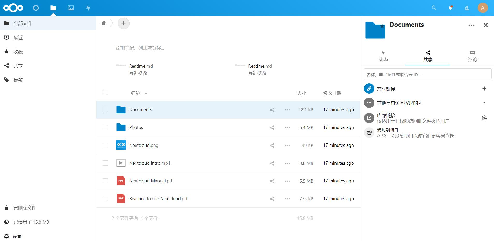

# Nextcloud

：一个 Web 服务器，提供了企业级的网盘功能，基于 HTTP 通信。
- [官方文档](https://docs.nextcloud.com/server/10/user_manual/contents.html)
- 特点：
  - 可以通过浏览器访问，也提供了 Linux、MacOS、Windows、Android、IOS 版的客户端。
  - 支持全局搜索，支持在线预览文本文件、图片、音频、视频。
  - 不能生成文件的下载链接，只能在用户之间共享文件。
  - 提供了插件市场，功能丰富。
- 同类产品：
  - Seafile  ：国产开源网盘，功能很少。
  - ownCloud ：可以生成文件的下载链接。提供了插件市场，功能比 Nextcloud 略少。

## 部署

- 用 docker-compose 部署：
  ```yml
  version: '3'

  services:
    mysql:
      image: percona
      environment:
      - MYSQL_ROOT_PASSWORD=******    # 设置 root 密码
      - MYSQL_DATABASE==nextcloud
      - MYSQL_USER=nextcloud
      - MYSQL_PASSWORD=******         # 设置密码
      networks:
      - net
      volumes:
      - ./mysql:/var/lib/mysql

    web:
      image: nextcloud
      depends_on:
      - mysql
      ports:
      - 80:80
      networks:
      - net
      volumes:
      - ./html:/var/www/html

  networks:
    net:
  ```

## 用法

- Web 页面示例：

  

