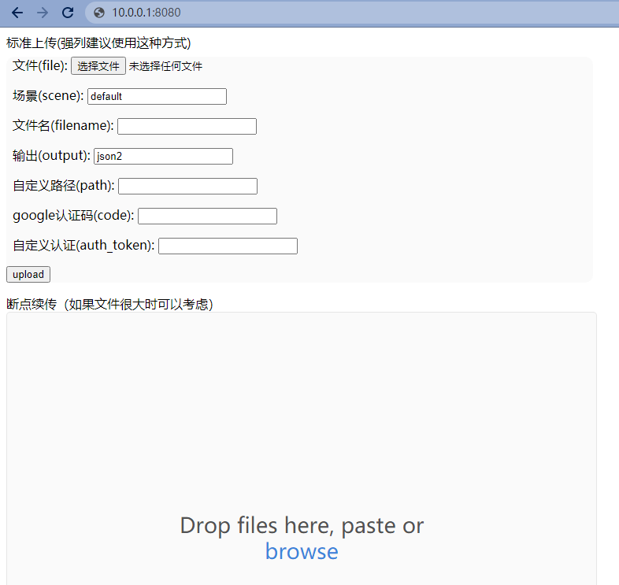

# go-fastdfs

：一个与 fastdfs 类似的文件服务器，但功能更多。
- [GitHub 页面](https://github.com/sjqzhang/go-fastdfs)
- 由国内开发者发布，采用 Golang 开发。
- 功能：
  - 采用 HTTP 协议通信，支持通过浏览器或 curl 命令上传、下载文件。
  - 上传的文件会自动去重。
  - 上传文件时，如果以存在与它哈希值相同的文件则自动秒传。
  - 支持断点续传。
  - 可以部署多个集群，通过 group 划分集群，从而横向扩容。

## 部署

- 用 Docker 部署：
  ```sh
  docker run -d --name go-fastdfs \
            -p 8080:8080 \
            -v go-fastdfs:/usr/local/go-fastdfs/data \
            sjqzhang/go-fastdfs
  ```

## 用法

- 上传文件：
  ```sh
  [root@Centos ~]# curl http://127.0.0.1:8080/group1/upload -F file=@f1
  http://127.0.0.1:8080/group1/default/20210101/15/22/2/f1?name=f1&download=1
  ```

- 下载文件：
  ```sh
  wget http://127.0.0.1:8080/group1/default/20210101/15/22/2/f1
  ```

- 在浏览器上访问服务器，会显示一个简单的上传文件的页面：

  

