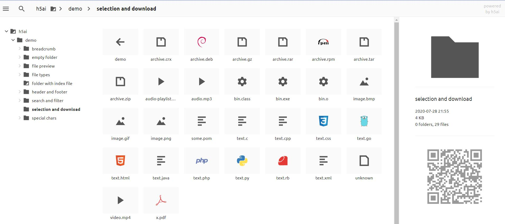

# h5ai

：HTML5 Apache Index ，一个轻量级的文件索引服务器，基于 HTTP 通信，常用于公开展示文件。
- [官方文档](https://larsjung.de/h5ai/)
- 采用 PHP 5.5 语言开发。
- 特点：
  - 它本身不存储文件，而是索引多个目录的文件，供用户读取、下载。但是不支持上传文件、修改文件。
  - 提供了 Web 页面，左侧显示一个目录树，右侧显示当前目录的文件列表。
  - 支持全局搜索，支持在线预览文本文件、图片、音频、视频，还可以根据文件的 URL 生成二维码。
  - 所有文件都可以公开访问，不支持用户权限控制，但可以通过 Nginx 代理加上 HTTP Basic Auth 。

## 部署

见官方文档。

## 用法

- Web 页面示例：

  

