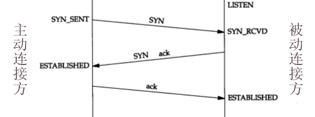
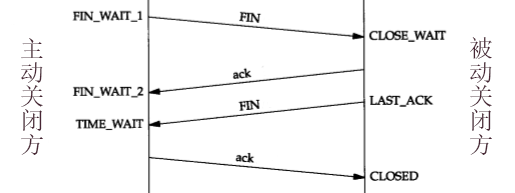

# TCP/UDP

## Socket的状态

未连接时的状态：
- `LISTEN` ：该Socket已绑定到某个进程，内核正在监听该Socket。


建立TCP连接时的状态：
- `SYN_SENT` ：已发出SYN=1的TCP包，还没有收到ACK=1、SYN=1的TCP包。
- `SYN_RECEIVED`
- `ESTABLISHED` ：已建立连接，可以通信。




断开TCP连接时的状态：
- `FIN-WAIT-1`
- `FIN-WAIT-2`
- `TIME_WAIT`
  - 主动关闭方在关闭连接之后，还要等待 2MSL 时间之后才能变成CLOSED，避免对方来不及关闭连接。此时该端口占用的资源不会被内核释放。
  - MSL的默认值为两分钟。
  - 服务器应该尽量不要主动断开连接，否则会经常产生TIME_WAIT状态的端口，浪费大量的服务器资源。
- `CLOSE_WAIT`
- `LAST_ACK`
- `CLOSED` ：已关闭连接。




## TCP通信的常见报错

- 当主机A向主机B的某个端口发送SYN包，请求建立TCP连接时：
  - 如果主机B的防火墙禁用了该端口，或者启用了该端口但是没有进程在监听该端口，主机B的内核就会回复一个RST包（也可能一直不回复），导致主机A报错：`Connection refused`
  - 如果主机A一直没有收到回复（连RST包都没收到），则超出等待时间之后会报错：`Connection timed out`

- 当主机A与主机B通信过程中，主机B突然断开TCP连接时：
  - 如果主机A继续读取数据包，主机B就会回复一个RST包，导致主机A报错：`Connection reset`
  - 如果主机A继续发送数据包，主机B就会回复一个RST包，导致主机A报错：`Connection reset by peer`

## telnet

：一个传统的远程登录工具。
- 通信内容没有加密，容易被监听。因此不再适合用于远程登录，现在常用于测试TCP端口是否连通。
- 命令：
    ```sh
    $ telnet <host> [port]    # 连接到某个主机的TCP端口（默认是23端口）
    ```

- 例：端口连通
    ```
    [root@Centos ~]# telnet baidu.com 80
    Trying 39.156.69.79...
    Connected to baidu.com.
    Escape character is '^]'.

    ```
    - 可见它成功连接到目标主机的80端口。此时按 `Ctrl+]` 和 `Ctrl+D` 即可断开连接。

- 例：端口不连通
    ```
    [root@Centos ~]# telnet 127.0.0.1 8000
    Trying 127.0.0.1...
    telnet: connect to address 127.0.0.1: Connection refused
    ```
    - Connection refused表示与目标主机的物理网络连通，但是连接不到目标端口。原因可能是：
      - 目标主机的防火墙拦截了发向该端口的数据包。
      - 目标主机的防火墙开通了该端口，但是目标主机上没有进程在监听该端口。
    - 上方访问的目标主机是本地环回地址，不会被防火墙拦截，所以是第二种原因。

- 例：无响应
    ```
    [root@Centos ~]# telnet baidu.com
    Trying 220.181.38.148...

    ^C
    ```
    - 可见它一直尝试连接目标主机的23端口，但并没有成功。原因可能是：
      - 与目标主机的网络不通
      - 端口无响应

## nmap

：一个端口扫描工具。
- 安装：yum install nmap
- 命令：
    ```sh
    $ nmap
          192.168.0.1               # 扫描目标主机有哪些端口可以连接
          192.168.0.1/24            # 扫描一个网段，检测有哪些可连接的主机，并扫描它们的端口
          192.168.0.1 192.168.0-5.1 # 扫描多个主机
          -p 80,443                 # 只扫描指定端口（默认扫描常用的1000个端口）
          -A                        # 扫描各种信息（比如推测目标主机的操作系统、版本）
    ```

## netstat

：用于查看本机网络连接的状态。

<details>
<summary>已淘汰不用</summary>

命令：

```sh
$ netstat
        -a  # 显示所有网络连接、socket
        -l  # 只显示LISTEN状态的
        -t  # 只显示tcp的socket
        -u  # 只显示udp的socket
        -x  # 只显示unix socket
        -p  # 显示使用每个网络连接的进程名
```

</details>

## ss

：socket statistics，用于查看socket的统计信息。与netstat命令类似，但运行速度更快。

- 命令：
    ```sh
    $ ss        # 显示established状态的socket
        -a      # 显示所有状态的socket
        -l      # 只显示被进程listen的socket
        -t      # 只显示TCP协议的端口
        -u      # 只显示UDP协议的端口
        -x      # 只显示本机通信的socket

        -p      # 显示使用每个socket的进程名
        -n      # 不允许用服务名代替端口号（比如默认会把22端口显示成ssh）
        -s      # 增加显示TCP、UDP等类型端口的统计信息
    ```

- 例：查看所有TCP端口的信息
    ```
    [root@Centos ~]# ss -tapn | cat    # 加上cat使显示的users不换行
    State      Recv-Q Send-Q Local Address:Port    Peer Address:Port
    LISTEN     0      128    127.0.0.1:34186            *:*              users:(("node",pid=15647,fd=19))
    LISTEN     0      128        *:111                  *:*              users:(("systemd",pid=1,fd=51))
    LISTEN     0      128        *:22                   *:*              users:(("sshd",pid=3057,fd=3))
    ```
    - Recv-Q、Send-Q：表示接收队列、发送队列中待处理的数据包数。它们最好为0，即没有包堆积。
    - 最右端的一列users表示监听每个端口的进程。

- 例：查看指定端口的信息
    ```
    [root@Centos ~]# ss -tapn | grep 8000
    LISTEN     0      128         :::8000               :::*             users:(("docker-proxy",pid=18614,fd=4))
    ```
