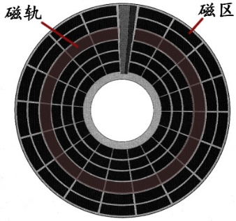

# 外存

：外部存储器，在工作时不必连接到计算机。
- 可以在计算机断电后继续保存数据，可以用作计算机外部的可移动存储介质。
- 不能被 CPU 直接读写。外存中的数据要载入内存之后，才能被 CPU 访问。

## 磁盘

：Disk ，泛指基于磁记录技术存储数据的设备。
- 磁盘的分类：
  - 软磁盘（Soft Disk）：是早期常见的磁盘，存储容量小，目前已经淘汰使用。
  - 硬磁盘（Hard Disk）：主要为机械硬盘。

### 机械硬盘

：HDD（Hard Disk Drive），简称为硬盘。结构如下：

- 机械硬盘由多个磁碟组成，磁碟的结构如下图：

  

  - 磁碟的表面涂有磁性颗粒，通过磁极的方向表示二进制的 0、1 。
  - 磁碟的两面通常都可读写数据，每面各有一个磁头（Head）。
    - 磁头可以转动到磁碟某个位置，根据磁感应，获取此处磁性颗粒的磁极方向，或者改变其方向。
  - 每个磁碟上有多个同心圆，根据半径线分成多个弧道，称为磁区、扇区（Sector）。
    - 每个扇区存储 512Bytes 的数据。
    - 实际上外圈的磁区容量较大，浪费了一些空间。
  - 同一圈的扇区组成一条磁轨、磁道（Track）。
  - 如果有多个磁碟叠在一起，则所有碟上的相同位置的磁轨组成一个磁柱、扇面（Cylinder）。
  - BIOS 会自动检测硬盘，计算出 ` 总容量 = Head 数 × Cylinder 数 × Sector 数 × 512 Bytes` 。
    - BIOS 采用十进制计算容量，因此它的 1KB = 1000B 。

- 硬盘的读写速度，主要受以下因素影响：
  - 存储介质
    - 比如固态硬盘比机械硬盘快，内存比固态硬盘快。

  - 寻址方式
    - 顺序寻址：指访问一组地址连续的存储空间。
      - 主要的性能指标是 MBPS ：读写一个大文件时，每秒读写的数据量。

    - 随机寻址：指访问一组地址不连续的存储空间。
      - 主要的性能指标是 IOPS ：读写大量 4KB 的小文件时，每秒读写的文件数量。

- 硬盘的读写速度大概为以下数量级：

  -        |机械硬盘       | 固态硬盘
  -|-|-|-
  顺序读写  | 100 MB/s     | 500 MB/s
  随机读写  | 0.5 MB/s     | 30 MB/s

  - 这里是指 SATA 接口的硬盘。
  - 写入速度通常比读取速度较低。
  - 机械硬盘随机读写的速度很慢，因为每次更换地址都需要磁头移动寻址。
    - 顺序读写的速度则快了两个数量级。
  - 固态硬盘不需要磁头寻址。不过随机读写时，每块地址需要分别处理，而且只能以 Block 为单位访问，因此依然比顺序读写慢一个数量级。

### 固态硬盘

：SSD（Solid State Disk），是基于 DRAM 或 NAND Flash 存储数据。
- 读写速度比机械硬盘快很多。
- 不是采用磁性颗粒存储数据，严格来说不属于磁盘，只是通常当作磁盘使用。

### 磁盘接口

- IDE（Integrated Device Electronics，集成设备电路）
  - IO 速度可达 100 MB/s 。
  - 采用并口排线，容易受干扰，不支持热插拔。
- SATA（Serial ATA)
  - 采用串口排线，抗干扰，支持热插拔。
  - IDE 是并口 ATA ，而 SATA 是串口 ATA 。
  - SATA 3.0 标准的 IO 速度可达 600 MB/s 。
- SCSI（Small Computer System Interface，小型计算机系统接口）
  - 性能较好，价格较贵。
- SAS（Serial Attached SCSI）
  - 新一代的 SCSI 技术，向下兼容 SATA 接口，但反之不兼容。
  - IO 速度可达 6 GB/s 。

### 主引导扇区

：每块硬盘的第一个扇区又称为主引导扇区，它不属于任何分区，不会被格式化分区的命令影响。
- 主引导扇区的大小为 512 Bytes ，前 446 Bytes 存储一段代码，称为主引导记录；后面的 64 Bytes 存储硬盘分区表。

- 主引导记录（Master Boot Record ，MBR）
  - ：又称为启动引导程序（Bootloader）。
  - 负责根据硬盘分区表找到硬盘中存储的操作系统文件，读取并运行它。

- 硬盘分区表（Disk Partition Table ，DPT）
  - ：用于存储硬盘的物理分区信息。
  - 比如记录第四个分区是从第 301 号磁柱到第 400 号磁柱，挂载到目录 /dev/hda4 。
  - 将硬盘分区后，不同分区的内容互不影响，可以分别管理，而且磁头读取数据时的搜寻范围变小了。

### BIOS

：基本输入输出系统（Basic Input Output System）
- 负责在计算机开机时初始化硬件设备、引导操作系统。
- 是一组固化在 ROM 中的程序，包括基本输入输出程序、开机后自检程序、系统自启动程序等。

BIOS 常见的启动模式：
- Legacy
  - ：传统的 BIOS 启动模式。
  - 使用 MBR 扇区存储 Bootloader 。
  - 采用 DPT 分区表，最多只能存储 4 个分区的信息，每个分区的最大容量为 2TB 。
    - 通常将前三个分区用作主分区，将第 4 个分区 /dev/hda4 用作扩展分区，存储额外的分区信息，从而可以分出无数个逻辑分区（编号从 5 开始）。
    - 因此，磁盘总容量 = 主分区容量 + 扩展分区容量，扩展分区容量 = 所有逻辑分区容量之和 。

- UEFI（Unified Extensible Firmware Interface）
  - ：目前流行的 BIOS 启动模式，只支持 64 位的系统。
  - 使用 ESP（EFI system partition）扇区存储 Bootloader 。
  - 采用 GPT（Globally Unique Identifier Partition Table）分区表：
    - 分区信息存储为 efi 文件。
    - 支持划分无数个分区，每个分区的最大容量为 18EB 。
  - 计算机开机时不需要进行自检，而是直接读取 Bootloader ，因此开机速度更快。

### RAID

：独立冗余磁盘阵列技术（Redundant Array of Independent Disks），将多个磁盘设备组合成一个磁盘阵列使用。

常见的 RAID 方案：
- RAID 0
  - ：将数据拆成几份，分别写入 n 个磁盘设备。
  - 这样读写速度提升到 n 倍，但不能备份数据，只要有一个磁盘受损，数据就会无法恢复。
- RAID 1
  - ：将数据拷贝几份，分别写入 n 个磁盘。
  - 这样能备份 n 份数据。但读写速度不变，增加了 CPU 写数据时的工作量，增加了磁盘成本。
- RAID 5
  - ：将数据的奇偶校验信息保存到其它磁盘设备中。当当前磁盘受损时，可以尝试用奇偶校验信息来恢复数据。
- RAID 10
  - ：按 RAID 0 技术部署一组磁盘，并给每个 RAID 0 磁盘部署一个 RAID 1 磁盘做备份。
  - 这样兼容了 RAID 0 和 RAID 1 的优点，能提升读写速度，备份 1 份数据，性价比较好。

## CD

：光盘（Compact Disc），一种用激光存储数据的设备。
- 光盘技术的发展。
  - CD ：80 年代开始流行，取代了传统的黑胶唱片、软盘。
  - VCD（Video Compact Disc）：一种存储视频信息的光盘。
  - DVD（Digital Video Disc）：一种存储数字视频的光盘，容量更大，
  - BD（Blue-ray Disc）：蓝光光盘，一种用蓝色激光存储数据的大容量光盘。
- 根据是否可擦写分类：
  - 不可擦写光盘：只能写入一次数据，写入后只能读取，比如 CD-ROM、DVD-ROM 。
  - 可擦写光盘：比如 CD-RW、DVD-RAM 。
