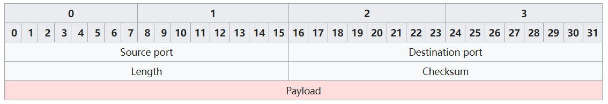

# UDP

：用户数据报协议（User Datagram Protocol）
- 属于传输层协议，与 TCP 类似。
- 特点：
  - 全双工通信。
  - 面向无连接。
    - TCP 通信之前需要先握手，耗时为 1 RTT 。而 UDP 通信可以直接发送数据包，因此更适合即时通信，比如网络聊天。
    - UDP 通信不需要握手，不需要接收方同意即可发送数据包，因此可实现多播消息、广播消息。
  - 传输不可靠。
    - 与 TCP 协议相比，UDP 没有顺序控制、差错控制等功能，只是简单地发送数据包，不考虑对方是否在线、是否接收。优点是开销低，缺点是容易丢包、网络拥塞。
    - 使用 UDP 时，如果需要顺序控制、差错控制等功能，可在应用层软件实现。

- 大部分应用层协议，在传输层是基于 TCP 或 UDP 协议进行通信的。而 TCP、UDP 协议，在网络层是基于 IP 协议进行通信的。
  - 例如 HTTP、FTP、SMTP 是基于 TCP 协议。
  - 例如 DHCP、DNS、SNMP（简单网络管理协议）、TFTP（通用文件传输协议）、NFS（网络文件系统）是基于 UDP 协议。

- 对比 TCP 与 UDP 协议：
  - 早期计算机网络的通常带宽低、丢包率高，因此 UDP 通信的质量差，大部分应用只能采用 TCP 通信。
  - 目前计算机网络的质量变好，城域网基本不丢包，因此一些软件从 TCP 改用 UDP ，希望提高通信效率。
    - 特别是在一些机房内网中，主机之间进行高速网络通信。采用 TCP 协议时，会因为三次握手、顺序控制、差错控制等因素，明显增加通信延迟、通信开销。

## 数据格式

UDP 协议传输 payload 数据时，会封装成至少一个数据包，每个数据包称为报文（datagram），其数据结构如下：

- Source Port ：源端口，占 16 bits 空间。
  - 该字段声明了发送方使用的端口。当接收方回复 UDP 报文时，应该采用该端口作为目标端口。
  - 该字段可以省略，此时相当于取值为 0 。
- Dest Port ：目标端口，占 16 bits 。
- Length ：整个 UDP 报文的字节长度（包括 headers、payload），占 16 bits 。
  - 理论上，UDP datagram 的最大长度为 `2^16 - 1 = 65535 bytes` 。
  - 实际上，UDP datagram 和 TCP segment 的最大长度都应该小于 IP 包的最大体积 MTU 。
- Checksum ：校验和，占 16 bits。
  - IPv4 协议允许省略该字段，而 IPv6 协议不允许。
- Payload ：该数据包负责传输的数据，取值可以为空。

- 可见，TCP segment 包含大量 headers ，而 UDP datagram 只有少量 headers ，因此网络流量少得多。
