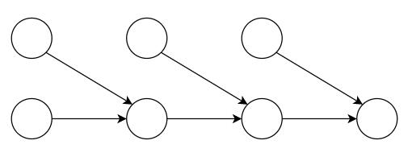
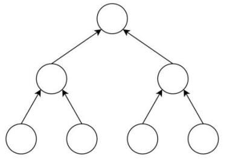

# 哈希算法

：Hash algorithm 。是一种信息摘要算法，用于计算一段数据的摘要值。
- 用户向哈希算法输入一段数据，哈希算法会输出一个几乎随机、几乎独一无二的摘要值，又称为散列值、哈希值。

- 哈希算法常用于检验数据的一致性。
  - 例如两个人各自拥有一个文件，如何在不泄露文件内容的情况下，判断这两个文件内容是否相同？两个人可分别计算自己文件的哈希值，然后告知对方。如果两个哈希值相同，则说明两个文件极大概率相同。
  - 例如 Web 服务器不储存用户的明文密码，而是储存密码的哈希值。如果用户输入的密码的哈希值与数据库中存储的哈希值一致，则判断密码正常。这样连网站管理员都看不到用户的明文密码，避免泄露。
  - 哈希算法常用于加密领域，不过也有图片哈希算法等其它用途。

- 哈希算法在广义上可视作加密算法，但加密过程不可逆。
  - 可以加密：用户拥有一个字符串 str1 ，可以计算出它的哈希值 hash1 ，然后只将 hash1 告诉其他人，避免泄露 str1 的值。
  - 不能解密：其他人知道了 hash1 ，不能从 hash1 反推出 str1 的值。
  - 极低概率被破解：其他人可以编造一个字符串 str2 ，如果其哈希值 hash2 等于 hash1 ，则说明 str2 的值与 str1 相同，或者是两个不同的 str 发生了哈希碰撞。但这样编造 str2 ，需要尝试非常多的可能取值，工作量极大，破解的概率极低。

## 特点

人们发明了多种哈希算法，它们通常具有以下特点：
- 正向快速
  - ：输入一段任意长度的数据，由哈希算法计算，会快速输出一个固定长度的、难以预测的哈希值。
  - 输入值通常采用二进制格式。例如将图片等文件转换成二进制流，然后计算哈希值。
  - 输出值通常采用十六进制格式，便于阅读。
- 逆向困难
  - ：如果只知道一个数据的哈希值，则难以据此反推出原数据的内容。
  - 因为理论上生成同一个哈希值的原数据可能有无数个。想反推出原数据，除非哈希算法存在容易被反推的缺陷，或者建立一个庞大的数据库，存储常见的一些数据的哈希值。
- 确定性
  - ：如果两个输入数据相同，则它们的哈希值一定相同。
  - 在计算机上编辑图片等文件时可能会自动加上时间信息等内容，导致最后保存的文件内容看起来一样，实际上二进制数据并不一样，因此哈希值不同。
- 抗碰撞性
  - ：很难找到两个不同的输入数据，映射到相同的哈希值。
  - 如果两个数据的哈希值相同，则称为发生碰撞。
  - 哈希算法的碰撞率越低越好。这需要哈希值的取值空间大，并且映射的哈希值均匀分布。
  - 例如 MD5 生成 128 位的哈希值，而 SHA256 生成 256 位的哈希值，取值空间更大，因此碰撞概率更低。
- 输入敏感
  - ：如果两个输入数据不同，即使只有一个 bit 的差异，输出的哈希值也会有很大差异。

## 批量哈希

用户将一条数据，输入哈希算法，便可得到其哈希值。但如果存在很多条数据（比如几百个文件），如何批量计算哈希值？可采用几种方案：

- 哈希列表（Hash List）
  - 原理：
    1. 分别计算每个节点的哈希值。将这些哈希值，保存为一个列表。
    2. 计算列表的哈希值。
  - 如果任一节点发生变化，列表的哈希值都会变化。因此，用户不必保存每个节点的哈希值，只需保存列表的哈希值，就能检验所有节点的一致性。
  - 如果用户发现列表的哈希值变化，希望找出具体是哪个节点发生了变化。则需要遍历每个节点，检查其哈希值是否变化，时间复杂度为 O(n) 。

- 哈希链（Hash Chain）

  

  - 原理：
    1. 计算第 1 个节点的哈希值。
    2. 将上述哈希值，与第 2 个节点的内容拼接在一起，计算哈希值。
    3. 将上述哈希值，与下一个节点的内容拼接在一起，计算哈希值。以此类推。
  - 如果任一节点发生变化，则在哈希链中，其后所有节点的哈希值都会变化。

- 哈希树（Hash Tree）：又称为默克尔树（Merkle Tree）

  

  - 原理：
    1. 计算每个节点的哈希值，存放在二叉树的叶子节点。
    2. 对于每个父节点，将它所有子节点的值拼接在一起，计算哈希值，作为父节点存储的值。
  - 从一个叶子节点到根节点的路径，称为 Merkle 路径。
  - 如果任一节点发送变化，则根节点存储的哈希值都会变化。
  - 如果用户发现根节点的哈希值变化，希望找出具体是哪个节点发生了变化。则需要按二分法查找子孙节点，检查其哈希值是否变化。时间复杂度为 O(logn) ，效率较高。
  - 假设哈希值存储在其它主机上，则采用 Hash List、Hash Chain 时，本机需要下载所有节点的哈希值用于遍历检验。而采用 Merkle Tree 时，本机只需下载 Merkle 路径上相关节点的哈希值用于检验，开销更低。

## MD5

：消息摘要算法（Message-Digest Algorithm）
- 于 1992 年发布，生成 128 位的哈希值。
- 存在容易被碰撞攻击的漏洞，安全性差。但生成速度快，依然可以用于非安全用途。

## SHA

：安全哈希算法（Secure Hash Algorithm）
- 由美国国家安全局发布，分为几个版本：
  - SHA-1 ：于 1995 年发布，会生成 160 位的哈希值。安全性较差，可能被碰撞攻击。
  - SHA-2 ：于 2001 年发布。常用的是 SHA-256、SHA-512 ，分别生成 256、512 位的哈希值。安全性更高，但是生成速度较慢。
  - SHA-3 ：于 2015 年发布。

## MAC

- MAC（Message Authentication Code，消息验证码）
  - 用途：在主体数据之外附带一个验证码，用于校验主体数据的一致性。而且第三方没有密钥，不能伪造这个验证码。
- 用于生成 MAC 的算法有多种，统称为 MAC 算法。
  - MAC 算法的基本逻辑：输入一段数据、一个密钥，然后输出一个 MAC 验证码。
  - MAC 算法与哈希算法的都属于信息摘要算法，主要用于校验数据一致性，区别在于：
    - 如果知道一段数据的明文、哈希值，任何人都能检验该哈希值是否正确。
    - 如果知道一段数据的明文、MAC 验证码，只有拥有 MAC 密钥的人，才能检验该 MAC 验证码是否正确。其他人不能检验数据的一致性。
  - MAC 算法常用于计算机通信领域。
    - TCP 通信中，发送方会同时发送 payload 及其 checksum ，接收方会根据 checksum 检查 payload 是否传输出错。但第三方可以篡改 payload ，并根据新的 payload 伪造出新的 checksum 。
    - SSL 通信中，发送方会同时发送 payload 及其 MAC 验证码。只有通信双方知道 MAC 密钥，能计算出 MAC 验证码。而第三方不能伪造 MAC 验证码，因此不能篡改 payload 。因此 MAC 验证码又称为受保护的校验和。

## import hashlib

：Python 的标准库，提供了实现 MD5、SHA1、SHA256、SHA512 等常见哈希算法的函数。
- 例：
  ```py
  >>> import hashlib
  >>> h = hashlib.sha256()          # 创建一个 Hash 对象
  >>> h.update("Hello".encode())    # 输入要 Hash 的内容（必须转换成 bytes 类型）
  >>> h.update("World".encode())    # 可以累加
  >>> h.digest()                    # 生成哈希值（ bytes 类型）
  b'\x87.NP\xce\x99\x90\xd8\xb0A3\x0cG\xc9\xdd\xd1\x1b\xeckP:\xe98j\x99\xda\x85\x84\xe9\xbb\x12\xc4'
  >>> h.hexdigest()                 # 生成十六进制的哈希值（ str 类型）
  '872e4e50ce9990d8b041330c47c9ddd11bec6b503ae9386a99da8584e9bb12c4'
  >>> hashlib.sha256("HelloWorld".encode()).hexdigest()      # 可简化成一步
  '872e4e50ce9990d8b041330c47c9ddd11bec6b503ae9386a99da8584e9bb12c4'
  ```
- 在哈希时加盐：
  ```py
  import os
  salt       = os.urandom(10)       # 生成指定字节数的随机 bytes 对象
  password   = '123456'.encode()
  Hash_bytes = salt + password
  result     = hashlib.sha256(Hash_bytes).hexdigest()
  ```
  - 用 Python 的 random 模块生成的随机数是不安全的，此处应该用 os.urandom() 函数生成随机数。

## import hmac

：Python 的标准库，提供了实现 HMAC 算法的函数。
- HMAC 算法是一种输出哈希值的 MAC 算法。
  - 加密过程：
    1. 输入一段数据、一个密钥、一个哈希算法名。
    2. 将数据与密钥拼接，计算哈希值。（还会对密钥进行加工）
    3. 将上述值与密钥拼接，计算哈希值，作为 MAC 验证码。
  - 与哈希加盐类似，但计算两次哈希值，更难预测。
- 例：
  ```py
  >>> import hmac
  >>> key = os.urandom(10)
  >>> msg = '123456'.encode()
  >>> hmac.new(key, msg, 'sha256').hexdigest()
  '62f33c9d8af25adb6ca6180f9351618084de7d95d5f2689489700f48f982bae6'
  >>> hmac.compare_digest(b'123', b'123')    # 比较两个数据的哈希值是否相同
  True
  ```
