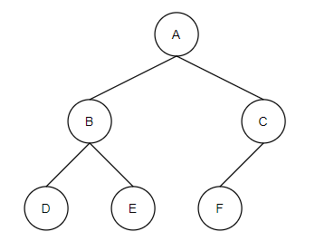
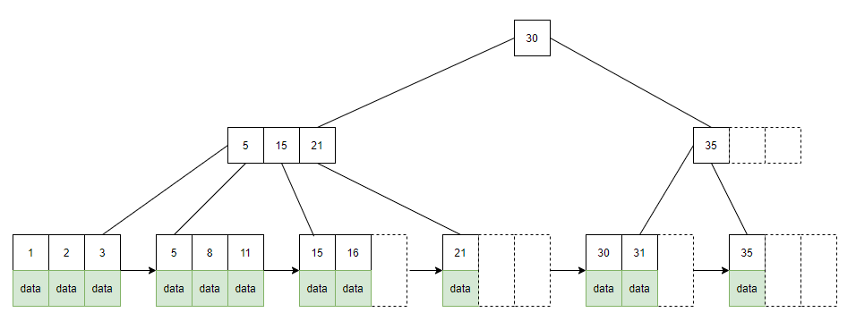
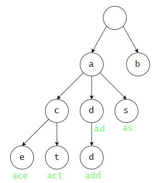

# 数据结构

<!--
## 数据：对客观事物的符号表示，。
- 数据元素：数据的基本单位。
- 数据对象：一部分数据元素的集合。
- 各种编程语言都定义了自己的数据类型，一般分为简单类型和结构类型两种，像 C 语言中的基本数据类型与结构体。
  - 简单类型的数据都是无法细分的单位，而结构类型的数据是由简单类型或结构类型的数据组成的。
- 数据结构（Data Structure）：指数据、数据之间的关系。
  - 可以表示成二元组的形式，比如 B=(K ，R)，其中 B 代表一个数据结构，K 是数据的有限集，R 是数据之间的关系的有限集。
  - 也可以表示成三个方面的内容：逻辑结构、存储结构（物理结构）、数据的运算。
## 逻辑结构是从实际问题中抽象出来的结构，用于反映数据之间的逻辑关系。以下是四种基本的逻辑结构：
- 集合结构：所有节点属于一个集合。
- 线形结构：节点之间只存在一对一的关系，可以依次连成一条线，有且仅有一个头节点、一个尾节点。
- 树形结构：节点之间存在一对多的关系。
- 图状（网状）结构：节点之间存在多对多的关系。
## 存储结构是逻辑结构在计算机中的存储形式。
- 顺序存储结构：节点们的存储地址连续，并且存储顺序与逻辑顺序一致。
  - 比如数组，其元素之间的逻辑关系为线形结构，存储时采用顺序存储结构。
- 链式存储结构：节点们的存储地址不必连续，分散存储，只是可以用一条线串联起来。
- 索引存储结构
- 散列存储结构
## 常见的数据结构。
- 线性表：一组存储地址连续的元素，存储顺序也与逻辑顺序一致。
  - 典型的例子就是数组。
- 栈(stack)：一种线形结构，只能在一端（称为栈顶）移入（PUSH）、移出（POP）元素，因此读写顺序为先进后出(First-In Last-Out ，FILO)。
  - 栈的基本操作包括入栈、出栈、读栈顶元素。
- 堆(heap)：一种完全二叉树，读写顺序任意。
- 队列：一种线形结构，只能在一端移出元素（称为队首）、在另一端移入元素（称为队尾），因此读写顺序为先进先出（First-In First-Out ，FIFO）。
- 链表：像数组，但是属于链式存储结构，每个节点包含一个指向下一个节点的指针。
  - 顺序存储可以访问任意节点，而链表只能从第一个节点开始逐个访问。
  - 例：
typedef struct Node{
    int id;
    struct Node *next;            // 只有一个指向下一个节点的指针，称为单向链表
    // struct Node *last;            // 加上指向上一个节点的指针，就变成了双向链表
};
Node *n = malloc(sizeof(Node));    // 创建一个节点
n->id = 0;
n->next = NULL;                    // 初始化
-->

## 线性表

- 节点之间的连接线段称为边（edge）。

## 树

：树形结构。包含一些用边连接的节点，存在层级关系。
- 特点：
  - 有且仅有一个根节点。
  - 除了根节点以外，其它节点都有且仅有一个父节点。
  - 除了叶子节点以外，其它节点都有一个或多个子节点。

- 图例：

  

- 相关概念：
  - 森林（Forest）：包含多个不相交的树。
  - 根节点：唯一一个没有父节点的节点，是其它节点的父节点或祖父节点。
  - 叶子节点（leaf nodes）：没有子节点的节点，又称为外部节点（external nodes）。
  - 内部节点（internal node）：非叶子节点。
  - 节点的度（degree）：指该节点的子节点个数。
    - 叶子节点的度为 0 。
    - 树中节点的最大度数，称为树的阶数（order）。
  - 节点的路径（path）：指从根节点到该节点依次经过了哪些节点。
  - 节点的深度（depth）：指从根节点（深度为 0 ）往下到该节点经过的边数。
  - 节点的高度（height）：指从叶子节点（高度为 0 ）往上到该节点经过的边数。
    - 树中节点的最大高度（总是根节点），称为树的高度。

### 二叉树

：Binary Tree
- 特点：每个节点最多有两个子节点，称为左子树、右子树。

二叉树的常见类型：
- 满二叉树（Full Binary Tree）
  - 特点：内部节点都拥有两个子节点。
  - 只存在根节点时，也属于满二叉树。
- 完美二叉树（Perfect Binary Tree）
  - 特点：属于满二叉树，且叶子结点都位于最底一层，即深度相同。
- 完全二叉树（Complete Binary Tree）
  - 特点：叶子结点都位于最底一层，且集中在左侧。
  - 完全二叉树相当于完美二叉树去掉了最底一层的右侧部分叶子节点。
  - 例如上图属于完全二叉树，不属于满二叉树、完美二叉树。
- 平衡二叉树（Balanced Binary Tree）
  - 特点：在同一个父节点下，左子树与右子树的高度差不超过 1 。

#### 遍历

将二叉树转换成线形结构时，有多种遍历方法：
- 层序遍历（level order traversal）
  - ：从上到下逐层遍历，每层从左到右遍历。
  - 上图的遍历顺序是 abcdef 。
- 前序遍历（preorder traversal）
  - ：先访问父节点，再访问左子树的所有节点，最后访问右子树的所有节点。
    - 前序是指父节点最先访问。
    - 对于子树则递归遍历。
  - 上图的遍历顺序是 abdecf 。
- 中序遍历（inorder traversal）
  - ：先访问左子树，再访问父节点，最后访问右子树。
  - 上图的遍历顺序是 dbeafc 。
- 后序遍历（postorder traversal）
  - ：先访问左子树，再访问右子树，最后访问父节点。
  - 上图的遍历顺序是 debfca 。

Python 代码示例：
```py
class Node:
    def __init__(self, name, data=None, left=None, right=None):
        self.name  = name   # 节点名，必须指定
        self.data  = data   # 节点存储的数据，默认为空
        self.left  = left   # 左子节点，默认为空
        self.right = right  # 右子节点，默认为空
    def __repr__(self):
        return "Node('{}')".format(self.name)

def preorder(node):
    """ 前序遍历 """
    if not node:
        return []
    result = []
    result.append(node)
    result.extend(preorder(node.left))
    result.extend(preorder(node.right))
    return result

# 创建各节点
root            = Node('a')
root.left       = Node('b')
root.right      = Node('c')
root.left.left  = Node('d')
root.left.right = Node('e')
root.right.left = Node('f')
# 开始遍历
preorder(root)
```

改进 Node 的定义：
```py
class Node:
    node_dict = {}    # 记录所有节点
    def __new__(cls, name, *args, **kwargs):
        """ 创建节点时，如果已存在同名节点，则返回其实例 """
        instance = cls.node_dict.get(name)
        if instance:
            return instance
        else:
            instance = super().__new__(cls)
            cls.node_dict[name] = instance
            return instance
    def __init__(self, name, data=None, left=None, right=None):
        self.name  = name
        self.data  = data
        self.left  = left
        self.right = right
    def __repr__(self):
        return "Node('{}')".format(self.name)

Node('a').left  = Node('b')
Node('a').right = Node('c')
```
- 这里的每个 Node 存放一个数据元素，只需指定节点的 name ，就可找到对应的 data 。
  - 多个 Node 之间通过比较 name 的大小来排序。

#### 排序

二叉树常见的排序算法：
- 二叉查找树（Binary Search Tree ，BST）
  - ：一种便于查找节点的二叉树，将所有节点中序排列，即：
    - 左子树的所有节点都小于父节点。
    - 右子树的所有节点都大于父节点。
  - 读取一个节点时，可以根据二分法快速定位，时间复杂度为 O(log n) 。
    - 插入、删除一个节点时，需要先根据二分法定位，然后移动中序的后继节点，比较麻烦。
  - 如果二叉查找树只存在一条路径，呈线形结构，则定位的时间复杂度为 O(n) 。
    - 使用 AVL tree 可以保证树的自平衡，避免这种情况。

- AVL tree
  - ：一种自平衡的二叉查找树。
  - 每个节点会记录自己的平衡因子，其值等于左子树的高度 - 右子树的高度，取值范围为 -1、0、1 。
  - 插入、删除节点时，通常需要进行左旋、右旋操作，移动节点的位置，从而维持平衡。

- B tree（B- Tree）
  - ：一种具有自平衡、查找特性的树，不属于二叉树 。特点如下：
    - 叶子结点都位于最底一层。
    - 假设树的阶数为 n ，则每个节点拥有 [n/2, n] 个子节点。
    - 每个节点存放最多 n-1 个数据元素。
      - 每个元素以 name:data 键值对形式存储，按升序排列。
      - 根节点可以只存放 1 个元素。
      - 叶子节点的元素数量等于子节点数减一，从而与子节点呈中序排列。
  - 与 AVL tree 相比，B tree 的每个节点存放更多元素，因此减少了节点数，减少了左旋、右旋操作，减少了磁盘 IO 。

- BPlus tree（B+ tree）
  - ：在 B tree 的基础上，增加定义：
    - 内部节点只存放元素 name ，用于索引。其完整的元素 name、data 存放在叶子节点，是叶子节点中的第一个元素。
    - 在最底一层，每个叶子节点会记录相邻的下一个叶子节点的指针，因此形成了线形结构，允许进行更快的顺序遍历。
  - 例：一个 4 阶的 B+ tree 图

    

  - 例：B+ tree 的节点定义
    ```py
    class BPTreeNode:
        def __init__(self, order):
            self.order      = order   # 记录树的阶数
            self.values     = []      # 一组元素的值
            self.keys       = []      # 一组元素的名称
            self.parent     = None    # 父节点
            self.children   = []      # 一组子节点
            self.next       = None    # 下一个叶子节点
            self.check_leaf = False   # 表示该节点是否为叶子节点
    ```

- 红黑树（Red-Black Tree）
  - ：一种具有自平衡、查找特性的二叉树，采用较弱的平衡条件：
    - 叶子节点为空，只有内部节点存放数据元素。
    - 根节点、叶子节点总是黑色。
    - 其它内部节点可以是黑色或红色，只需要满足以下条件：
      - 每个红色节点的子节点都是黑色。
      - 对于任一节点，从该节点到其各个叶子节点，经过的黑色节点数相同。
  - 与 BST 相比，红黑树的平衡性保证了树中的最长路径不超过最短路径的两倍，因此查找耗时更稳定。
  - 与 AVL tree 相比，红黑树的平衡性较弱，减少了左旋、右旋操作，因此开销更低。

### 字典树

：又称为前缀树、trie ，是将前缀相同的单词存放在树的同一条路径上，方便查找单词。
- 原理：
  - 除了根节点以外，每个节点存放一个字母。
  - 每个节点可以有任意个子节点，每个子节点存放的字母不同。
- 使用单词的存放路径作为 key ，查找单词的 value 。
  - 树的高度等于最长的一个单词的长度。假设树的高度为 n ，则查找一个单词的时间复杂度为 O(n) 。
- 图例：

  

## 图

：图形结构。包含一些用边连接的节点。
- 如果两个节点直接相连，则称为相邻。
- 线下结构属于树形结构，而树形结构属于图形结构。
  - 如果图形结构中的节点存在层级关系，则形成了树形结构。
  - 如果树形结构中只存在一条路径，则形成了线形结构。

