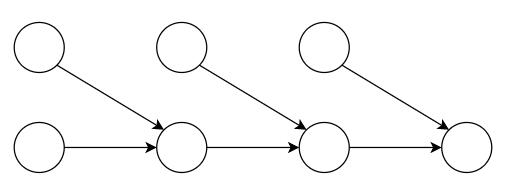
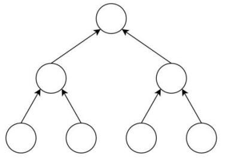

# 哈希算法

：Hash algorithm ，又称为散列函数。用于将一段数据映射到一个接近随机的值，称为散列值、哈希值、摘要值。
- 常用于检验数据的一致性。
  - 例如根据一个文件的哈希值是否变化，能判断该文件的内容是否变化。
  - 例如 Web 服务器不储存用户的明文密码，而是储存密码的哈希值。如果用户输入的密码的哈希值与数据库中存储的哈希值一致，则判断密码正常。这样连网站管理员都看不到用户的明文密码，避免泄露。
- 哈希算法属于不可逆的加密算法。
  - 可以加密：用户拥有一个字符串 str1 ，可以计算出它的哈希值 hash1 ，然后只将 hash1 告诉其他人，避免泄露 str1 的值。
  - 不能解密：其他人知道了 hash1 ，不能从 hash1 反推出 str1 的值。
  - 极低概率被破解：其他人可以编造一个字符串 str2 ，如果其哈希值 hash2 等于 hash1 ，则说明 str2 等于 str1 ，或者属于哈希碰撞。但这样需要尝试 str2 的很多个可能取值，工作量极大，破解的概率极低。
- 哈希算法常用于加密领域，不过也有图片哈希算法等其它用途。

## 原理

哈希算法有多种，通常具有以下特点：
- 正向快速：输入一段任意长度的数据，会快速输出一个固定长度的、取值难以预测的数据。
  - 通常在二进制格式下进行哈希运算。例如将图片等文件转换成二进制流，再计算哈希值。
  - 通常将输出的哈希值转换成十六进制，便于阅读。
- 逆向困难：如果只知道一个数据的哈希值，则难以据此反推出原数据的内容。
  - 因为理论上生成同一个哈希值的原数据可能有无数种。想反推出原数据，除非哈希算法存在容易被反推的缺陷，或者建立一个庞大的数据库，存储常见的一些数据的哈希值。
- 确定性：如果两个输入数据相同，则它们的哈希值一定相同。
  - 在计算机上编辑图片等文件时可能会自动加上时间信息等内容，导致最后保存的文件内容看起来一样，实际上二进制数据并不一样，因此哈希值不同。
- 抗碰撞性：很难找到两个不同的输入数据，映射到相同的哈希值。
  - 如果哈希值相同，则称为发生碰撞。
  - 哈希算法的碰撞率越低越好。这需要哈希值的取值空间大，并且映射的哈希值均匀分布。
  - 例如 MD5 生成 128 位的哈希值，而 SHA256 生成 256 位的哈希值，取值空间更小，因此碰撞率更低。
- 输入敏感：如果两个输入数据不同，即使只有一个 bit 的差异，哈希值也会有很大差异。

### 存储方案

通过哈希算法检验大量数据（比如大量文件）的一致性时，常见的存储方案：
- 哈希列表（Hash List）
  - 原理：
    1. 计算每个数据的哈希值，保存为一个列表。
    2. 记录该列表的哈希值，用于检验整体的一致性。
  - 当发现整个 Hash List 的哈希值变化时，需要遍历检验每个数据的哈希值是否变化，从而找出变化的数据。时间复杂度为 O(n) 。

- 哈希链（Hash Chain）

  

  - 原理：
    1. 计算每个数据的哈希值。
    2. 将两个数据的哈希值组合，计算哈希值，再与下一个数据的哈希值组合，计算哈希值。以此类推，最后得到链尾的哈希值。
  - 如果任一节点的哈希值发生变化，则在哈希链中，其后所有节点的哈希值都会变化。

- 哈希树（Hash Tree）：又称为默克尔树（Merkle Tree）

  

  - 原理：
    1. 计算每个数据的哈希值，存放在二叉树的叶子节点。
    2. 父节点存放了其下所有子节点组合之后的哈希值。
  - 从一个叶子节点到根节点的路径称为 Merkle 路径。
  - 任一节点变化，都会导致根节点的哈希值变化。
    - 当发现根节点的哈希值变化时，需要按二分法检验子孙节点的哈希值是否变化，从而找出变化的节点。时间复杂度为 O(logn) ，效率较高。
  - 假设哈希值存储在其它主机上，则采用 Hash List、Hash Chain 时，本机需要下载所有数据的哈希值用于遍历检验。而采用 Merkle Tree 时，本机只需下载 Merkle 路径上相关节点的哈希值用于检验，开销更低。

## MD5

：消息摘要算法（Message-Digest Algorithm）
- 于 1992 年发布，生成 128 位的哈希值。
- 存在容易被碰撞攻击的漏洞，安全性差。但生成速度快，依然可以用于非安全用途。

## SHA

：安全哈希算法（Secure Hash Algorithm）
- 由美国国家安全局发布，分为几个版本：
  - SHA-1 ：于 1995 年发布，会生成 160 位的哈希值。安全性较差，可能被碰撞攻击。
  - SHA-2 ：于 2001 年发布。常用的是 SHA-256、SHA-512 ，分别生成 256、512 位的哈希值。安全性更高，但是生成速度较慢。
  - SHA-3 ：于 2015 年发布。

## ♢ Hashlib

：Python 的标准库，提供了实现 MD5、SHA1、SHA256、SHA512 等常见哈希算法的函数。
- 例：
  ```py
  >>> import hashlib
  >>> h = hashlib.sha256()          # 创建一个 Hash 对象
  >>> h.update("Hello".encode())    # 输入要 Hash 的内容（必须转换成 bytes 类型）
  >>> h.update("World".encode())    # 可以累加
  >>> h.digest()                    # 生成哈希值（ bytes 类型）
  b'\x87.NP\xce\x99\x90\xd8\xb0A3\x0cG\xc9\xdd\xd1\x1b\xeckP:\xe98j\x99\xda\x85\x84\xe9\xbb\x12\xc4'
  >>> h.hexdigest()                 # 生成十六进制的哈希值（ str 类型）
  '872e4e50ce9990d8b041330c47c9ddd11bec6b503ae9386a99da8584e9bb12c4'
  >>> hashlib.sha256("HelloWorld".encode()).hexdigest()      # 可简化成一步
  '872e4e50ce9990d8b041330c47c9ddd11bec6b503ae9386a99da8584e9bb12c4'
  ```
- 在哈希时加盐：
  ```py
  import os
  salt       = os.urandom(10)       # 生成指定字节数的随机 bytes 对象
  password   = '123456'.encode()
  Hash_bytes = salt + password
  result     = hashlib.sha256(Hash_bytes).hexdigest()
  ```
  - 用 Python 的 random 模块生成的随机数是不安全的，此处应该用 os.urandom() 函数生成随机数。
 
## ♢ hmac

：Python 的标准库，提供了实现 hmac 算法的函数。
- hmac 算法使用一个密钥搭配一个哈希算法来计算哈希值，比单纯的哈希加盐更难以预测。
- 例：
    ```py
    >>> import hmac
    >>> key = os.urandom(10)
    >>> msg = '123456'.encode()
    >>> hmac.new(key, msg, 'sha256').hexdigest()
    '62f33c9d8af25adb6ca6180f9351618084de7d95d5f2689489700f48f982bae6'
    >>> hmac.compare_digest(b'123', b'123')    # 比较两个数据的哈希值是否相同
    True
    ```
