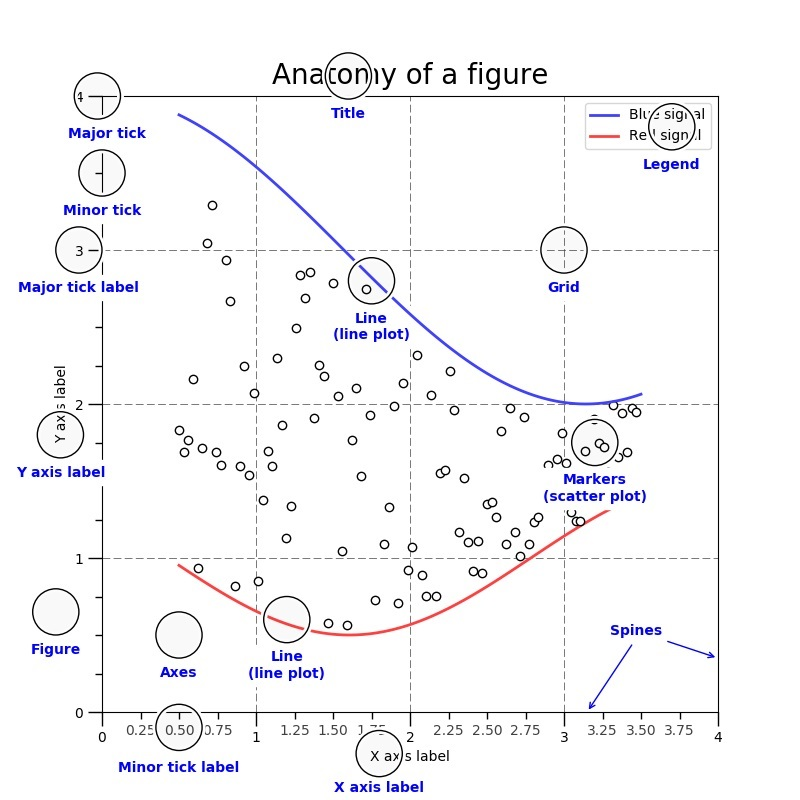

# import matplotlib

：Python 的第三方库，提供了一些模仿 MATLAB 的数学绘图函数，并基于 tkinter、qt5 等 GUI 库显示图像。
- [官方文档](https://matplotlib.org/users/index.html)
- [图像示例](https://matplotlib.org/tutorials/introductory/sample_plots.html)
- 安装：`pip install matplotlib`

## 折线图

- 使用绘图函数时，通常输入 numpy.array 等类型的数组，就会在坐标轴中绘制函数曲线。
- 可以用 `plt.plot()` 绘制一条折线，如下：
  ```py
  >>> import matplotlib.pyplot as plt
  >>> x = [1, 2, 3]
  >>> y = [-1, -2, -3]
  >>> plt.plot(x, y)                                          # 绘制一条折线，x、y 数组分别表示各个点的 x 轴、y 轴坐标，两个数组的长度必须相同
  [<matplotlib.lines.Line2D object at 0x000001F35773F820>]
  >>> plt.plot(y, x, label='line2', linestyle='', marker='.') # 绘制第二条折线，它是散点线
  [<matplotlib.lines.Line2D object at 0x000001F35801BB20>]
  >>> plt.show()                                              # 显示 Figure 窗口
  ```

- `plt.plot()` 的常用参数：
  ```py
  label='xx'          # 折线的名称
  linewidth=1.0       # 线宽
  linestyle='-'       # 线型
  marker=''           # 节点标记的形状
  color='#008000'     # 线的颜色。默认每次绘制时，会按蓝、橙、绿等顺序分配颜色
  ```
  - 线型有以下几种：
    ```py
    None
    ''
    ' '
    '-'
    '--'
    '-.'
    ':'
    'solid'     # 实线
    'dashed'    # 虚线
    'dotted'    # 点线
    'dashdot'   # 点划线
    ```
  - 节点标记的形状有以下几种：
    ```py
    's'         # 正方形
    'o'         # 圆形
    '^'         # 正三角形，分为四种朝向
    '>'
    'v'
    '<'
    'd'         # 正菱形
    'p'         # 正五边形
    'h'         # 正六边形
    '8'         # 正八边形
    ```

### 动态折线图

例：
```py
import random

plt.ion()
last_dot = [0, 0]
for i in range(100):
    new_dot = [i, random.randint(0, 10)]  # 生成当前点的坐标
    # 每次循环会绘制一条新折线，与上一条折线连接，并采用统一的颜色
    plt.plot([last_dot[0], new_dot[0]], [last_dot[1], new_dot[1]], color='blue')
    last_dot = new_dot
    plt.pause(0.1)

```

## Figure

- Matplotlib 提供了显示图像的 GUI 窗口，称为 Figure 。其结构如下：

  

  - 每个 Figure 上可以显示一个或多个坐标区（Axes）。
  - 坐标区的坐标轴（Axis）有多种类型：
    - xy 二维坐标轴
    - xyz 三维坐标轴
    - 极坐标轴

- 通常有两种绘图方式：
  - 通过 `plt.plot()` 直接绘图，只能操作一个 Figure 实例。
  - 通过 `plt.figure()` 创建 Figure 实例，以面向对象的方式绘图。

### 交互模式

- 显示 Figure 窗口时默认采用非交互模式：
  - 执行 `plt.plot()` 等函数时只会记录图像数据，不会实际绘制。执行 `plt.show()` 才会开始绘制图像，显示 Figure 。
  - Figure 显示期间会一直阻塞前端，直到用户关闭其窗口。

- 在交互模式下：
  - 执行 `plt.plot()`、`plt.show()` 等函数都会立即显示 Figure 窗口，如果已显示则更新显示。
  - Figure 显示期间不会阻塞前端，从而可以继续执行其它代码来修改 Figure 。
    ```py
    >>> plt.ion()                     # 打开交互模式
    >>> matplotlib.is_interactive()   # 判断是否处于交互模式
    True
    >>> plt.ioff()                    # 关闭交互模式
    ```
- 执行 `plt.pause(n)` 会显示 Figure ，并阻塞前端 n 秒。

### 关闭窗口

- 显示 Figure 窗口时，如果用户关闭该窗口：
  - 非交互模式下，会自动销毁该 Figure 对象，导致不能再次显示。
  - 交互模式下，可以再次显示。
- 可以在代码中主动关闭 Figure 窗口：
  ```py
  >>> plt.close()           # 关闭当前的 Figure
  >>> plt.close(f1)         # 关闭指定的 Figure
  >>> plt.close('test1')    # 关闭指定名称的 Figure（该名称不存在时并不会报错）
  >>> plt.close('all')      # 关闭所有 Figure
  ```

### 排版

```py
plt.axis('off')             # 不显示坐标轴（默认显示）
plt.axis([0, 10, 0, 1])     # 设置 x 轴和 y 轴的长度（如果设置了，显示时窗口比例会固定，否则会自动调整）

plt.title('Simple Plot')    # 设置图像的名称（默认为空），这并不是设置 Figure 窗口的 Title
plt.xlabel('x label')       # 设置 X 轴的名称（默认为空）
plt.ylabel('y label', fontsize=16))
plt.legend()                # 显示图例（这会自动提取每条折线的 label 名作为图例名）
plt.grid(True)              # 在坐标轴区域显示网格线

plt.cla()                   # 对当前 figure 中的所有坐标轴执行 axes.cla()，清除其显示内容
plt.clf()                   # 清除显示当前 figure 中的所有坐标轴

plt.savefig('./1.png')      # 保存图像
```

### 后端

- Matplotlib 将执行代码的线程称为前端，将显示 Figure 的线程称为后端。
- 管理 Matplotlib 后端的 GUI 引擎：
  ```py
  >>> matplotlib.get_backend()    # 查看当前引擎
  'TkAgg'
  >>> matplotlib.use('qt5agg')    # 使用指定的引擎
  ImportError: Failed to import any qt binding
  ```

### 实例化

- 创建 Figure 实例：
  ```py
  >>> f1 = plt.figure()           # 创建一个 Figure
  >>> f2 = plt.figure('test')
  >>> f3 = plt.figure('test')
  >>> f1.show()                   # 显示 Figure
  >>> plt.show()                  # 显示所有已激活的 Figure
  ```

- 相关 API ：
  ```py
  def figure(num=None,        # 设置 ID
             figsize=None,    # 设置宽度、高度，比如 (3, 2.2)
             dpi=None,        # 设置分辨率，比如 10 。实际的显示尺寸等于 figsize*dpi
             facecolor=None,  # 设置背景色
             edgecolor=None,  # 设置边框颜色
             clear=False,     # 如果已存在相同 ID 的 Figure 则清除它
             **kwargs
             )
  ```
  创建 Figure 时，传入的 num 参数会用作其唯一 ID 。
  - 如果没传入 num 参数，或者传入的 num 参数不是 int 类型，则会自动使用一个从 1 开始递增的 num 值。如下：
    ```py
    >>> f1.number
    1
    ```
  - 如果传入的 num 参数是 str 类型，则会用作该 Figure 的 Title 。如下：
    ```py
    >>> f2.number
    2
    >>> f2.get_label()
    'test'
    ```
  - 如果传入的 num 参数是 int 型，且已存在相同 ID 的 Figure ，则会激活该 Figure 并返回其引用。否则创建一个新的 Figure 并返回其引用。如下：
    ```py
    >>> f1 == f2
    False
    >>> f2 == f3
    True
    ```

### Subplot

- 创建一个 Figure 时，默认只包含一个坐标轴图像，可以划分多个子图（Subplot）：
  ```py
  >>> fig, axes = plt.subplots(1)       # 创建一个 Figure ，采用 1 行的网格布局，每一格包含一个子图
  >>> fig, axes = plt.subplots(2, 3)    # 创建一个 Figure ，采用 2 行、3 列的网格布局，每一格包含一个子图
  >>> fig
  <Figure size 640x480 with 4 Axes>
  >>> axes                              # axes 数组中，每个元素对应一个子图的 axes
  array([[<AxesSubplot:>, <AxesSubplot:>],
        [<AxesSubplot:>, <AxesSubplot:>]], dtype=object)
  >>> ax1 = axes[0, 0]                  # 选中第一个子图的 axes
  >>> ax1.plot(x, x)
  [<matplotlib.lines.Line2D object at 0x000001F35B72B1F0>]
  >>> plt.show()
  ```

- 可以给已有的 Figure 添加子图：
  ```py
  >>> f1 = plt.figure()
  >>> f1.add_subplot(2, 3, 1)       # 让 Figure 采用 2 行、3 列的网格布局，将子图放在横向第 1 格内（只能位于第 1 行内）
  <AxesSubplot:>
  >>> f1.add_subplot(3, 3, (1,2))   # 让 Figure 采用 2 行、3 列的网格布局，将子图放在横向第 1 格至 第 2 格区域（只能位于第 1 行内）
  <AxesSubplot:>
  >>> f1.add_subplot(331)           # 当网格布局的行列数不超过 9 时，可以将前三个参数合并成一个三位整数
  <AxesSubplot:>
  ```
  - 相关 API ：
    ```py
    def add_subplot(nrows=1, ncols=1, index=1, **kwargs)
    ```
    - index 的取值必须符合 `1 ≤ index ≤ nrows` ，否则会报错。
    - 可以给同一个 Figure 多次添加子图，不过新的子图在显示时会覆盖旧的子图。


## 显示图片

- 例：
  ```py
  >>> from matplotlib import pyplot as plt, image
  >>> img = image.imread('./1.jpg')   # 读取本地图片
  >>> p1 = plt.imshow(img)            # 将图片导入 Figure
  >>> plt.show()                      # 显示 Figure
  ```

- 读取到的图片对象实际上存储在 numpy 数组中：
  ```py
  >>> type(img)
  <class 'numpy.ndarray'>
  >>> img
  array([[[ 72, 164, 201],
          [ 64, 156, 193],
          [ 66, 158, 195],
          ...,
          [  0,  54,  74],
          [  0,  53,  73],
          [  0,  54,  74]]], dtype=uint8)
  ```
