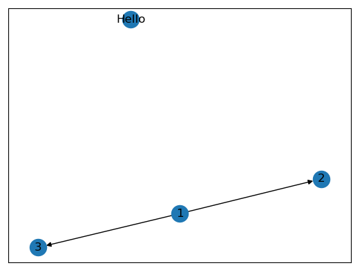

# ♢ NetworkX

：Python 的第三方库，用于绘制无向图、有向图等图结构。
- [官方文档](https://networkx.org/documentation/stable/)
- 安装：`pip install networkx`
- 用 NetworkX 生成图像数据之后，通常再用 Matplotlib 绘制图像。
- [图像示例](https://networkx.org/documentation/stable/auto_examples/index.html)

## 原理

- 无向图：
  - 一条边是连接任意两个节点的线段，甚至可以连接同一个节点（称为自循环）。
  - 任意两个节点之间最多只能存在一条边，不能存在多条边（称为平行边）。
- 有向图：
  - 在边的某一端加上一个箭头。
  - 任意两个节点之间最多只能存在一条边，这条边上最多有两个箭头。

## 用法

### 创建图像

```py
>>> import networkx as nx
>>> g = nx.Graph()              # 创建一个空的无向图
>>> g = nx.DiGraph()            # 创建一个空的有向图
>>> g.add_node(1)               # 添加一个节点
>>> g.add_node('Hello')         # 节点的名称可以是数字、字符串等，根据哈希值区分
>>> g.add_nodes_from([2, 3])    # 从可迭代对象添加多个节点
```

```py
>>> g.add_edge(1, 2)            # 添加一条边，从前一个节点指向后一个节点（如果节点不存在，则会自动创建）
>>> g.add_edges_from([(1, 2), (1, 3)])
>>> g.nodes
NodeView((1, 'Hello', 2, 3))
>>> g.edges
EdgeView([(1, 2), (1, 3)])
```

### 绘制图像

例：
```py
from matplotlib import pyplot as plt
nx.draw_networkx(g)
plt.show()
```

效果图：




相关 API ：
```py
def draw_networkx(G,                        # 一个 NetworkX 的图对象
                  
                  pos:dict,                 # 各节点的坐标，比如 pos={1: (0, 0), 2: (10, -10)} 
                  # 指定的坐标值可以为任意大小、正负的浮点数，最终用 Matplotlib 显示时会自动缩放至适合窗口的大小
                  # 如果指定坐标则必须指定所有节点，如果不指定坐标则随机生成

                  ax=None,                  # 指定一个 Matplotlib Axes 对象来绘制
                  alpha=1.0,                # 图像的不透明度
                  nodelist:list=G.nodes()   # 仅绘制指定节点
                  edgelist:list=G.edges()   # 仅绘制指定边

                  node_size=300,            # 节点的大小（也可以传入一个 list ，分别设置每个节点的大小）
                  node_color='#1f78b4',     # 节点的颜色
                  node_shape='o',           # 节点的形状

                  width=1.0,                # 边的线宽
                  style='solid',            # 边的线型
                  edge_color='black',       # 边的颜色

                  arrows=True,              # 是否显示有向图的箭头
                  arrowsize=10,             # 箭头的大小

                  with_labels=True,         # 是否显示节点的名称
                  font_size=12,             # 字体的大小
                  font_color='black',       # 字体的颜色
                  font_weight='normal',     # 字体的宽度
                  font_family='sans-serif', # 字体
                  )
```

