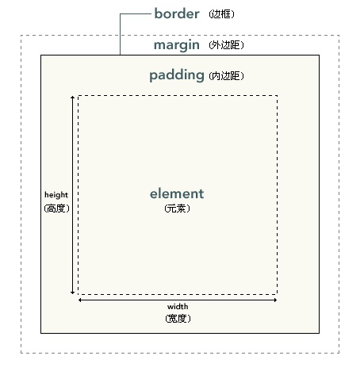

# CSS样式

## 尺寸单位

- px：像素点数，用于设置绝对位置。
- em：相对于父元素的倍数。
  - 如果元素的 font-size 为 n em ，则等于`父元素的font-size × n`。
  - 如果元素的 width、height、padding、margin 为 n em ，则等于`该元素的font-size × n`。
- n%：相对于父元素的相应值的百分比。
- rem：相对于根元素 html 的倍数。

例：
```css
html {
    font-size: 10px;
}
body {
    font-size: 40px;
    width: 10em;        # 等于400px
}
p {
    font-size: 0.5em;   # 等于20px
    width: 10em;        # 等于200px
    height: 10rem;      # 等于100px
}
```

## inherit

绝大部分样式都支持赋值为 inherit ，表示继承父元素中该属性的值。
- 例：
    ```css
    background-color: inherit;    # 背景色默认不会继承父元素，这里主动让它继承
    ```

## 关于背景

background-color：背景色
- 默认不继承父元素。
- 可应用于绝大部分元素。
- 例：
    ```css
    background-color: transparent;     # 默认值，透明
    background-color: red;             # 使用预设的颜色名字
    background-color: #ff0000;         # 使用颜色的十六进制值
    background-color: rgb(255 ,0, 0);  # 用 rgb() 选择颜色
    ```
- 很多样式支持用一些预设的关键字赋值，比如red、center。`如果用户设置的值不是有效的关键字，则使用默认值。`

background-image：背景图片
- 默认不继承父元素。
- 可应用于绝大部分元素。
- 图片要用 url() 指定位置。
- 例：
    ```css
    background-image: none;             # 默认值，不显示图片
    background-image: url(/img/01.gif); # 显示指定图片
    ```
- 背景图片的重复策略：
    ```css
    background-repeat: repeat;    # 默认值，在水平、垂直方向上都重复显示图片
    background-repeat: repeat-x;  # 只在水平方向上重复
    background-repeat: repeat-y;  # 只在垂直方向上重复
    background-repeat: no-repeat; # 不重复
    ```
- 背景图片的显示位置：
    ```css
    background-position: top left;   # 默认值，位于左上角
    background-position: top;
    ```
    - 水平方向的关键字：left、center、right
    - 垂直方向的关键字：top、center、bottom
    - 最多可设置两个方向的关键字，顺序任意。如果只设置一个方向，则另一个方向默认为center。
    ```css
    background-position: 100% 33%;   # 设置图片中心点在显示区域以内的百分比位置
    background-position: 50px 100px; # 设置图片左上角的绝对位置（可能超出显示区域）
    ```

- 当用户滚动页面时，如果背景图片跟随滚动，就可能滚动到显示区域以外。可设置图片是否滚动：
    ```css
    background-attachment: scroll;   # 默认值，图片跟随滚动
    background-attachment: fixed;    # 不滚动
    ```

## 关于文本

color：文本颜色（前景色）
- 例：
    ```css
    color: red;
    color: #ff0000;
    color: rgb(255 ,0, 0);
    ```

text-decoration：文本的装饰线
- 例：
    ```css
    text-decoration: none;          # 默认值，不处理
    text-decoration: underline;     # 显示下划线
    text-decoration: overline;      # 显示上划线
    text-decoration: line-through;  # 显示删除线
    text-decoration: blink;         # 闪烁显示（大部分浏览器都不支持）
    text-decoration: underline overline;  # 可以组合使用多个装饰线
    ```

text-transform：大小写
- 例：
    ```css
    text-transform: none;       # 默认值，不处理
    text-transform: uppercase;  # 所有字母显示成大写
    text-transform: lowercase;  # 所有字母显示成小写
    text-transform: capitalize; # 每个单词的首字母显示成大写
    ```

text-align：对齐方式
- 控制的是元素中的文本的位置，而HTML中的 center 等标签控制的是元素的位置。
- 例：
    ```css
    text-align: left;       # 左对齐
    text-align: center;     # 居中对齐
    text-align: right;      # 右对齐
    text-align: justify;    # 两端对齐（调整字符间距，使每行的长度相等）
    ```

text-indent：缩进
- 默认会继承父元素。
- 常应用于块级元素。想应用于行级元素时可采用以下方法：
  - 为一个行级元素单独创建一个块，然后设置该块级元素的缩进。
  - 设置行级元素的左内边距，达到缩进的效果。
- 例：
    ```css
    text-indent: 5em;   # 相对于父元素的倍值
    text-indent: -5em;  # 缩进可以为负值（可能超出显示区域）
    text-indent: 20%;   # 相对于父元素的百分比
    ```

line-height：行高
- 不允许使用负值。
- 例：
    ```css
    line-height: 10px;
    line-height: 90%;
    ```

word-spacing：字或单词的间距
- 例：
    ```css
    word-spacing: normal;   # 默认值，等于 0 px
    word-spacing: 30px;
    word-spacing: -0.5em;   # 可以为负值
    ```
- 例：应用到HTML中
    ```css
    <style type="text/css">
        p.tight {word-spacing: -0.5em;}
    </style>

    <p class="tight">
        This is a paragraph.
    </p>
    ```

letter-spacing：字母的间距

white-space：处理空白字符的策略
- 例：
    ```css
    white-space: normal;    # 默认值，将连续的空格合并为一个空格，忽略换行符，允许自动换行
    white-space: nowrap;    # 与normal相似，只是不允许自动换行
    white-space: pre;       # 保留所有空格、换行符，与原文本一致，不允许自动换行
    ```

direction：文本方向
- 例：
    ```css
    direction: ltr;    # 默认值，从左往右
    direction: rtl;    # 从右往左
    ```

## 字体

CSS将大部分字体划分为5种通用的字体系列：
- Serif：字符的宽度与字体大小成比例，一些字母的笔划的末端有短横杆装饰。
- Sans-serif：字符的宽度与字体大小成比例，字母没有短横杆装饰。
- Monospace：等宽字体。
- Cursive：手写体。
- Fantasy：其它类型的字体。

font-family：字体系列
- 例：
    ```css
    p {font-family: Consolas, "Microsoft YaHei", serif;}
    ```
    - 浏览器在显示时，会按先后顺序寻找这些字体（客户端是否存在对应的字体库），如果没找到就使用后一种字体，如果都没找到则使用默认的字体。
    - 如上，"Consolas"字体只包含英文字符。显示英文时会优先使用"Consolas"字体，显示中文时则使用后面的"Microsoft YaHei"字体。
- 导入外部字体：
    ```css
    @font-face{
        font-family: '字体名'; 
        src:url('/font/字体名.woff') format('woff'),   # 导入本地字体
            url('/font/字体名.svg') format('svg'),
            url('https://fonts.gstatic.font.im/.../字体名.ttf') format('truetype');    # 导入在线字体
    }

    h1{font-family: "字体名";}  # 使用字体
    ```

font-size：字体大小
- 例：
    ```css
    h1 {font-size: 3em;}
    h2 {font-size: 2.5em;}
    h3 {font-size: 2em;}
    h4 {font-size: 1.5em;}
    p {font-size: 1em;}
    ```
    段落文本的字体大小默认为 1em = 16px

font-weight：字体的粗细
- 例：
    ```css
    font-weight: normal;    # 默认值，正常显示
    font-weight: bold;      # 显示成粗体
    font-weight: 900;       # 设置粗度值
    ```
    粗度值的取值范围为100~900，400等价于normal，700等价于bold。

font-style：字体风格
- 例：
    ```css
    font-style: normal;    # 默认值，正常显示
    font-style: italic;    # 显示成斜体
    ```

## 链接

链接有 4 种状态：
- link：普通状态，没有被点击过。
- visited：被鼠标点击过。
- hover：当鼠标悬停在链接上时。
- active：当鼠标按住链接时。

例：
```css
a:link {text-decoration:none;}
a:visited {text-decoration:none;}
a:hover {text-decoration:underline;}
a:active {text-decoration:underline;}
```

## 框模型

每个元素的显示内容都局限在一个矩形区域之内，该区域的边框默认不显示。

一个块级元素有一个大的“块框”，其中的每行有一个“行框”，每行中的每个行内元素有一个“行内框”。
- 块级元素：在一行内只能显示一个，比如div、h1、p等。
- 行内元素：在一行内可以显示多个，比如strong、span等。

CSS根据框模型显示元素，如下图：



- 元素的实际显示内容位于最内层。
  - 默认内边距、边框、外边距的宽度为 0 ，框模型被元素的内容填满。
- padding：内边距，元素内容与边框之间的距离。
- border：边框。
  - `元素的背景色、背景图片显示在边框以内的区域，简称“框内”。`
  - `边框以外的区域默认是透明的，简称“框外”。`
- margin：外边距，边框与外部的距离。
  - 外边距可以为负值。

例：
```css
p {
    width: 30px;
    height: 1em;
    padding: 5%;
    margin: auto;   # 让浏览器自动处理（通常用于居中显示）
}
```

框模型中，可以分别设置四条边的样式。
- 例：
    ```css
    p {
        padding: 1em 1em 1em 1em;   # 按顺序一次性设置四条边

        padding-top: 1em;    # 单独设置一条边
        padding-right: 1em;
        padding-bottom: 1em;
        padding-left: 1em;
    }
    ```
- 同理还有margin-top、border-top-style等。

配置边框：
```css
p {
    border-style: solid;  # 边框线的类型
    border-width: 5px;    # 边框线的宽度
    border-color: blue;   # 边框线的颜色
}
```

border-style的可用取值：
- none：默认，不显示。
- dotted：点状线，由一个个小方块组成。
- dashed：虚线，由一个个短横线组成。
- solid：实线。
- double：双线。
- groove：3D 凹槽。
- ridge：3D 凸槽。
- inset：3D 凹边。
- outset：3D 凸边。
- inherit：继承父元素。

## 定位

这里研究的元素定位，是指 元素外边距的边界 相当于 其外部块的边界 的位置。

用position属性可设置元素的定位方式，分为四种：
- static：默认方式。所有元素按HTML中的顺序从上到下显示。
- relative：相对位置。元素相对于static位置的位置。（此时元素依然占据static空间）
- absolute：绝对位置。元素相对于其外部块的绝对位置。
- fixed：固定位置。元素相对于浏览器窗口的绝对位置。
  - absolute、fixed定位的元素脱离了文档流（不占据static空间），且作为块级元素显示。

例：
```css
p {
    position: relative;  # 使用相对位置
    left: -20px;         # 元素外边距的左边界 相对于 其外部块的左边界 的偏移
    top: 5%;             # 可以使用相对于其外部块的百分比位置
    /* bottom: 5%; */
    /* right: 5%; */
}
```

z-index：元素的堆叠顺序
- 默认值为auto，会继承父元素的值。
- 取值越大，元素显示时的优先级越高。
- absolute、fixed定位的元素在显示时可能发生堆叠，需要设置元素的堆叠顺序。
- 例：
    ```css
    p {
        position: absolute;
        z-index: -1;        # 堆叠顺序可以取负值
    }
    ```

overflow：元素溢出显示区域时的对策
- 取值：
  - visible：默认值，显示元素的溢出部分。
  - hidden：不显示元素的溢出部分。
  - scroll：限制元素的显示区域，但浏览器会显示一个滚动条，供用户查看完整的元素。
  - auto：当元素超出显示区域时才显示一个滚动条。

## 浮动

float：让元素浮动
- 例如，当元素向左浮动时，会挤开static、relative定位的元素，移动到外部块的最左端。如果多个元素向左浮动，则会紧挨着排列，不会换行。
- 取值：
  - none：默认值，不浮动。
  - left：向左滑动。
  - right：向右滑动。
- 例：
    ```css
    p > img {           # 让p元素内的img元素浮动（可达到文本环绕图片的效果）
        float: left;
        border: 1px;
        margin: auto;
    }
    ```

clear：禁止浮动
- 取值：
  - none：默认值。
  - left：该元素的左侧不允许存在浮动元素（会挤到下一行）。
  - right：右侧不允许。
  - both：左侧、右侧都不允许。
- 例：
    ```css
    p > img {
        float: left;
        clear: both;
    }
    ```
