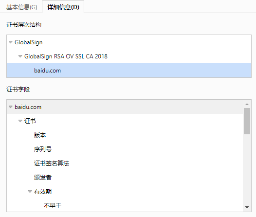

# HTTPS

- HTTP 协议是基于 TCP 协议传输 HTTP 报文，属于明文通信，因此安全性低，可能泄露隐私、被篡改。
- 后来发明了安全超文本传输协议（Secure Hypertext Transfer Protocol，HTTPS）协议，基于 SSL 协议传输 HTTP 报文，实现加密通信，安全性高。

## 原理

- 采用 HTTPS 协议时，client 与 server 的通信流程如下：
  1. client 得知 server 的域名，进行 DNS 查询，得到 server 的 IP 地址。
      - SSL 证书通常颁发给域名，因此 server 通常提供域名作为访问地址。
      - 这里假设 client 缓存了 DNS 记录，因此忽略 DNS 查询的耗时。
  2. client 与 server 进行 TCP 握手，建立 TCP 连接，属于一个明文的通信信道。握手耗时为 1 RTT 。
  3. client 与 server 进行 SSL 握手，建立 SSL 连接，属于一个加密的通信信道。握手耗时为 1 RTT （假设采用 TLSv1.3 ）。
  4. client 生成 HTTP 请求报文，加密成 SSL 密文，发送给 server 。
  5. server 收到 SSL 密文，进行解密，得到 HTTP 请求报文。
  6. server 生成 HTTP 响应报文，加密成 SSL 密文，发送给 client 。

- client 与 server 进行 SSL 握手时，会下载其 SSL 证书文件，用于验证 server 的身份真伪：
  - 检查该证书的颁发者是谁。如果不是 client 信任的 CA 机构，则认为该证书无效，SSL 握手失败。
  - 检查该证书是否包含 CA 机构的数字签名，从而证明该证书的确是由该 CA 机构签发的，并且避免证书内容被篡改。
  - 检查该证书颁发给哪些域名使用。如果不包含当前 server 的域名，则该证书无效，SSL 握手失败。
  - 提取证书中的公钥，用它加密一个消息发送给 server 。如果 server 没有对应的私钥，则不能解密该消息，导致 SSL 握手失败。

- 如何使用 HTTPS 协议？关键是准备 SSL 证书，这里分情况讨论：
  - 对于服务器：
    - 一般的 Web 服务器软件（比如 nginx ）可以直接监听 HTTP 端口，但不能直接监听 HTTPS 端口。需要将 SSL 证书文件（包含公钥）、私钥文件放到 Web 服务器上，然后修改 Web 服务器的配置，使用这两个文件监听 HTTPS 端口。
  - 对于客户端：
    - Chrome 等浏览器软件，通常预先安装了一些主流的 CA 根证书，用于验证 HTTPS 服务器的 SSL 证书。因此既能访问 HTTP 服务器，又能访问 HTTPS 服务器。
      - 如果 SSL 证书是从冷门 CA 机构创建的，则需要用户手动安装其根证书到浏览器中。
    - JVM 等程序，通常会认可操作系统已下载的根证书。例如：
      - CentOS 系统默认将 SSL 证书文件存储在 `/etc/pki/tls/certs/` 目录下（包括一些主流的 CA 根证书），将私钥文件存储在 `/etc/pki/tls/private/` 目录下。
      - Ubuntu 系统默认将 SSL 证书文件存储在 `/etc/ssl/certs/` 目录下，将私钥文件存储在 `/etc/ssl/private/` 目录下。

- 与 HTTP 协议相比，HTTPS 的优点是安全性高，但也有一些缺点：
  - Web 网站的管理员需要申请、配置 SSL 证书，增加了工作量。
  - 采用 HTTP 协议时， client 发出第一个 HTTP 请求之前，需要 TCP 握手，等待 1 RTT 。而采用 HTTPS 协议时，需要 TCP 握手、SSL 握手，等待 2 RTT ，耗时更久。
  - client 与 server 每次 SSL 握手，需要下载一次 server 的 SSL 证书文件，文件体积大概为 4KB 。
    - 假设每秒进行 100 次 SSL 握手，则累计流量为 100*4/1024≈0.4MB ，占用 3.2Mbps 的网络带宽。
    - 网络传输 SSL 证书时不应该压缩，因为存在一些已知漏洞。
    - Nginx 支持让 client 在一段时间内复用 SSL 会话，不必重复 SSL 握手。
    - 有的浏览器会缓存网站的 SSL 证书，直到用户关闭该网页。
  - 每次传输 HTTP 报文时需要用 SSL 加密、解密，略微增加了 CPU 负载和耗时。

## SSL协议

- 1990 年代，Netscape 公司发布了 SSL（Secure Sockets Layer ，安全套接字层）协议，主要用于加密传输 HTTP 报文。
  - SSL 工作在传输层与应用层之间。
  - 基本原理：
    1. 应用层协议（比如 HTTP ）调用 SSL 协议，传输一段 payload 。
    2. SSL 协议将 payload 加密之后，再调用传输层协议（比如 TCP ）传输。

- 关于版本。
  - SSLv1 版本未公开发布，在发布了 SSLv2、SSLv3 版本之后，过渡到更安全的 TLS（Transport Layer Security ，安全传输层）协议。有时也将 SSL、TLS 统称为 SSL 协议。
  - 目前建议最好采用 TLSv1.3 。其次采用 TLSv1.2 ，但握手耗时更久。不应该采用 SSLv2、SSLv3、TLSv1.0、TLSv1.1 ，因为存在一些漏洞。

- SSL 协议提供了多个方面的安全性：
  - 身份验证
    - 为什么需要身份验证？
      - 当 client 向 server 发送消息时，可能被第三方冒充 server 来与 client 通信，从而窃取 client 发送的私密信息。
      - 例如，第三方可能篡改 DNS 记录，将 server 的域名解析到自己的 IP ，从而冒充 server 。
    - 使用 SSL 协议时，通信双方可向对方发送自己的 SSL 证书，用于验证自己的身份。
    - 一般 Web 网站只要求 server 提供 SSL 证书，不要求 client 提供 SSL 证书。因此只要求单向认证，不要求双向认证。
  - 加密传输 payload ，保护隐私，避免被窃听
    - SSL 协议采用对称加密的方式。发送方将 payload 用密钥加密之后才发送，接收方用同一密钥才能解密 payload 。
    - 每个 SSL 会话会临时生成一个随机的会话密钥，互不相同，因此隔离了风险。
    - 不过 SSL 只是加密了 payload ，其它信息没有加密。例如第三方可以抓包查看 TCP 头，得知通信双方的 IP 地址。
  - 避免重放攻击
    - 每发送一个 SSL 数据包，会包含一个从 0 开始递增的序列号（sequence number），从而保证 SSL 数据包的有序传输。
  - 校验数据一致性，避免 payload 传输出错、被篡改
    - 发送方会根据会话密钥生成 MAC（Message Authentication Code，消息验证码）密钥。然后使用 MAC 密钥搭配一个哈希算法，将 payload、sequence number、ssl version 等信息拼凑在一起计算哈希值，作为 MAC 验证码。最后将 MAC 验证码加入 SSL 包一起发送。
    - 接收方会根据 MAC 验证码，检查 payload 是否传输出错。
    - 只有通信双方知道 MAC 密钥，能计算出 MAC 验证码。而第三方不能伪造 MAC 验证码，因此不能篡改 payload 。
    - TLSv1.3 弃用单纯的 MAC 算法，改用包含 MAC 算法的 AEAD 算法。

### TLSv1.2

- 2008 年发布。
- 握手流程：
  1. client 发送 Client Hello 消息，说明自己支持哪些 TLS 版本、哪些加密算法（ciphers），请 server 决定选用哪个。还包含一个临时生成的随机数，称为 client random 。
  2. server 回复 Server Hello 消息，说明决定采用哪个 TLS 版本、哪个加密算法。还包含另一个临时生成的随机数，称为 server random 。
      - 再发送 Server Key Exchange 消息。
      - 再发送 Certificate 消息，包含 server 的 SSL 证书，用于验证 server 的身份。
      - 可选发送 CertificateRequest 消息，索要 client 的 SSL 证书，实现双向验证。
      - 最后发送 Server Hello Done 消息，表示 Hello 阶段的消息已发送完。
  3. client 收到 server 的 SSL 证书，验证 server 的身份。
      - 再临时生成一个随机数，称为预主密钥（pre-master secret）。用 SSL 公钥加密，放在 Server Key Exchange 消息中，发送给 server 。这样只有 server 能解密，第三方即使监听了通信，也不能解密。
      - 再使用上述采纳的加密算法，根据上述三个随机数，生成一个会话密钥（master secret）。然后发送 Change Cipher Spec 消息，表示已生成会话密钥，以后的消息都将加密传输。
      - 再发送 Finished 消息，表示握手完成。
  4. server 收到 Server Key Exchange 消息，用 SSL 私钥解密，得到 pre-master secret 。
      - 再使用上述采纳的加密算法，根据上述三个随机数，生成一个会话密钥。然后发送 Change Cipher Spec 消息。因此 client、server 会分别生成一个会话密钥，但取值相同，属于对称加密。
      - 再发送 Finished 消息，表示握手完成。

- 总结：
  - 握手流程的第 1、2 步，是 client 与 server 协商采用哪个 TLS 版本、哪个加密算法。
  - 握手流程的第 3、4 步，是先基于 SSL 非对称加密，交换随机数。然后根据随机数，生成对称加密的会话密钥，用于之后的 TLS 加密通信。
  - TLSv1.2 握手需要两次往返通信，client 需要等待 2 RTT ，才能开始发送 HTTP 请求。

### TLSv1.3

- 2018 年，IETF 发布 [RFC 8446](https://datatracker.ietf.org/doc/html/rfc8446) 规范，定义了 TLSv1.3 。
- 握手流程：
  1. client 发送 Client Hello 消息，与 TLSv1.2 相似，但还包含 pre-master secret 。
  2. server 回复 Server Hello 消息，与 TLSv1.2 相似，但还包含 server 的 SSL 证书。同时，server 已得到三个随机数，可以生成会话密钥，发送 Finished 消息。
  3. client 验证 server 的 SSL 证书，然后生成会话密钥，发送 Finished 消息。同时，开始发送 HTTP 请求。
- 由上可见，与 TLSv1.2 相比，TLSv1.3 简化了握手流程，client 只需等待 1 RTT ，在第 3 步就能开始发送 HTTP 请求。

- TLSv1.3 还提供了 0-RTT 会话恢复模式，用于将重复握手的耗时缩短到 0 。
  - 流程：
    1. 当 client 与 server 第一次 TLSv1.3 握手时，server 在收到 client 的 Finished 消息之后，可发送一个 NewSessionTicket 消息，包含一个临时生成的随机密钥 PSK（Pre-Shared Key）及其有效期。
        - PSK 是 client 在当前 TLS 会话的凭证（session ticket）。类似于浏览器访问网站时用 cookie 作为身份凭证。
        - server 会为每个 TLS 会话生成不同的 PSK 。
    2. 当 client 重新向 server 建立 TCP 连接时（例如浏览器重新打开一个网站），可不遵循标准握手流程，而是请求恢复之前的 TLS 会话。做法为发送 Client Hello 消息，包含：PSK （用于证明该 client 曾经握手成功、经过 server 身份验证）、early data （此时就可发送 HTTP 请求，用 PSK 加密）。
    3. server 收到 Client Hello 消息之后，如果认为其中的 PSK 有效，则回复 Server Hello 消息，包含新的 PSK （表示新的 TLS 会话）、HTTP 响应。同时发送 Finished 消息。
    4. client 发送 Finished 消息。
  - 优点：
    - 跳过了重复 SSL 握手的耗时，不过依然要重新 TCP 握手。
    - 跳过了身份验证，不必传输 SSL 证书，节省了网络流量。
  - 缺点：
    - TLS 会话传输的每个数据包都包含序列号，不怕重放攻击。但 0-RTT 数据包的作用是创建一个新的 TLS 会话，不受序列号限制。因此第三方可以监听 client 发送的 0-RTT 数据包（包含已加密的 HTTP 请求），重复发送给 server ，造成重放攻击。
  - 可以在应用层采用几种措施，防御 0-RTT 重放攻击：
    - 禁用 0-RTT 功能。例如 nginx 在采用 TLSv1.3 协议时，默认禁用 0-RTT 。
    - 如果 0-RTT 数据包中的 HTTP 请求是 GET 类型，则 server 正常响应，否则拒绝服务。因为 GET 类型的 HTTP 请求通常具有幂等性。
    - client 给 0-RTT 的 HTTP 请求添加一个 header ，取值唯一。当 server 收到重复的 HTTP 请求时，就能发现该 header 取值重复出现，因此拒绝服务。该方案比较麻烦。

- 启用 TLSv1.3 时，需要 HTTP 服务器、客户端同时支持该功能。而 SSL 证书通常同时支持多种 SSL 版本，不必额外配置。
  - 例如 OpenSSL 从 1.1.1 版本开始支持 TLSv1.3 ，而 Nginx 从 1.13 版本开始将构建时依赖的 OpenSSL 升级到 1.1.1 ，从而支持 TLSv1.3 。
  - TLSv1.3 采用一些新的加密算法，与 TLSv1.2 不兼容。
  - 可访问网站 <howsmyssl.com> 测试本机浏览器支持哪些 SSL 版本、加密算法。
  - 访问一个网站时，在 Chrome 浏览器的开发者工具 -> 安全页面，可查看当前采用的 SSL 版本、加密算法。

### SNI

- SNI（Server Name Indication，服务器名称指示）
  - 某个 IP 地址的 Web 服务器，可能同时提供多个 HTTPS 网站供用户访问。这些网站的域名不同，DNS 解析到相同 IP ，理论上可以申请同一个 SSL 证书用于验证，但通常会创建不同的 SSL 证书，分别管理。当 client 与 server 进行 SSL 握手时，server 如何判断发送哪个 SSL 证书给 client ？
    - 常见的解决方案：在 TLS 握手的第一步，让 client 发送的 Client Hello 消息中包含 SNI 信息，说明 client 想访问的目标域名是什么（通常等于 HTTP 报文的 Host 字段）。然后 server 找到该域名对应的 SSL 证书，发送给 client 。
    - 如果没有 SNI 信息，server 可能会发送一个默认域名的 SSL 证书，可能与 client 请求的域名不同，导致 SSL 握手失败。
    - 如果没有 SNI 信息，server 也可能直接拒绝 SSL 握手。
  - 缺点：发送的 SNI 信息默认未加密，第三方可能发现 client 访问的域名地址，进行审查、拦截。
    - 对策：可采取一些措施来提高安全性。比如加密的 SNI、加密的 Client Hello、加密的 DNS 。

## SSL证书

### PKI

- 1970 年代，英国情报机构开始研发一种非对称加密的系统架构，后来被称为公开密钥基础设施（Public Key Infrastructure，PKI）。
  - PKI 包含多个角色，定义了如何创建、使用、管理数字证书及其公钥、私钥。
  - PKI 可以管理多种协议的数字证书，但最常用的是 SSL 协议的数字证书，简称为 SSL 证书。
  - 1990 年代，Netscape 公司发布 SSL 协议，并采用 PKI 架构管理 SSL 证书。
  - 2002 年，IETF 制定了 PKI 的 X.509 标准。

- 证书授权中心（Certificate Authority ，CA）
  - ：PKI 系统中，CA 机构负责颁发数字证书、存储公钥。
  - 多个 CA 机构可以建立树形关系：
    - 上级 CA 可以向下级 CA 颁发证书，证明后者的身份。如果用户信任上级 CA ，则会信任其下级 CA 。
    - 最上级 CA 使用一个自签名的证书，称为根证书，作为信任的源头。如果用户信任根证书，则会信任其下级所有 CA 。
  - Chrome 等浏览器软件，通常预先安装了一些主流的 CA 根证书，因此信任这些 CA 及下级 CA 创建的所有数字证书。
    - 用户也可以自己部署 CA 服务器，创建自签名证书，但不会被公众信任，只能用于私有网络。

- 注册机构（Registration Authorities，RA）
  - ：PKI 系统中，如果用户想创建新的数字证书，则需要找 RA 机构申请。RA 机构审核通过之后，有权基于 CA 证书颁发数字证书。
  - CA 机构可以自己担任 RA 机构，也可以委任第三方担任 RA 机构。

- 按照 PKI ，如果 Web 网站的管理员想使用一个 SSL 证书，则流程如下：
  1. 申请：向 RA 机构申请一个 SSL 证书。可能需要填一些申请信息，比如网站用途、联系方式。
  2. 批准：RA 机构审核通过之后，由 CA 机构颁发一个 SSL 证书，包含以下两个文件：
      - SSL 证书文件（包含公钥）
      - 私钥文件
  3. 绑定：管理员将这两个文件放到 Web 服务器上。然后修改 Web 服务器的配置，使用这两个文件。

### 文件格式

- 根据 PKI 的 X.509 标准，SSL 证书保存为一个文件，有两种文件格式：
  - PEM
    - ：文本文件，采用 Base64 编码。
    - 文件扩展名为 .pem、.crt 等。
    - 内容示例：
      ```sh
      -----BEGIN CERTIFICATE-----
      MIIJ6DCCCNCgAwIBAgIMVeasrtH4pDD5qTjFMA0GCSqGSIb3DQEBCwUAMFAxCzAJ
      BgNVBAYTAkJFMRkwFwYDVQQKExBHbG9iYWxTaWduIG52LXNhMSYwJAYDVQQDEx1H
      bG9iYWxTaW...
      -----END CERTIFICATE-----
      ```
  - DER
    - ：二进制文件。
    - 文件扩展名为 .der、.crt 等。

- SSL 证书通常包含以下信息：
  - SSL 协议版本
  - SSL 公钥
  - 证书的颁发者，即 CA 机构的名称。
  - 证书的使用者，包括域名、机构名、联系方式等。
    - 允许在一个证书中包含多个域名，同时验证这些域名。
    - 允许在域名中使用通配符，比如 `*.test.com` ，表示所有子域名都可以使用该证书来验证。
    - 证书通常颁发给域名，但也可以颁发给 IP 地址。
      - 可以用 openssl 命令创建自签名证书，绑定到私有 IP 。
      - 可以修改主机的 hosts 文件，将域名解析到私有 IP ，然后访问该域名。
  - 证书的颁发日期
  - 证书的有效截止日期

- 例：用浏览器访问 baidu.com 网站，查看其 SSL 证书，截图如下：

    

    - 给 baidu.com 颁发证书的 CA 机构是 GlobalSign RSA OV SSL CA 2018 ，它的上级 CA 机构是 GlobalSign 。
    - 当浏览器检查 baidu.com 的 SSL 证书是否有效时，需要先检查 GlobalSign RSA OV SSL CA 2018 是否为一个可信的 CA 机构，因此需要检查该 CA 机构的数字证书。
    - 为了方便浏览器检查，Web 服务器给客户端发送一个证书文件时，实际上包含了多份数字证书，称为证书链：
      - 该域名的证书
        - ：由 CA 机构颁发，证明该网站的公钥值是什么。
      - 下级 CA 机构的证书
        - ：由上级 CA 机构颁发，证明该 CA 机构的公钥值是什么。又称为中间证书。
      - 根 CA 机构的证书
        - ：由根 CA 机构自己颁发，被公众信任。
    - 证书链能实现信任传递：如果客户端信任根证书，则会信任其下级证书。
      - 客户端需要从下往上，逐个检查每一级证书是否有效。
      - 证书链的层次越多，客户端需要下载的 SSL 证书文件越大，需要检查的证书越多，导致 SSL 握手耗时越久。
    - 根 CA 机构是信任的源头。如果其私钥泄露，则其下所有证书链都不可信。
      - 目前世界上有少量根 CA 机构，通常与互联网隔离，被严格保护。
      - 用户不能直接找根 CA 机构申请证书，只能找下级 CA 机构申请证书。
      - 根 CA 机构的下级 CA 机构，可能再创建一层下级 CA 机构。最终给用户颁发证书的，可能是二级 CA 机构，也可能是三级、四级等 CA 机构。

### OpenSSL

：一个关于 SSL 的开源工具包。
- 常用于生成 SSL 证书，或被客户端、服务器用于 SSL 握手。
- 例：生成 SSL 私钥和自签名证书
  ```sh
  openssl
          req -x509           # 生成自签名的数字证书，采用 X.509 标准
          -days 365           # 证书的有效期
          -newkey rsa:2048    # 使用新生成的密钥
          -nodes              # no DES ，生成 key 文件时不加密
          -keyout cert.key    # 保存私钥到指定文件
          -out cert.crt       # 保存证书到指定文件
  ```
  - 浏览器通常不会承认自签名证书，会警告该网站不安全。

### ACME

- letsencrypt.org ：一个 CA 网站，可以免费申请数字证书。
- ACME（Automatic Certificate Management Environment）：一个网络协议，用于向 CA 申请、续订、撤销证书。
  - 最初是为 letsencrypt.org 设计的，后来也支持其它 CA 。
  - 2016 年发布 API v1 。
  - 2018 年发布 API v2 ，支持通配符域名。

#### Certbot

：一个命令行工具，作为 ACME 客户端。
  - [GitHub](https://github.com/certbot/certbot)
- 用户需要证明自己对域名拥有控制权，该过程称为 challenge ，主要有两种方式：
  - HTTP ：将域名绑定到一个网站，监听 80 端口，并在 URL `/.well-known/acme-challenge/` 下提供一个指定文件。
  - DNS ：添加一个 TXT 类型的 DNS 记录，将子域名 `_acme-challenge.<domain>` 解析到指定字符串。
    - 使用 DNS 插件时，会调用 DNS 服务器的 API ，从而自动进行验证。
    - 通配符域名只能通过 DNS 方式申请证书。
- 证书的有效期默认为 90 天。
  - 为了刷新有效期，可以重新创建证书，或续订。
  - 通过 --manual 方式申请的证书，不能自动续订，需要重新申请。
- 命令：
  ```sh
  certbot
          # 申请证书
          run                 # 默认执行该操作，会自动申请证书并安装
          certonly            # 只是获取证书，保存到本机，不会安装
          -d <domain>         # 指定要申请证书的域名。可以多次使用该选项，指定多个域名
          --email <xx>        # 填写申请人的 email

          # 证明域名控制权的几种方式
          --nginx             # 发现本机的 Nginx 服务器，自动修改配置文件，进行验证
          --standalone        # 运行一个简单的 HTTP 服务器。这需要暂时停止原网站
          --webroot -w /www/  # 指定网站的静态目录，自动创建验证文件
          --manual --preferred-challenges=dns  # 手动添加 DNS 记录
          --dns-goole         # 调用 Goole 云平台的 DNS 插件

          # 关于 certbot 的配置
          --dry-run           # 向 CA 测试服务器发出请求，从而模拟执行命令
          --config-dir  /etc/letsencrypt

          # 其它操作
          certificates        # 列出本机存放的证书
          renew               # 续订有效期不足 30 天的所有证书
          revoke              # 撤销证书
          delete              # 删除本机存放的证书
  ```

- 例：
  1. 使用 Nginx 部署网站，在配置文件中加入一个路由：
      ```sh
      location /.well-known/acme-challenge/ {
          root  /certbot/www;
      }
      ```
  2. 运行 Certbot 的 Docker 镜像：
      ```sh
      docker run -it --rm \
          -v $PWD/certbot/www:/www \
          -v $PWD/certbot/etc:/etc/letsencrypt \
          certbot/certbot:v2.6.0 \
          certonly --webroot -w /www -d test.com --email xxx
      ```
      - 申请的证书会保存在配置目录下。
  3. 修改 Nginx 配置，使用证书，提供 HTTPS 服务：
      ```sh
      server {
          listen    443  ssl;
          ssl_certificate /certbot/etc/fullchain.pem;
          ssl_certificate_key /certbot/etc/privkey.pem;
      }
      ```
  4. 增加一个 crontab 定时任务，定期续订证书：
      ```sh
      0 1 * * 1  docker run -i --rm -v /data/certbot/www:/www -v /data/certbot/etc:/etc/letsencrypt certbot/certbot:v2.6.0 renew &>> /var/log/cron
      0 2 * * 1  docker exec -i nginx nginx -s reload &>> /var/log/cron       # 让 Nginx 重新读取 ssl 文件
      ```

#### acme.sh

：一个 shell 脚本，作为 ACME 客户端，与 Certbot 类似。
- [GitHub](https://github.com/acmesh-official/acme.sh)
- 为很多种 DNS 服务商提供了对接插件。
- 例：通过 HTTP 方式申请证书
  ```sh
  docker run -it --rm \
      -v $PWD/acme:/acme \
      neilpang/acme.sh:3.0.1 \
      --issue -d test.com --webroot /www/
  ```
- 例：通过阿里云 DNS 申请证书
  1. 到阿里云插件 API 密钥，声明为环境变量：
      ```sh
      export Ali_Key="******"
      export Ali_Secret="******"
      ```
  2. 申请证书：
      ```sh
      docker run -it --rm \
          -v $PWD/acme:/acme \
          neilpang/acme.sh:3.0.1 \
          --issue --dns dns_ali -d test.com -d *.test.com
      ```
